# Actividad Práctica 5 — Enrutamiento Inter-VLAN (ROAS vs Switch Capa 3)

**Curso:** Redes de Computadoras 1 — Segundo Semestre 2026
**Carné:** 202206425
**Herramienta:** Cisco Packet Tracer

---

## 1. Estructura de la carpeta

```
Actividad5/
├── README.md                          ← este manual
├── Actividad5_202206425.pkt           ← archivo de Packet Tracer
├── Actividad5_202206425.pdf           ← documento final de entrega
├── topologia/
│   └── Actividad5_Topologia.drawio    ← diseño previo en draw.io
├── configs/
│   ├── R1-ROAS.txt                    ← config del router 2911
│   ├── SW1-L2.txt                     ← config del switch 2960
│   └── MLS1-L3.txt                    ← config del switch 3650
└── imagenes/
    └── (capturas, ver sección 7)
```

---

## 2. Topología

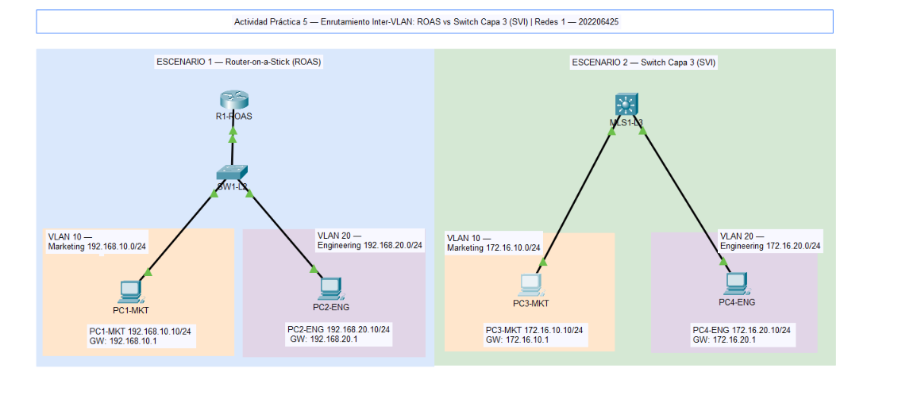

| Escenario | Dispositivos | Método |
|---|---|---|
| 1 | R1-ROAS (2911), SW1-L2 (2960), PC1-MKT, PC2-ENG | Router-on-a-Stick con subinterfaces 802.1Q |
| 2 | MLS1-L3 (3650-24PS), PC3-MKT, PC4-ENG | Switch Capa 3 con SVIs + `ip routing` |

---

## 3. Tabla de direccionamiento

### Escenario 1 — ROAS

| Dispositivo | Interfaz | VLAN | Dirección IP | Máscara | Gateway |
|---|---|---|---|---|---|
| R1-ROAS | G0/0 | Trunk | — (sin IP) | — | — |
| R1-ROAS | G0/0.10 | 10 | 192.168.10.1 | 255.255.255.0 | — |
| R1-ROAS | G0/0.20 | 20 | 192.168.20.1 | 255.255.255.0 | — |
| PC1-MKT | Fa0 | 10 | 192.168.10.10 | 255.255.255.0 | 192.168.10.1 |
| PC2-ENG | Fa0 | 20 | 192.168.20.10 | 255.255.255.0 | 192.168.20.1 |

### Escenario 2 — SVI

| Dispositivo | Interfaz | VLAN | Dirección IP | Máscara | Gateway |
|---|---|---|---|---|---|
| MLS1-L3 | Vlan10 | 10 | 172.16.10.1 | 255.255.255.0 | — |
| MLS1-L3 | Vlan20 | 20 | 172.16.20.1 | 255.255.255.0 | — |
| PC3-MKT | Fa0 | 10 | 172.16.10.10 | 255.255.255.0 | 172.16.10.1 |
| PC4-ENG | Fa0 | 20 | 172.16.20.10 | 255.255.255.0 | 172.16.20.1 |

### Conexiones (todas con cable de cobre directo)

| Origen | Puerto | Destino | Puerto | Tipo |
|---|---|---|---|---|
| R1-ROAS | G0/0 | SW1-L2 | G0/1 | Trunk 802.1Q |
| SW1-L2 | Fa0/1 | PC1-MKT | Fa0 | Access VLAN 10 |
| SW1-L2 | Fa0/2 | PC2-ENG | Fa0 | Access VLAN 20 |
| MLS1-L3 | G1/0/1 | PC3-MKT | Fa0 | Access VLAN 10 |
| MLS1-L3 | G1/0/2 | PC4-ENG | Fa0 | Access VLAN 20 |

---

## 4. Colores de identificación

| Área | Color HEX | RGB (para Packet Tracer) |
|---|---|---|
| Fondo Escenario 1 (ROAS) | `#DAE8FC` | 218, 232, 252 |
| Fondo Escenario 2 (SVI) | `#D5E8D4` | 213, 232, 212 |
| VLAN 10 — Marketing | `#FFE6CC` | 255, 230, 204 |
| VLAN 20 — Engineering | `#E1D5E7` | 225, 213, 231 |
| Leyenda | `#F5F5F5` | 245, 245, 245 |

---

## 5. Procedimiento

### 5.1 Escenario 1 — Router-on-a-Stick

1. Colocar un router **2911**, un switch **2960** y dos **PC**.
2. Cablear según la tabla de conexiones.
3. En **SW1-L2** crear VLAN 10 (Marketing) y VLAN 20 (Engineering), asignar Fa0/1 y Fa0/2 como puertos de acceso y G0/1 como trunk (`configs/SW1-L2.txt`).
4. En **R1-ROAS** levantar G0/0 **sin IP**, crear las subinterfaces G0/0.10 y G0/0.20 con `encapsulation dot1Q` e IP de gateway (`configs/R1-ROAS.txt`).
5. Configurar IP, máscara y gateway en PC1 y PC2.

### 5.2 Escenario 2 — Switch Capa 3

1. Colocar un switch **3650-24PS** y dos **PC**.
2. **Importante:** en la pestaña *Physical* del 3650 arrastrar la fuente **AC-POWER-SUPPLY** a la ranura vacía; sin eso el switch está apagado.
3. Cablear según la tabla de conexiones.
4. Habilitar `ip routing`, crear VLAN 10 y 20, asignar los puertos de acceso y crear las SVIs `interface Vlan10` e `interface Vlan20` (`configs/MLS1-L3.txt`).
5. Configurar IP, máscara y gateway en PC3 y PC4.

---

## 6. Verificación

### Comandos en los dispositivos

```
show vlan brief
show interfaces trunk          (solo SW1-L2)
show ip interface brief
show ip route
show running-config
```

### Resultados esperados de `show ip route`

**R1-ROAS**
```
C    192.168.10.0/24 is directly connected, GigabitEthernet0/0.10
L    192.168.10.1/32 is directly connected, GigabitEthernet0/0.10
C    192.168.20.0/24 is directly connected, GigabitEthernet0/0.20
L    192.168.20.1/32 is directly connected, GigabitEthernet0/0.20
```

**MLS1-L3**
```
C    172.16.10.0/24 is directly connected, Vlan10
L    172.16.10.1/32 is directly connected, Vlan10
C    172.16.20.0/24 is directly connected, Vlan20
L    172.16.20.1/32 is directly connected, Vlan20
```

### Pruebas desde las PCs (Desktop → Command Prompt)

| Desde | Comando | Resultado esperado |
|---|---|---|
| PC1-MKT | `ping 192.168.20.10` | Respuestas exitosas |
| PC1-MKT | `tracert 192.168.20.10` | Salto 1: 192.168.10.1 → Salto 2: 192.168.20.10 |
| PC3-MKT | `ping 172.16.20.10` | Respuestas exitosas |
| PC3-MKT | `tracert 172.16.20.10` | Salto 1: 172.16.10.1 → Salto 2: 172.16.20.10 |

> El primer paquete del ping puede dar *Request timed out* por la resolución ARP; es normal. Repetir el ping.

---

## 7. Evidencias

### Escenario 1 — ROAS
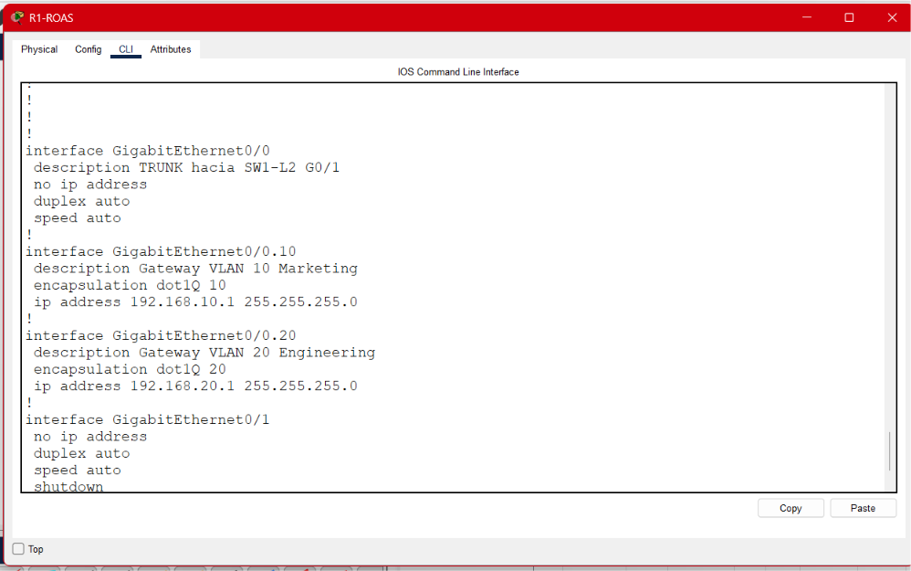
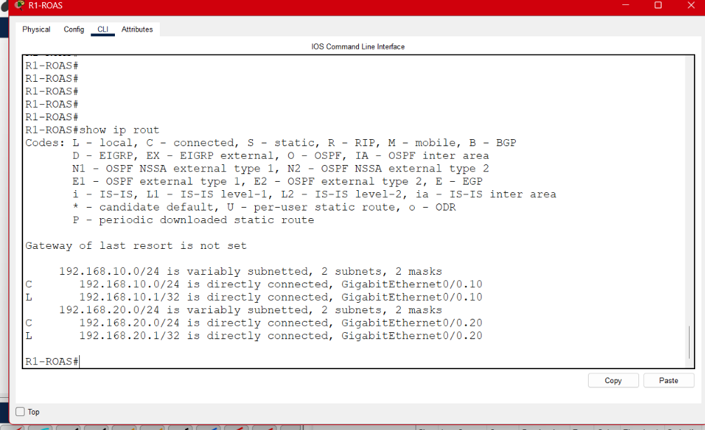
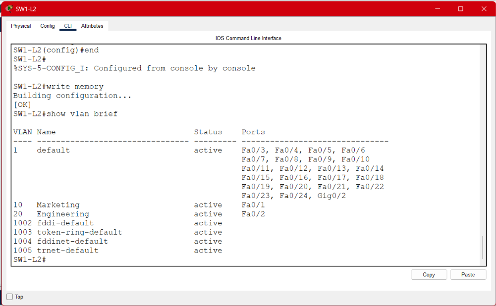
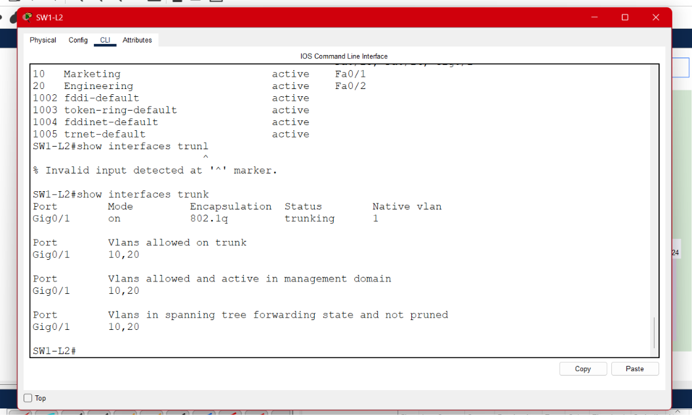
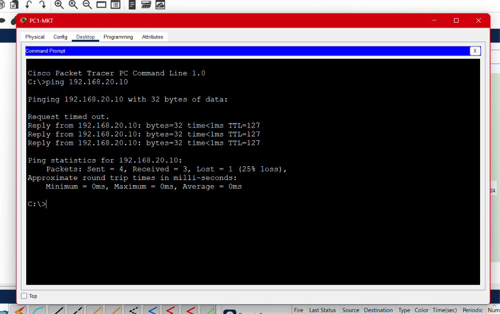
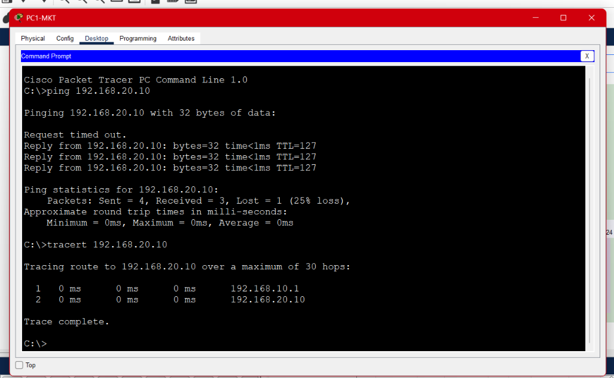

### Escenario 2 — SVI

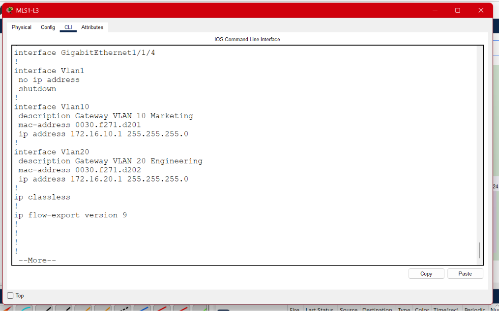
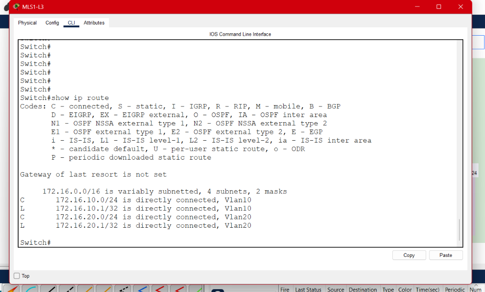
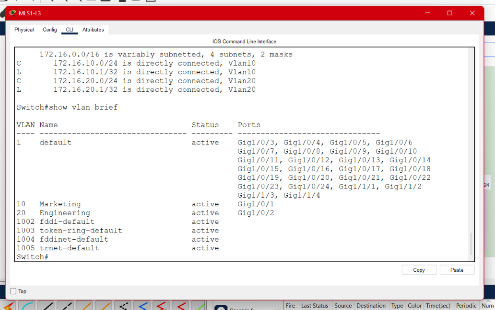
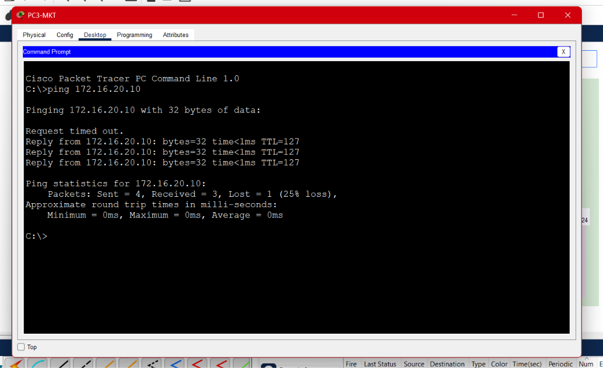
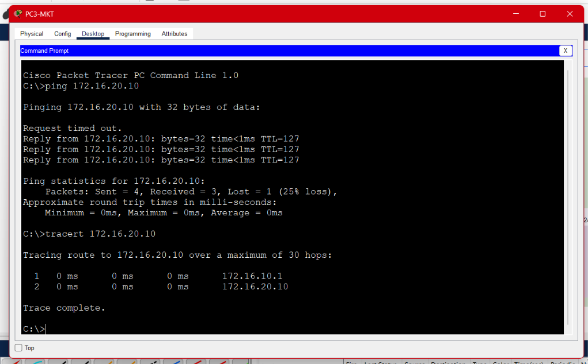

---

## 8. Análisis técnico

**¿Qué método es más eficiente para una red empresarial de alto tráfico?**

El **Switch de Capa 3 con SVIs** es el método más eficiente para una red empresarial de alto tráfico.

En **Router-on-a-Stick**, todo el tráfico entre VLANs sube por un único enlace troncal hacia el router y regresa por ese mismo enlace. Ese cable se convierte en un cuello de botella, porque su ancho de banda se comparte entre todas las VLANs y cada paquete lo atraviesa dos veces. Además, el router enruta por software (CPU), lo que agrega latencia a medida que crece el tráfico, y el enlace es un punto único de falla.

En el **Switch Capa 3**, el enrutamiento ocurre dentro del mismo equipo que conmuta las tramas. Se hace por hardware (ASICs y tablas CEF/TCAM), con velocidad de línea y menor latencia. No se necesita enlace troncal hacia un dispositivo externo ni un router adicional, lo que reduce hardware, cableado y puntos de falla, y escala mejor al agregar más VLANs (basta con crear otra SVI).

ROAS sigue siendo útil en redes pequeñas o de bajo presupuesto, donde ya existe un router y el volumen de tráfico entre VLANs es bajo.

| Aspecto | ROAS | Switch Capa 3 (SVI) |
|---|---|---|
| Dónde se enruta | Router externo | Dentro del switch |
| Tipo de enrutamiento | Software (CPU) | Hardware (ASIC) |
| Ancho de banda inter-VLAN | Limitado a un enlace trunk | Velocidad del backplane |
| Latencia | Mayor | Menor |
| Escalabilidad | Baja | Alta |
| Costo | Bajo (reutiliza router) | Mayor por equipo, menos dispositivos |
| Uso recomendado | Redes pequeñas | Redes empresariales / campus |
