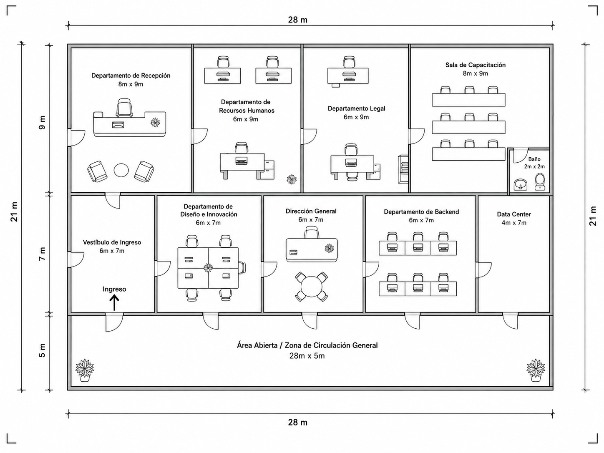

# Manual Técnico — Diseño de Infraestructura Física (Capa 1)
## QuetzalDev S.A. — Edificio Corporativo de un Nivel

**Curso:** Redes de Computadoras 1 — Segundo Semestre 2026
**Estudiante:** _(nombre)_
**Carné:** _(carné)_
**Práctica:** 1 — Diseño de Cableado Estructurado
**Fecha:** _(fecha de entrega)_

---

## Índice

1. [Resumen del diseño](#1-resumen-del-diseño)
2. [Interpretación del plano arquitectónico](#2-interpretación-del-plano-arquitectónico)
3. [Inventario de equipos](#3-inventario-de-equipos)
4. [Ubicación y justificación del MDF](#4-ubicación-y-justificación-del-mdf)
5. [Puntos de red y tipo de toma](#5-puntos-de-red-y-tipo-de-toma)
6. [Topología física por departamento](#6-topología-física-por-departamento)
7. [Medio de transmisión: tipo y categoría de cable](#7-medio-de-transmisión-tipo-y-categoría-de-cable)
8. [Cableado horizontal: distancias y bobinas](#8-cableado-horizontal-distancias-y-bobinas)
9. [Cableado troncal](#9-cableado-troncal)
10. [Equipo activo y dimensionamiento](#10-equipo-activo-y-dimensionamiento)
11. [Canalización](#11-canalización)
12. [Rack / gabinete del MDF](#12-rack--gabinete-del-mdf)
13. [Respaldo de energía (UPS)](#13-respaldo-de-energía-ups)
14. [Estándares T568A/T568B y disposición de pines](#14-estándares-t568at568b-y-disposición-de-pines)
15. [Etiquetado de cables y puertos](#15-etiquetado-de-cables-y-puertos)
16. [Comparación con el estándar TIA/EIA-606](#16-comparación-con-el-estándar-tiaeia-606)
17. [Flujo de conexión end-to-end](#17-flujo-de-conexión-end-to-end)
18. [Presupuesto estimado](#18-presupuesto-estimado)
19. [Consideraciones de escalabilidad futura](#19-consideraciones-de-escalabilidad-futura)
20. [Referencias](#20-referencias)

---

## 1. Resumen del diseño

> TODO — Párrafo corto (5–8 líneas): qué se diseñó, topología general adoptada
> (estrella extendida / árbol jerárquico), dónde quedó el MDF, cuántos puntos de red
> totales, qué medio se usó en troncal y en horizontal.

| Dato | Valor |
|---|---|
| Área del edificio | 28 m × 21 m = 588 m² |
| Niveles | 1 |
| Departamentos / áreas | 8 con equipo de red |
| Hosts totales | 42 equipos de cómputo + 6 servidores |
| Puntos de red totales | 48 |
| Ubicación del MDF | Data Center (4 m × 7 m) |
| Topología general | Árbol (estrella extendida) |

---

## 2. Interpretación del plano arquitectónico

> TODO — Describe la distribución leída del plano. Incluye la imagen:



| Área | Dimensiones | Fila |
|---|---|---|
| Departamento de Recepción | 8 m × 9 m | Superior |
| Departamento de Recursos Humanos | 6 m × 9 m | Superior |
| Departamento Legal | 6 m × 9 m | Superior |
| Sala de Capacitación | 8 m × 9 m | Superior |
| Baño | 2 m × 2 m | Superior |
| Vestíbulo de Ingreso | 6 m × 7 m | Media |
| Departamento de Diseño e Innovación | 6 m × 7 m | Media |
| Dirección General | 6 m × 7 m | Media |
| Departamento de Backend | 6 m × 7 m | Media |
| Data Center | 4 m × 7 m | Media |
| Área Abierta / Circulación General | 28 m × 5 m | Inferior |

---

## 3. Inventario de equipos

### 3.1 Distribución de hosts

| Departamento | PCs | Laptops | Servidores | Total hosts | Puntos de red |
|---|---:|---:|---:|---:|---:|
| Recepción | 2 | 1 | 1 | 4 | 4 |
| Recursos Humanos | 7 | 1 | 0 | 8 | 8 |
| Legal | 3 | 1 | 0 | 4 | 4 |
| Sala de Capacitación | 6 | 4 | 0 | 10 | 10 |
| Diseño e Innovación | 5 | 2 | 1 | 8 | 8 |
| Dirección General | 2 | 2 | 0 | 4 | 4 |
| Backend | 5 | 1 | 1 | 7 | 7 |
| Data Center | 0 | 0 | 3 | 3 | 3 |
| **TOTAL** | **30** | **12** | **6** | **48** | **48** |

> Verificación contra el enunciado: 30 PCs, 12 laptops, 6 servidores.

### 3.2 Equipo activo y pasivo propuesto

| # | Elemento | Cantidad | Ubicación | Función |
|---|---|---:|---|---|
| 1 | Switch principal (core) | 1 | MDF | TODO |
| 2 | Switches de departamento | 8 | Cada depto. | TODO |
| 3 | Patch panels | TODO | TODO | TODO |
| 4 | Rack / gabinete | TODO | TODO | TODO |
| 5 | Organizadores de cable | TODO | TODO | TODO |
| 6 | UPS | TODO | MDF | TODO |
| 7 | Tomas de red (faceplates) | TODO | Áreas de trabajo | TODO |
| 8 | Patch cords | TODO | Ambos extremos | TODO |
| 9 | Canalización (escalerilla/canaleta) | TODO m | Ver ruta | TODO |

---

## 4. Ubicación y justificación del MDF

**Ubicación seleccionada:** Data Center (4 m × 7 m), fila media, extremo derecho del plano.

### 4.1 Cálculo del centroide ponderado

Origen en la esquina superior izquierda del edificio. Peso = puntos de red por área.

| Área | Centro X (m) | Centro Y (m) | Peso |
|---|---:|---:|---:|
| Recepción | 4 | 4.5 | 4 |
| Recursos Humanos | 11 | 4.5 | 8 |
| Legal | 17 | 4.5 | 4 |
| Sala de Capacitación | 24 | 4.5 | 10 |
| Diseño e Innovación | 9 | 12.5 | 8 |
| Dirección General | 15 | 12.5 | 4 |
| Backend | 21 | 12.5 | 7 |
| Data Center | 26 | 12.5 | 3 |

- **X̄ ≈ 16.0 m**
- **Ȳ ≈ 8.2 m**

### 4.2 Justificación

1. **Espacio técnico dedicado.** TODO — desarrollar (TIA-569, acceso controlado, sin tránsito).
2. **Concentración de servicios críticos.** TODO — ya alberga 3 servidores principales.
3. **Acceso al eje de canalización.** TODO — adyacencia con el Área Abierta 28×5 m.
4. **Desviación respecto al centroide y su descarte técnico.** TODO — recorrido más
   desfavorable (Recepción) ≈ 50 m, contra el límite de 90 m de TIA-568 para
   cableado horizontal. Demostrar la suma del recorrido.

---

## 5. Puntos de red y tipo de toma

| Departamento | Puertos requeridos | Tomas propuestas | Puertos instalados | Reserva |
|---|---:|---|---:|---:|
| Recepción | 4 | 2 dobles | 4 | 0 |
| Recursos Humanos | 8 | 4 dobles | 8 | 0 |
| Legal | 4 | 2 dobles | 4 | 0 |
| Sala de Capacitación | 10 | 5 dobles | 10 | 0 |
| Diseño e Innovación | 8 | 4 dobles | 8 | 0 |
| Dirección General | 4 | 2 dobles | 4 | 0 |
| Backend | 7 | 4 dobles | 8 | 1 |
| Data Center | 3 | 3 unitarias | 3 | 0 |

> TODO — Justificar el criterio: por qué doble en puestos de trabajo y unitaria en Data Center.

---

## 6. Topología física por departamento

| Departamento | Hosts | Topología | Criticidad | Justificación |
|---|---:|---|---|---|
| Recepción | 4 | TODO | TODO | TODO |
| Recursos Humanos | 8 | TODO | TODO | TODO |
| Legal | 4 | TODO | TODO | TODO |
| Sala de Capacitación | 10 | TODO | TODO | TODO |
| Diseño e Innovación | 8 | TODO | TODO | TODO |
| Dirección General | 4 | TODO | TODO | TODO |
| Backend | 7 | TODO | TODO | TODO |
| Data Center | 3 | TODO | TODO | TODO |
| **Edificio (global)** | 48 | TODO | — | TODO |

---

## 7. Medio de transmisión: tipo y categoría de cable

| Segmento | Medio | Categoría | Distancia máx. | Ancho de banda | Justificación |
|---|---|---|---:|---|---|
| Horizontal — oficinas | TODO | TODO | TODO | TODO | TODO |
| Horizontal — Data Center | TODO | TODO | TODO | TODO | TODO |
| Troncal MDF ↔ deptos. | TODO | TODO | TODO | TODO | TODO |
| Patch cords | TODO | TODO | TODO | TODO | TODO |

---

## 8. Cableado horizontal: distancias y bobinas

| Departamento | Puntos | Dist. mín. (m) | Dist. máx. (m) | Dist. promedio (m) | Holgura (%) | Cable total (m) |
|---|---:|---:|---:|---:|---:|---:|
| Recepción | 4 | TODO | TODO | TODO | 10 | TODO |
| Recursos Humanos | 8 | TODO | TODO | TODO | 10 | TODO |
| Legal | 4 | TODO | TODO | TODO | 10 | TODO |
| Sala de Capacitación | 10 | TODO | TODO | TODO | 10 | TODO |
| Diseño e Innovación | 8 | TODO | TODO | TODO | 10 | TODO |
| Dirección General | 4 | TODO | TODO | TODO | 10 | TODO |
| Backend | 7 | TODO | TODO | TODO | 10 | TODO |
| Data Center | 3 | TODO | TODO | TODO | 10 | TODO |
| **TOTAL** | **48** | — | — | — | — | **TODO** |

**Cálculo de bobinas:** bobina estándar = 305 m.

> TODO — total de metros ÷ 305 = N bobinas → redondear hacia arriba.

---

## 9. Cableado troncal

| Enlace | Origen | Destino | Medio | Distancia (m) | Velocidad uplink | Justificación |
|---|---|---|---|---:|---|---|
| MDF-Recepcion | Switch core | SW-REC | TODO | TODO | TODO | TODO |
| MDF-RRHH | Switch core | SW-RRHH | TODO | TODO | TODO | TODO |
| MDF-Legal | Switch core | SW-LEG | TODO | TODO | TODO | TODO |
| MDF-Capacitacion | Switch core | SW-CAP | TODO | TODO | TODO | TODO |
| MDF-Diseno | Switch core | SW-DIS | TODO | TODO | TODO | TODO |
| MDF-Direccion | Switch core | SW-DIR | TODO | TODO | TODO | TODO |
| MDF-Backend | Switch core | SW-BAK | TODO | TODO | TODO | TODO |
| MDF-DataCenter | Switch core | SW-DC | TODO | TODO | TODO | TODO |

---

## 10. Equipo activo y dimensionamiento

### 10.1 Dimensionamiento de patch panels y switches

| Ubicación | Puntos de red | Patch panel | Switch propuesto | Puertos libres |
|---|---:|---|---|---:|
| Recepción | 4 | TODO | TODO | TODO |
| Recursos Humanos | 8 | TODO | TODO | TODO |
| Legal | 4 | TODO | TODO | TODO |
| Sala de Capacitación | 10 | TODO | TODO | TODO |
| Diseño e Innovación | 8 | TODO | TODO | TODO |
| Dirección General | 4 | TODO | TODO | TODO |
| Backend | 7 | TODO | TODO | TODO |
| Data Center | 3 | TODO | TODO | TODO |
| **MDF (troncales)** | TODO | TODO | TODO | TODO |

> Regla del enunciado: el switch debe tener una cantidad de puertos **igual o mayor**
> a la del patch panel correspondiente.

### 10.2 Justificación de cada elemento

> TODO — Un párrafo por elemento: switch core, switches de acceso, patch panel,
> organizadores, ODF (si aplica), UPS. Explicar su función dentro del flujo de conexión.

---

## 11. Canalización

| Tramo | Tipo de canalización | Justificación |
|---|---|---|
| Troncal (Área Abierta) | TODO | TODO |
| Horizontal (dentro de deptos.) | TODO | TODO |
| Bajadas a tomas | TODO | TODO |

---

## 12. Rack / gabinete del MDF

> TODO — Decidir rack de piso vs. gabinete de pared. Justificar con:
> unidades de rack (U) requeridas, peso, equipo a alojar, crecimiento futuro.

| Equipo | Unidades (U) |
|---|---:|
| Switch core | TODO |
| Patch panel MDF | TODO |
| Organizadores | TODO |
| UPS | TODO |
| Servidores del Data Center | TODO |
| **Total U ocupadas** | **TODO** |
| **Rack propuesto** | **TODO U** |

---

## 13. Respaldo de energía (UPS)

| Equipo | Cantidad | Consumo unitario (W) | Consumo total (W) |
|---|---:|---:|---:|
| Switch core | 1 | TODO | TODO |
| Switches de acceso | 8 | TODO | TODO |
| Servidores (MDF) | 3 | TODO | TODO |
| **TOTAL** | | | **TODO W** |

- Factor de potencia asumido: TODO
- Potencia aparente: TODO VA
- Margen de crecimiento (25 %): TODO VA
- **UPS recomendada:** TODO VA / TODO W — autonomía estimada TODO min

---

## 14. Estándares T568A/T568B y disposición de pines

**Estándar adoptado:** TODO (A o B) — justificar.

> Regla del enunciado: el cableado horizontal debe poncharse bajo el **mismo estándar
> en ambos extremos** (toma de red y patch panel).

### 14.1 Disposición de pines — T568B

| Pin | Color |
|---:|---|
| 1 | Blanco/Naranja |
| 2 | Naranja |
| 3 | Blanco/Verde |
| 4 | Azul |
| 5 | Blanco/Azul |
| 6 | Verde |
| 7 | Blanco/Café |
| 8 | Café |

### 14.2 Disposición de pines — T568A

| Pin | Color |
|---:|---|
| 1 | Blanco/Verde |
| 2 | Verde |
| 3 | Blanco/Naranja |
| 4 | Azul |
| 5 | Blanco/Azul |
| 6 | Naranja |
| 7 | Blanco/Café |
| 8 | Café |

### 14.3 Cable straight-through (T568B – T568B)

| Pin | Extremo 1 | Extremo 2 |
|---:|---|---|
| 1 | Blanco/Naranja | Blanco/Naranja |
| 2 | Naranja | Naranja |
| 3 | Blanco/Verde | Blanco/Verde |
| 4 | Azul | Azul |
| 5 | Blanco/Azul | Blanco/Azul |
| 6 | Verde | Verde |
| 7 | Blanco/Café | Blanco/Café |
| 8 | Café | Café |

### 14.4 Cable crossover (T568A – T568B)

| Pin | Extremo 1 (T568A) | Extremo 2 (T568B) |
|---:|---|---|
| 1 | Blanco/Verde | Blanco/Naranja |
| 2 | Verde | Naranja |
| 3 | Blanco/Naranja | Blanco/Verde |
| 4 | Azul | Azul |
| 5 | Blanco/Azul | Blanco/Azul |
| 6 | Naranja | Verde |
| 7 | Blanco/Café | Blanco/Café |
| 8 | Café | Café |

### 14.5 Tipo de cable por enlace

| Enlace | Dispositivo A | Dispositivo B | Tipo de cable | Justificación técnica |
|---|---|---|---|---|
| TODO | TODO | TODO | TODO | TODO |

---

## 15. Etiquetado de cables y puertos

**Formato horizontal:** `[Área/Departamento]-[Número de Punto de Red]` → ej. `Recepcion-PR01`
**Formato troncal:** `MDF-[Área/Departamento]` → ej. `MDF-Recepcion`

| Etiqueta | Tipo | Origen | Destino | Puerto patch panel | Puerto switch |
|---|---|---|---|---|---|
| Recepcion-PR01 | Horizontal | TODO | TODO | TODO | TODO |
| TODO | | | | | |

> TODO — Completar las 48 filas horizontales + 8 troncales.

---

## 16. Comparación con el estándar TIA/EIA-606

| Aspecto | Esquema usado en la práctica | Exigencia de TIA/EIA-606 |
|---|---|---|
| Identificador | TODO | TODO |
| Codificación por colores | TODO | TODO |
| Registro de espacios y rutas | TODO | TODO |
| Documentación de administración | TODO | TODO |

**Diferencias concretas identificadas:**

1. TODO
2. TODO

**¿Por qué en un entorno real se usaría el estándar completo?**

> TODO — Un párrafo.

---

## 17. Flujo de conexión end-to-end

> TODO — Describir la cadena completa desde una PC hasta el switch core.

```
PC → patch cord → toma de red (faceplate) → cableado horizontal (dentro de canalización)
   → patch panel del departamento → patch cord → switch de departamento
   → enlace troncal → patch panel del MDF → switch core
```

> TODO — Explicar cada salto y qué etiqueta corresponde en cada tramo.

---

## 18. Presupuesto estimado

| # | Descripción | Cantidad | Unidad | Precio unitario (Q) | Subtotal (Q) |
|---|---|---:|---|---:|---:|
| 1 | TODO | | | | |
| | **TOTAL** | | | | **TODO** |

> TODO — Usar los catálogos de Siemon y Panduit indicados en el material de apoyo.
> Indicar fuente de cada precio.

### 18.1 Compra individual vs. proveedor externo

> TODO — Recomendado por el enunciado. Comparar ambas opciones.

---

## 19. Consideraciones de escalabilidad futura

> TODO — Puertos libres en patch panels, espacio en rack (U disponibles),
> capacidad de canalización, margen de la UPS, previsión de PoE / Wi-Fi.

---

## 20. Referencias

- Odom, Wendell. 2019. *CCNA 200-301 Official Cert Guide. Vol. 1*. Indianápolis: Cisco Press.
- ANSI/TIA-568 — Cableado de Telecomunicaciones para Edificios Comerciales.
- ANSI/TIA-569 — Rutas y Espacios de Telecomunicaciones.
- ANSI/TIA-606 — Administración de Infraestructura de Telecomunicaciones.
- Catálogo Siemon 2022.
- Catálogo Panduit — Infraestructura de Redes 2025.
