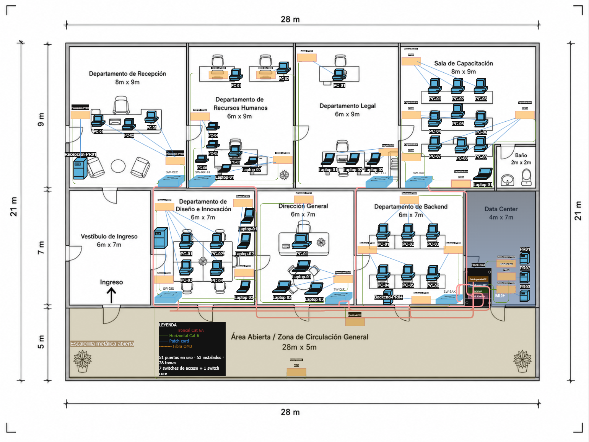

# Manual Técnico — Diseño de Infraestructura Física (Capa 1)
## QuetzalDev S.A. — Edificio Corporativo de un Nivel

**Curso:** Redes de Computadoras 1 — Segundo Semestre 2026
**Estudiante:** Carlos Javier Pérez Pocón
**Carné:** 202206425
**Plano asignado:** Terminación 4, 5
**Fecha:** 21/08/2026

---

## Índice

1. [Resumen ejecutivo del diseño](#1-resumen-ejecutivo-del-diseño)
2. [Interpretación del plano arquitectónico](#2-interpretación-del-plano-arquitectónico)
3. [Inventario de equipos](#3-inventario-de-equipos)
4. [Ubicación y justificación del MDF](#4-ubicación-y-justificación-del-mdf)
5. [Puntos de red y tipo de toma](#5-puntos-de-red-y-tipo-de-toma)
6. [Topología física por departamento](#6-topología-física-por-departamento)
7. [Medio de transmisión por segmento](#7-medio-de-transmisión-por-segmento)
8. [Cableado horizontal: distancias y bobinas](#8-cableado-horizontal-distancias-y-bobinas)
9. [Cableado troncal](#9-cableado-troncal)
10. [Equipo activo y dimensionamiento](#10-equipo-activo-y-dimensionamiento)
11. [Canalización](#11-canalización)
12. [Rack del MDF](#12-rack-del-mdf)
13. [Respaldo de energía (UPS)](#13-respaldo-de-energía-ups)
14. [Estándares T568A/T568B y disposición de pines](#14-estándares-t568at568b-y-disposición-de-pines)
15. [Etiquetado de cables y puertos](#15-etiquetado-de-cables-y-puertos)
16. [Comparación con el estándar TIA/EIA-606](#16-comparación-con-el-estándar-tiaeia-606)
17. [Flujo de conexión end-to-end](#17-flujo-de-conexión-end-to-end)
18. [Presupuesto estimado](#18-presupuesto-estimado)
19. [Consideraciones de escalabilidad futura](#19-consideraciones-de-escalabilidad-futura)
20. [Referencias](#20-referencias)

---

## 1. Resumen ejecutivo del diseño

Se diseñó la infraestructura de cableado estructurado de Capa 1 para el edificio corporativo de un nivel de QuetzalDev S.A., de 28 m × 21 m (588 m²), distribuido en ocho departamentos con equipo de red, un vestíbulo de ingreso, un baño y un área abierta de circulación general.

El diseño adopta una **topología en árbol (estrella extendida)**: cada departamento opera como una estrella independiente cuyo nodo central es su switch de acceso, y todos los switches convergen en un switch core alojado en el cuarto de telecomunicaciones (MDF), ubicado en el Data Center. Sobre esta estructura se implementa un **componente de malla parcial**: un enlace redundante en fibra óptica hacia el Departamento de Backend, el único segmento cuya criticidad justifica el sobrecosto de la redundancia.

| Dato | Valor |
|---|---|
| Área del edificio | 588 m² (28 m × 21 m) |
| Niveles | 1 |
| Departamentos con equipo de red | 8 |
| Hosts de cómputo | 30 PCs + 12 laptops = 42 |
| Servidores | 6 |
| Puertos de red requeridos | 51 |
| Puertos de red instalados | 53 |
| Tomas físicas | 28 |
| Switches de acceso | 7 |
| Switch core | 1 |
| Ubicación del MDF | Data Center (4 m × 7 m) |
| Medio horizontal | UTP Cat 6 |
| Medio troncal | UTP Cat 6A + fibra OM3 (redundante) |
| Topología general | Árbol con malla parcial |

---

## 2. Interpretación del plano arquitectónico

El plano base define un edificio rectangular de un solo nivel organizado en tres franjas horizontales:

| Área | Dimensiones | Franja |
|---|---|---|
| Departamento de Recepción | 8 m × 9 m | Superior |
| Departamento de Recursos Humanos | 6 m × 9 m | Superior |
| Departamento Legal | 6 m × 9 m | Superior |
| Sala de Capacitación | 8 m × 9 m | Superior |
| Baño | 2 m × 2 m | Superior (esquina) |
| Vestíbulo de Ingreso | 6 m × 7 m | Media |
| Departamento de Diseño e Innovación | 6 m × 7 m | Media |
| Dirección General | 6 m × 7 m | Media |
| Departamento de Backend | 6 m × 7 m | Media |
| Data Center | 4 m × 7 m | Media |
| Área Abierta / Circulación General | 28 m × 5 m | Inferior |

**Observaciones relevantes para el diseño de red:**

1. El **Área Abierta de 28 m × 5 m** recorre todo el ancho del edificio y comunica con todos los departamentos de la franja media mediante puertas. Constituye el único eje continuo disponible y por ello se designa como ruta principal de canalización troncal.

2. El **Data Center** es el único espacio técnico del plano, no tiene mobiliario de oficina y se ubica en el extremo derecho de la franja media, contiguo al Departamento de Backend.

3. Los departamentos de la **franja superior** no tienen acceso directo al Área Abierta: sus troncales deben descender por el muro divisorio entre franjas antes de incorporarse al eje de canalización.

4. El **Vestíbulo de Ingreso** y el **Baño** no albergan equipo de cómputo y quedan excluidos del diseño de puntos de red.



---

## 3. Inventario de equipos

### 3.1 Distribución de hosts

La distribución de las 30 PCs y 12 laptops entre departamentos se realizó con criterio de **perfil de movilidad** del puesto de trabajo, no mediante reparto uniforme. Los puestos de atención presencial y de cómputo intensivo reciben estaciones fijas; los puestos con agenda externa frecuente reciben equipos portátiles.

| Departamento | PCs | Laptops | Servidores | Total hosts | Criterio de la mezcla |
|---|---:|---:|---:|---:|---|
| Recepción | 3 | 0 | 1 | 4 | Atención presencial permanente; puesto fijo |
| Recursos Humanos | 6 | 2 | 0 | 8 | Dos laptops para reclutamiento y ferias de empleo externas |
| Legal | 1 | 3 | 0 | 4 | Audiencias, notarías y visitas a cliente: perfil mayoritariamente móvil |
| Sala de Capacitación | 9 | 1 | 0 | 10 | 9 estaciones fijas (3 filas × 3 puestos según mobiliario del plano) + laptop del instructor |
| Diseño e Innovación | 4 | 3 | 1 | 8 | UI/UX y QA presentan y prueban en campo; Data Analytics requiere estación fija |
| Dirección General | 1 | 3 | 0 | 4 | Dirección y asistentes con agenda externa frecuente |
| Backend | 6 | 0 | 1 | 7 | Compilación y contenedores locales exigen estación de escritorio |
| Data Center | 0 | 0 | 3 | 3 | Servidores principales en rack |
| **TOTAL** | **30** | **12** | **6** | **48** | |

> **Verificación contra el enunciado:** la distribución suma exactamente 30 PCs, 12 laptops y 6 servidores, conforme a las cantidades establecidas.

La distribución es deliberadamente asimétrica. Legal y Dirección General invierten la proporción respecto al resto del edificio (más portátiles que estaciones fijas), mientras que Backend y Recepción no reciben ninguna laptop. Esta asimetría responde al perfil funcional de cada área y tiene consecuencia directa en el diseño: al concentrarse 6 de las 12 laptops en Legal y Dirección General, se justifica la provisión de puntos de red destinados a acceso inalámbrico (sección 5.3).

### 3.2 Inventario de equipo activo y pasivo

| # | Elemento | Cantidad | Ubicación | Función en el flujo de conexión |
|---|---|---:|---|---|
| 1 | Switch core 48 puertos | 1 | MDF | Nodo raíz del árbol; concentra los siete enlaces troncales y los tres servidores del Data Center |
| 2 | Switch de acceso 24 puertos | 4 | RRHH, Capacitación, Diseño, Backend | Nodo central de la estrella departamental en segmentos de 8 o más puertos |
| 3 | Switch de acceso 8 puertos | 3 | Recepción, Legal, Dirección General | Nodo central de la estrella en segmentos de 4 puertos |
| 4 | Patch panel 48 puertos | 1 | MDF | Terminación ordenada del cableado troncal y de los servidores del DC |
| 5 | Patch panel 24 puertos | 4 | RRHH, Capacitación, Diseño, Backend | Terminación del cableado horizontal en gabinetes departamentales |
| 6 | Patch panel 12 puertos | 3 | Recepción, Legal, Dirección General | Terminación del cableado horizontal en segmentos pequeños |
| 7 | ODF 6 puertos LC | 1 | MDF | Terminación y protección del enlace de fibra hacia Backend |
| 8 | Rack de piso 24U | 1 | MDF | Alojamiento del equipo activo y pasivo central |
| 9 | Gabinete de pared 6U | 7 | Cada departamento | Alojamiento del switch y patch panel de acceso |
| 10 | UPS 3000 VA | 1 | MDF | Respaldo de energía del equipo activo y servidores |
| 11 | Organizadores de cable 1U | 4 | MDF | Guiado de patch cords; evita radios de curvatura excesivos |
| 12 | Tomas de red (faceplates) | 28 | Áreas de trabajo | Punto de terminación del cableado horizontal del lado del usuario |
| 13 | Patch cords Cat 6 (1–3 m) | 60 | Ambos extremos | Conexión host↔toma y patch panel↔switch |
| 14 | Escalerilla metálica abierta | ~40 m | Área Abierta y descensos | Canalización del cableado troncal |
| 15 | Canaleta plástica cerrada | ~120 m | Interior de departamentos | Canalización del cableado horizontal |

---

## 4. Ubicación y justificación del MDF

**Ubicación seleccionada:** Data Center (4 m × 7 m), franja media, extremo derecho del edificio.

### 4.1 Cálculo del centroide ponderado

Para fundamentar la decisión con criterio cuantitativo y no solo cualitativo, se calculó el centroide del edificio ponderado por la cantidad de puertos de red de cada área. El origen se sitúa en la esquina superior izquierda del edificio.

| Área | Centro X (m) | Centro Y (m) | Peso (puertos) |
|---|---:|---:|---:|
| Recepción | 4 | 4.5 | 4 |
| Recursos Humanos | 11 | 4.5 | 8 |
| Legal | 17 | 4.5 | 4 |
| Sala de Capacitación | 24 | 4.5 | 12 |
| Diseño e Innovación | 9 | 12.5 | 8 |
| Dirección General | 15 | 12.5 | 4 |
| Backend | 21 | 12.5 | 8 |
| Data Center | 26 | 12.5 | 3 |

**X̄ = Σ(xᵢ · wᵢ) / Σwᵢ ≈ 16.0 m**
**Ȳ = Σ(yᵢ · wᵢ) / Σwᵢ ≈ 8.2 m**

El punto teórico de mínima distancia promedio se sitúa cerca del límite entre el Departamento Legal y Dirección General, aproximadamente a 10 m del Data Center.

### 4.2 Justificación de la ubicación elegida

La ubicación del MDF **no coincide con el centroide teórico**, y esa desviación es una decisión deliberada de diseño sustentada en cuatro razones:

**1. Es el único espacio técnico dedicado del plano.**
La norma ANSI/TIA-569 establece que el cuarto de telecomunicaciones debe ser un espacio exclusivo, con acceso controlado y sin tránsito de personal ajeno a la función. El punto teórico del centroide cae dentro de oficinas activas (Legal / Dirección General), donde instalar un MDF implicaría sacrificar área productiva, exponer el equipo a manipulación no autorizada y violar el principio de espacio dedicado.

**2. Concentra los servicios críticos en un solo punto.**
El Data Center ya alberga los tres servidores principales del edificio. Ubicar el MDF allí concentra en un mismo espacio la alimentación eléctrica respaldada, el sistema de aterrizaje, el control de temperatura y el equipo activo central, reduciendo costos de acondicionamiento y simplificando el mantenimiento.

**3. Tiene acceso directo al eje de canalización.**
El Data Center es contiguo al Área Abierta (28 m × 5 m), la única ruta continua que comunica con todos los departamentos. Esto permite un trazado troncal limpio, sin atravesar oficinas ni requerir perforaciones adicionales en muros divisorios.

**4. La desviación no compromete el rendimiento, y se demuestra numéricamente.**
El recorrido más desfavorable corresponde a Recepción, el departamento más alejado. Su cálculo por ruta real de cable es:

| Tramo | Metros |
|---|---:|
| Bajada del punto de red al nivel de canalización | 3.0 |
| Recorrido interno de Recepción hasta el muro divisorio | 9.0 |
| Descenso al Área Abierta | 2.0 |
| Recorrido por el Área Abierta hasta el Data Center | 24.0 |
| Ingreso al MDF y subida al rack | 2.5 |
| **Subtotal** | **40.5** |
| Holgura de instalación y reserva de terminación (10 %) | 4.1 |
| **Total del enlace más largo** | **≈ 45 m** |

El límite establecido por ANSI/TIA-568 para el enlace permanente de cableado horizontal es de **90 m**, ampliable a 100 m considerando patch cords. El recorrido más desfavorable del edificio utiliza **la mitad del presupuesto de distancia disponible**, por lo que la desviación respecto al centroide teórico no genera ninguna restricción técnica.

> **Conclusión:** se privilegia el cumplimiento normativo, la seguridad física y la eficiencia de canalización por sobre la optimización pura de distancia promedio, dado que esta última no representa una restricción activa en un edificio de estas dimensiones.

---

## 5. Puntos de red y tipo de toma

### 5.1 Criterio de dimensionamiento

Se adoptó como criterio general la **toma doble en todo puesto de trabajo**, reservando un puerto para el equipo y otro para expansión (telefonía IP, segundo dispositivo o equipo de reemplazo durante mantenimiento). Este criterio incrementa marginalmente el costo de faceplates pero elimina la necesidad de reintervenir la obra civil ante crecimiento, que es el rubro más caro de una ampliación posterior.

Se establecieron tres excepciones:

- **Toma cuádruple** en el puesto del instructor de la Sala de Capacitación, que debe atender simultáneamente la laptop del instructor, un proyector de red, un punto de acceso inalámbrico y un equipo de demostración.
- **Tomas unitarias** en el Data Center, donde los servidores se terminan directamente en el patch panel del rack sin faceplate de pared intermedio.
- **Tomas unitarias** en los puntos destinados a acceso inalámbrico del Área Abierta y el pasillo, que atienden un único dispositivo (el AP).

### 5.2 Distribución de tomas

| Departamento | Puertos requeridos | Tomas instaladas | Puertos instalados | Reserva |
|---|---:|---|---:|---:|
| Recepción | 4 | 2 dobles | 4 | 0 |
| Recursos Humanos | 8 | 4 dobles | 8 | 0 |
| Legal | 4 | 2 dobles | 4 | 0 |
| Sala de Capacitación | 11 | 4 dobles + 1 cuádruple | 12 | 1 |
| Diseño e Innovación | 8 | 4 dobles | 8 | 0 |
| Dirección General | 4 | 2 dobles | 4 | 0 |
| Backend | 7 | 4 dobles | 8 | 1 |
| Data Center | 3 | 3 unitarias | 3 | 0 |
| Área Abierta (AP) | 1 | 1 unitaria | 1 | 0 |
| Pasillo Legal/Dirección (AP) | 1 | 1 unitaria | 1 | 0 |
| **TOTAL** | **51** | **28 tomas** | **53** | **2** |

### 5.3 Justificación de los puntos para acceso inalámbrico

El inventario concentra **12 laptops**, de las cuales 6 se ubican en Legal y Dirección General, donde constituyen la mayoría del parque de equipos. Un diseño exclusivamente cableado obligaría a esos equipos a operar anclados a un punto fijo, lo que contradice el perfil de movilidad que motivó su asignación.

Se proveen por tanto **tres puntos de red destinados a puntos de acceso inalámbrico**:

| Punto | Ubicación | Cobertura prevista |
|---|---|---|
| `AreaAbierta-AP01` | Centro del Área Abierta | Zona de circulación general y accesos a franja media |
| `Pasillo-AP02` | Muro entre Legal y Dirección General | Ambos departamentos, donde se concentran 6 de las 12 laptops |
| `Capacitacion-AP05` | Puesto del instructor | Sala de Capacitación durante sesiones de formación |

> **Alcance:** estos son **puntos de red cableados** dimensionados para soportar PoE+, no equipo inalámbrico configurado. El diseño y configuración de la red WLAN queda fuera del alcance de esta práctica, que se limita a la Capa 1 del modelo OSI. La previsión consiste en dejar el cableado instalado y el presupuesto de puertos reservado.

---

## 6. Topología física por departamento

### 6.1 Estructura en dos niveles

El diseño distingue dos niveles topológicos con criterios independientes:

**Nivel de acceso (cableado horizontal):** topología en **estrella** en los ocho segmentos, sin excepción. Cada punto de red mantiene un enlace dedicado y exclusivo hacia el switch de su departamento.

**Nivel troncal (MDF ↔ switches de acceso):** aquí se introduce diferenciación según la criticidad del segmento, mediante la asignación de enlaces simples o redundantes.

### 6.2 Justificación de la topología en estrella

La selección de estrella para la totalidad del cableado horizontal responde a cinco razones:

1. **Aislamiento de fallos.** La interrupción de un enlace afecta exclusivamente al host servido por ese enlace. En topologías de bus o anillo, un cable dañado degrada o interrumpe el segmento completo.

2. **Diagnóstico puerto a puerto.** El origen de una falla se localiza en el puerto correspondiente sin necesidad de interrumpir el servicio de los demás usuarios, lo que reduce el tiempo medio de reparación.

3. **Escalabilidad incremental.** Agregar un host requiere únicamente tender un cable adicional y ocupar un puerto libre, sin modificar la infraestructura existente ni interrumpir el servicio.

4. **Cumplimiento normativo.** ANSI/TIA-568 establece la topología en estrella como la configuración requerida para el cableado horizontal en edificios comerciales. Cualquier alternativa quedaría fuera de norma.

5. **Compatibilidad con el equipo activo disponible.** Los switches Ethernet operan nativamente en estrella. Implementar bus o anillo requeriría hardware específico fuera del mercado comercial actual y sin soporte del fabricante.

**Desventaja reconocida:** la estrella consume más metros de cable que una topología en bus, ya que cada host requiere un tendido independiente hasta el nodo central. Este mayor consumo se cuantifica en la sección 8 y representa aproximadamente 496 m de UTP Cat 6. El sobrecosto en material es marginal frente al costo de mano de obra de un rediseño posterior y frente al costo operativo de las interrupciones que las topologías compartidas producirían.

### 6.3 Asignación por departamento

| Departamento | Puertos | Topología horizontal | Criticidad | Enlace troncal | Justificación |
|---|---:|---|---|---|---|
| Backend | 8 | Estrella | **Alta** | Doble: Cat 6A + fibra OM3 | Aloja el servidor de desarrollo y las estaciones de compilación. En una empresa de desarrollo de software, la interrupción de este segmento detiene la actividad productiva central del negocio |
| Data Center | 3 | Estrella (directa al core) | **Crítica** | No aplica: conexión directa | Sus servidores se conectan al switch core alojado en el mismo rack, eliminando el enlace troncal como punto de falla |
| Diseño e Innovación | 8 | Estrella | Media-alta | Simple Cat 6A | Incluye QA, UI/UX y Data Analytics con servidor local. Volumen de tráfico elevado, pero tolera una interrupción breve sin detener la operación |
| Recepción | 4 | Estrella | Media | Simple Cat 6A | Aloja el servidor de control de acceso y registro de visitas. Bajo tráfico pero servicio de operación continua durante horario laboral |
| Recursos Humanos | 8 | Estrella | Media | Simple Cat 6A | Densidad de hosts alta, pero el tráfico es ofimático y sin criticidad operativa inmediata |
| Dirección General | 4 | Estrella | Media | Simple Cat 6A | Pocos hosts; el perfil mayoritariamente móvil reduce la dependencia del punto fijo |
| Legal | 4 | Estrella | Baja | Simple Cat 6A | Menor densidad del edificio y perfil predominantemente móvil |
| Sala de Capacitación | 12 | Estrella | Baja | Simple Cat 6A | Mayor densidad de puertos del edificio, pero uso intermitente y no vinculado a la operación productiva |

### 6.4 Topología resultante del edificio

**Árbol (estrella extendida) con malla parcial.**

La estructura general es un árbol de dos niveles: ocho estrellas departamentales cuyos nodos centrales convergen en un switch core. Sobre esta base se superpone un **componente de malla parcial**, constituido por el enlace redundante en fibra óptica hacia el Departamento de Backend.

La redundancia es **selectiva y no generalizada**. Redundar los siete enlaces troncales duplicaría el costo del cableado vertical, el número de puertos requeridos en el switch core y la complejidad de administración, sin beneficio proporcional: la interrupción temporal de Legal, Capacitación o Recepción no detiene la operación de la empresa. Se redunda únicamente el segmento cuya indisponibilidad tiene impacto directo sobre la actividad productiva.

Esta decisión materializa el balance entre **costo, escalabilidad y tolerancia a fallos** que exige el enunciado: se acepta un punto único de falla en los segmentos de baja criticidad a cambio de concentrar la inversión en redundancia donde efectivamente se requiere.

---

## 7. Medio de transmisión por segmento

| Segmento | Medio | Categoría / tipo | Distancia máxima real | Ancho de banda soportado | Justificación |
|---|---|---|---:|---|---|
| Horizontal — oficinas | Cobre UTP | Cat 6 U/UTP, 4 pares, 23 AWG, cubierta CM | ~28 m | 1 Gbps a 100 m; 10 Gbps hasta 55 m | Ningún tendido horizontal supera los 28 m, muy por debajo del límite de 55 m para 10GBASE-T. Cat 6 soporta la migración a 10 Gbps sin recablear. Cat 6A representaría un sobrecosto aproximado del 40 % sin beneficio aprovechable a estas distancias |
| Horizontal — Data Center | Cobre | Cat 6A F/UTP, 4 pares | ~6 m | 10 Gbps a 100 m | La alta densidad de cables en rack genera diafonía exógena (*alien crosstalk*). El blindaje F/UTP la mitiga. Al tratarse de tendidos muy cortos, el sobrecosto del blindaje es marginal |
| Horizontal — puntos AP | Cobre UTP | Cat 6 U/UTP, 23 AWG | ~22 m | 1 Gbps + PoE+ (30 W) | Debe alimentar el punto de acceso por el mismo cable. El calibre 23 AWG reduce la caída de tensión y la elevación térmica frente al 24 AWG en aplicaciones PoE |
| Troncal — MDF ↔ switches | Cobre | Cat 6A U/FTP, 4 pares | ~24 m | 10 Gbps de uplink | Ver análisis comparativo en la sección 9.2 |
| Troncal redundante — Backend | Fibra óptica | OM3 multimodo dúplex, conector LC | ~8 m | 10 Gbps | Diversidad de medio en el único enlace crítico. Ver justificación en la sección 9.3 |
| Patch cords | Cobre | Cat 6 conductor flexible (*stranded*), 1–3 m | 3 m | 1 Gbps | El conductor sólido se fractura ante la manipulación repetida propia de un patch cord. El conductor flexible tolera flexión cíclica sin degradación |

> **Nota sobre el conductor:** todo el cableado horizontal y troncal utiliza conductor sólido, adecuado para tendidos fijos dentro de canalización y para terminación por desplazamiento de aislamiento (IDC) en patch panels y jacks. Únicamente los patch cords emplean conductor flexible.

---

## 8. Cableado horizontal: distancias y bobinas

### 8.1 Método de estimación

Las distancias se estimaron por **ruta real de cable**, no por línea recta. El cable no atraviesa muros ni mobiliario: desciende desde el punto de red hasta el nivel de canalización, recorre la canaleta perimetral del departamento y asciende hasta el gabinete del switch. La estimación por tramos considera:

```
Distancia total = bajada del punto (3 m)
                + recorrido horizontal en canalización
                + subida al gabinete (2 m)
                + holgura de instalación y terminación (15 %)
```

Se aplicó un promedio por departamento multiplicado por la cantidad de puertos, criterio admitido por el enunciado, que solicita un cálculo aproximado con base en la escala del plano.

### 8.2 Estimación por departamento

Las distancias siguientes se obtuvieron aplicando el método descrito sobre la escala del plano arquitectónico y el trazado de canalización definido en la sección 11. Corresponden a estimaciones de diseño, conforme a lo solicitado por el enunciado; la medición exacta de cada tendido se realiza durante el replanteo previo a la instalación.

| Departamento | Puertos | Recorrido promedio (m) | Subtotal (m) | Holgura 15 % (m) | Total (m) |
|---|---:|---:|---:|---:|---:|
| Recepción | 4 | 12 | 48 | 7.2 | 55.2 |
| Recursos Humanos | 8 | 8 | 64 | 9.6 | 73.6 |
| Legal | 4 | 8 | 32 | 4.8 | 36.8 |
| Sala de Capacitación | 12 | 9 | 108 | 16.2 | 124.2 |
| Diseño e Innovación | 8 | 7 | 56 | 8.4 | 64.4 |
| Dirección General | 4 | 7 | 28 | 4.2 | 32.2 |
| Backend | 8 | 7 | 56 | 8.4 | 64.4 |
| Data Center | 3 | 3 | 9 | 1.4 | 10.4 |
| Puntos AP | 2 | 15 | 30 | 4.5 | 34.5 |
| **TOTAL** | **53** | — | **431** | **64.7** | **495.7** |

### 8.3 Cálculo de bobinas

**Cableado horizontal — UTP Cat 6 (bobina estándar de 305 m):**

```
495.7 m ÷ 305 m = 1.63 bobinas  →  2 bobinas
Sobrante: 610 − 495.7 = 114.3 m disponibles para reserva y reposición
```

**Cableado horizontal — UTP Cat 6A blindado (Data Center):**
Los 10.4 m del Data Center se cubren con patch cords preterminados de fábrica, evitando la compra de una bobina completa para un tramo tan corto.

**Cableado troncal — UTP Cat 6A (bobina estándar de 305 m):**

| Enlace troncal | Distancia estimada (m) |
|---|---:|
| MDF ↔ SW-REC | 24 |
| MDF ↔ SW-RRHH | 17 |
| MDF ↔ SW-LEG | 11 |
| MDF ↔ SW-CAP | 4 |
| MDF ↔ SW-DIS | 17 |
| MDF ↔ SW-DIR | 11 |
| MDF ↔ SW-BAK | 5 |
| **Subtotal** | **89** |
| Holgura 20 % (mayor por descensos verticales) | 17.8 |
| **Total** | **106.8** |

```
106.8 m ÷ 305 m = 0.35 bobinas  →  1 bobina
```

**Fibra óptica OM3:**
El enlace único de 8 m se adquiere como **cable preterminado de 15 m con conectores LC dúplex de fábrica**. No se justifica adquirir bobina ni realizar fusión en campo para un solo enlace: el costo del equipo de fusión y la mano de obra especializada superan varias veces el del cable preterminado.

### 8.4 Resumen de compra de cable

| Material | Cantidad | Presentación |
|---|---:|---|
| UTP Cat 6 U/UTP | 2 | Bobinas de 305 m |
| UTP Cat 6A U/FTP | 1 | Bobina de 305 m |
| Fibra OM3 dúplex LC-LC | 1 | Cable preterminado de 15 m |
| Patch cords Cat 6A 1 m (Data Center) | 6 | Unidades preterminadas |

---

## 9. Cableado troncal

### 9.1 Definición de la ruta troncal

El cableado troncal interconecta el switch core del MDF con el switch de acceso de cada departamento. La ruta adoptada es:

```
Switch core (MDF, Data Center)
   → Patch panel 48P del rack
   → Escalerilla metálica por el Área Abierta (eje longitudinal, 28 m)
   → Descenso o ascenso al departamento correspondiente
   → Patch panel del gabinete departamental
   → Switch de acceso
```

Todos los troncales convergen en el eje del Área Abierta. Los departamentos de la franja media acceden directamente; los de la franja superior requieren un tramo de ascenso por el muro divisorio entre franjas antes de incorporarse al eje.

Esta decisión —hacer converger todo el troncal en un único eje— tiene tres consecuencias favorables: concentra la canalización en un solo elemento, facilita la inspección y el mantenimiento sin ingresar a oficinas, y permite ampliaciones futuras sin nueva obra civil.

### 9.2 Análisis comparativo: cobre frente a fibra en el troncal principal

Se evaluó la implementación de fibra óptica OM3 para la totalidad del cableado troncal y **se descartó**. El razonamiento:

La distancia máxima entre el MDF y el switch de acceso más lejano (Recepción) es de aproximadamente **24 m**, muy por debajo del límite de 100 m del cobre balanceado. En ese rango, un enlace de fibra requiere adicionalmente:

- Dos transceptores SFP+ por enlace (uno en cada extremo)
- Puertos SFP+ disponibles en ambos switches, lo que encarece el equipo activo
- Un ODF de terminación por cada extremo
- Mano de obra especializada para terminación o fusión

El costo total por enlace resulta entre **tres y cuatro veces superior** al de un enlace equivalente en Cat 6A, sin ganancia alguna en velocidad, latencia ni capacidad. Ambos medios entregan 10 Gbps en las distancias involucradas.

**Decisión:** los siete enlaces troncales principales se implementan en **UTP Cat 6A U/FTP**, que entrega 10 Gbps de uplink a 100 m, incorpora blindaje contra diafonía exógena en los tramos donde los cables corren agrupados por la escalerilla, y utiliza los puertos RJ45 nativos de los switches sin hardware adicional.

### 9.3 Justificación del enlace redundante en fibra

No obstante lo anterior, el enlace redundante hacia el Departamento de Backend **sí se implementa en fibra óptica OM3**. La razón no es la distancia sino la **diversidad de medio**.

Un enlace redundante tendido en el mismo medio y por la misma canalización que el principal comparte modos de falla: una sobretensión inducida, una fuente de interferencia electromagnética o un daño físico a la escalerilla afectarían simultáneamente a ambos enlaces, anulando el propósito de la redundancia.

La fibra óptica es un medio **dieléctrico**: no conduce corriente, es inmune a la interferencia electromagnética y no propaga sobretensiones. Un evento eléctrico que degrade el enlace de cobre no afecta al de fibra. Adicionalmente, ambos enlaces se tienden por rutas físicas separadas dentro del edificio.

Esta decisión justifica la inclusión del **ODF de 6 puertos** en el rack del MDF y de un módulo SFP+ en cada extremo del enlace.

### 9.4 Caso particular del Data Center

El Data Center **no requiere switch de acceso ni enlace troncal**. Sus tres servidores se conectan directamente al switch core alojado en el mismo rack, mediante patch cords Cat 6A de menos de 3 m.

Esta decisión:

- Elimina un salto de red innecesario, reduciendo latencia hacia los servidores principales
- Suprime un punto único de falla: no existe enlace troncal que pueda interrumpirse
- Ahorra el costo de un switch de acceso y su gabinete
- Es la práctica habitual en cuartos de telecomunicaciones donde el equipo servido comparte rack con el equipo activo central

Por la misma razón, el enlace redundante en fibra se implementa **únicamente hacia Backend**: es el único segmento crítico que depende de un enlace troncal susceptible de falla.

---

## 10. Equipo activo y dimensionamiento

### 10.1 Regla de dimensionamiento aplicada

Conforme al enunciado, el patch panel de cada ubicación se dimensiona según la cantidad de puntos de red que termina, y el switch correspondiente debe tener una cantidad de puertos **igual o mayor** a la del patch panel.

### 10.2 Dimensionamiento por ubicación

| Ubicación | Puertos instalados | Patch panel | Switch | Puertos libres del switch | Reserva |
|---|---:|---|---|---:|---:|
| Recepción | 4 | 12 puertos | 8 puertos | 3 (4 + 1 uplink) | 37 % |
| Recursos Humanos | 8 | 24 puertos | 24 puertos | 15 (8 + 1 uplink) | 62 % |
| Legal | 4 | 12 puertos | 8 puertos | 3 | 37 % |
| Sala de Capacitación | 12 | 24 puertos | 24 puertos | 11 | 45 % |
| Diseño e Innovación | 8 | 24 puertos | 24 puertos | 15 | 62 % |
| Dirección General | 4 | 12 puertos | 8 puertos | 3 | 37 % |
| Backend | 8 | 24 puertos | 24 puertos + 1 SFP+ | 15 | 62 % |
| **MDF (switch core)** | **51** | **48 puertos** | **48 puertos + 2 SFP+** | **38** | **79 %** |

**Ocupación del switch core:** 7 enlaces troncales + 3 servidores del Data Center = 10 puertos ocupados de 48 disponibles.

**Nota de diseño sobre el patch panel del MDF.** El dimensionamiento a 48 puertos responde al criterio de dimensionar el patch panel del edificio según la cantidad total de puntos de red (51). Cabe señalar que, al definirse el cableado horizontal como el tramo entre el switch de departamento y los hosts, los enlaces que llegan físicamente al MDF son únicamente los siete troncales y los tres servidores del Data Center, es decir diez terminaciones. Se opta por el dimensionamiento mayor porque el costo adicional es reducido frente al beneficio: deja 38 puertos disponibles para incorporar futuros IDF, servidores o enlaces redundantes sin sustituir el elemento pasivo central, que es el de mayor impacto operativo al reemplazarse.

### 10.3 Justificación de cada elemento de equipo activo

**Switch core 48 puertos + 2 SFP+.**
Constituye el nodo raíz del árbol. Concentra los siete enlaces troncales de cobre, los tres servidores del Data Center y el enlace redundante de fibra hacia Backend. Se selecciona con 48 puertos conforme a la regla de dimensionamiento del enunciado, lo que además deja 38 puertos libres para crecimiento. Los dos puertos SFP+ permiten el enlace de fibra y una futura conexión de fibra adicional sin sustituir el equipo. Es el único punto del diseño por el que transita la totalidad del tráfico inter-departamental, por lo que se selecciona con capacidad de conmutación holgada.

**Switches de acceso de 24 puertos (4 unidades).**
Nodo central de la estrella en los departamentos de 8 o más puertos: Recursos Humanos, Sala de Capacitación, Diseño e Innovación y Backend. Se selecciona 24 puertos en lugar de 16 porque la diferencia de precio es reducida y la reserva resultante (entre 45 % y 62 %) absorbe crecimiento sin sustitución de equipo. El de Backend incorpora un puerto SFP+ para el enlace redundante de fibra.

**Switches de acceso de 8 puertos (3 unidades).**
Nodo central de la estrella en Recepción, Legal y Dirección General, segmentos de 4 puertos. Un switch de 24 puertos en estos segmentos dejaría el 79 % de la capacidad ociosa sin justificación; el de 8 puertos ofrece reserva suficiente a menor costo y menor consumo eléctrico.

**Patch panels.**
Terminan el cableado horizontal de forma ordenada y permanente. Su función es desacoplar el cableado fijo —tendido en canalización, terminado por IDC, no destinado a manipulación— de los patch cords, que sí se manipulan con frecuencia. Sin patch panel, cada cambio de configuración implicaría manipular directamente el cableado estructural, degradándolo progresivamente. Adicionalmente permiten el etiquetado permanente y ordenado de cada punto.

**ODF (Optical Distribution Frame) de 6 puertos.**
Termina y protege el enlace de fibra hacia Backend. La fibra requiere control estricto del radio de curvatura y protección del conector frente a contaminación por polvo; el ODF provee ambos, además de permitir la conexión mediante patch cord de fibra sin manipular el cable troncal. Se dimensiona a 6 puertos —frente a los 2 requeridos— para admitir futuros enlaces de fibra sin sustituir el elemento.

**Organizadores de cable (4 unidades, 1U cada uno).**
Guían los patch cords entre patch panel y switch. Evitan que los cables queden en tensión o con radios de curvatura inferiores al mínimo especificado, condiciones que degradan el rendimiento del enlace y pueden causar fallas intermitentes de difícil diagnóstico.

**Gabinetes de pared 6U (7 unidades).**
Alojan el switch y el patch panel de cada departamento. Ver justificación de la selección en la sección 12.2.

---

## 11. Canalización

### 11.1 Selección por tramo

| Tramo | Tipo de canalización | Justificación |
|---|---|---|
| Troncal — Área Abierta | **Escalerilla metálica abierta**, tipo bandeja portacables, montada en cielo | Aloja siete enlaces troncales agrupados. La configuración abierta favorece la disipación térmica del conjunto —relevante porque los cables agrupados elevan su temperatura y degradan el rendimiento—, permite inspección visual sin desmontaje y admite agregar cables sin retirar tramos. Al ir en cielo raso del área de circulación, la estética no es determinante y el acceso para mantenimiento es directo |
| Troncal — descensos a franja superior | **Tubería EMT de 1"** | Los tramos verticales por muro requieren protección mecánica contra impacto y un elemento cerrado que evite la exposición del cable en área transitada |
| Horizontal — interior de departamentos | **Canaleta plástica cerrada**, perimetral a media altura | Recorre oficinas donde la apariencia sí es relevante. La configuración cerrada protege contra manipulación accidental por parte de los usuarios y contra acumulación de polvo. La cantidad de cables por tramo es reducida, por lo que la disipación térmica no constituye una restricción |
| Horizontal — bajadas a tomas | **Canaleta plástica de menor sección**, vertical hasta la altura de la toma | Continuidad con la canaleta perimetral; sección reducida por alojar un único cable |
| Data Center | **Organizadores verticales y horizontales de rack** | Los tendidos son internos al rack y no requieren canalización de obra |

### 11.2 Criterio general

La selección responde a tres variables evaluadas por tramo: **cantidad de cables agrupados** (que determina la necesidad de disipación térmica), **exposición del tramo** (que determina la necesidad de protección mecánica y de acabado estético) y **frecuencia de intervención prevista** (que determina la conveniencia de un sistema abierto o cerrado).

En todos los casos se dimensiona la canalización con un **factor de ocupación máximo del 40 %** de su sección transversal, conforme a la recomendación de ANSI/TIA-569. Este margen evita el sobrecalentamiento del conjunto de cables y permite incorporar tendidos futuros sin sustituir la canalización, que es el componente más costoso de modificar una vez instalado.

---

## 12. Rack del MDF

### 12.1 Contenido y dimensionamiento

| Equipo | Unidades de rack (U) |
|---|---:|
| Patch panel 48 puertos | 2 |
| Organizador de cable | 1 |
| Switch core 48 puertos | 1 |
| Organizador de cable | 1 |
| ODF 6 puertos LC | 1 |
| Organizador de cable | 1 |
| UPS 3000 VA (formato rack) | 2 |
| Bandeja para servidores / reserva | 2 |
| **Total ocupado** | **11 U** |
| **Rack seleccionado** | **24 U** |
| **Reserva disponible** | **13 U (54 %)** |

### 12.2 Justificación: rack de piso frente a gabinete de pared

**Para el MDF se selecciona rack de piso abierto de 24U.** Razones:

1. **Peso.** El conjunto —UPS de 3000 VA, switch core, patch panel poblado y servidores— supera ampliamente la capacidad de carga segura de un anclaje a muro convencional. Una UPS de esta capacidad puede pesar por sí sola más de 30 kg.

2. **Disipación térmica.** El equipo activo central del edificio opera de forma continua. El rack abierto favorece la convección natural, mientras que un gabinete cerrado requeriría ventilación forzada, con el costo, el consumo y el punto adicional de falla que ello implica.

3. **Acceso por ambas caras.** El patcheo y el mantenimiento requieren acceso frontal y posterior. El Data Center dispone de espacio circundante suficiente (4 m × 7 m), lo que hace innecesaria la restricción de un gabinete adosado a muro.

4. **Crecimiento.** Las 13 U libres permiten incorporar equipo adicional sin sustituir el bastidor.

**Para los departamentos se seleccionan gabinetes de pared de 6U.** El criterio se invierte: cada uno aloja únicamente un switch y un patch panel (2–3 U), el peso es reducido, el espacio de piso en oficinas es valioso y el gabinete cerrado con llave protege el equipo de manipulación por parte de personal no autorizado —consideración relevante en áreas de trabajo con tránsito de personas.

---

## 13. Respaldo de energía (UPS)

### 13.1 Estimación de consumo

| Equipo | Cantidad | Consumo unitario (W) | Consumo total (W) |
|---|---:|---:|---:|
| Switch core 48 puertos | 1 | 60 | 60 |
| Switch de acceso 24 puertos | 4 | 25 | 100 |
| Switch de acceso 8 puertos | 3 | 12 | 36 |
| Servidores del Data Center | 3 | 300 | 900 |
| Puntos de acceso inalámbrico (PoE+) | 3 | 15 | 45 |
| **TOTAL** | | | **1 141 W** |

### 13.2 Cálculo de capacidad

```
Potencia activa requerida       = 1 141 W
Factor de potencia asumido      = 0.9
Potencia aparente               = 1 141 / 0.9 ≈ 1 268 VA
Margen de crecimiento (25 %)    ≈ 1 585 VA
```

**Capacidad mínima requerida: 1 600 VA.**

### 13.3 Capacidad recomendada

Se recomienda una **UPS de 3 000 VA / 2 700 W en formato rack**. La selección excede la capacidad mínima calculada de forma deliberada, por dos razones:

1. **Autonomía.** La capacidad nominal determina la carga máxima soportada, no el tiempo de respaldo. Una UPS de 1 600 VA operando al 100 % de carga entrega apenas unos minutos de autonomía. La misma carga de 1 141 W sobre una unidad de 3 000 VA representa aproximadamente un 42 % de utilización, lo que extiende la autonomía a un rango de **20 a 30 minutos** —suficiente para un apagado ordenado de los servidores o para cubrir cortes breves sin interrupción del servicio.

2. **Vida útil de las baterías.** Operar de forma sostenida cerca de la capacidad nominal acelera la degradación del banco de baterías. Un margen de utilización del 40–50 % prolonga significativamente su vida útil.

Se especifica **formato rack** para su integración en el bastidor del MDF y **topología línea interactiva o doble conversión**, que además de respaldo provee regulación de tensión frente a las variaciones de la red comercial.

---

## 14. Estándares T568A/T568B y disposición de pines

### 14.1 Estándar adoptado

**Se adopta T568B en la totalidad del cableado del edificio.**

Justificación: T568B es el estándar de mayor difusión en instalaciones comerciales de la región, lo que facilita la disponibilidad de material preterminado, la contratación de mano de obra familiarizada con el esquema y la compatibilidad con patch cords comerciales. Ambos estándares son eléctricamente equivalentes; la decisión relevante no es cuál se elige, sino **mantener uno solo de forma consistente en toda la instalación**.

> **Regla de instalación:** todo el cableado horizontal se poncha bajo **T568B en ambos extremos** —en el jack de la toma de red y en el patch panel correspondiente. Ponchar extremos bajo estándares distintos produce un cruce involuntario que, si bien puede funcionar por autonegociación en equipo moderno, constituye un defecto de instalación no documentado y una fuente de fallas de diagnóstico complejo.

### 14.2 Disposición de pines — T568B

| Pin | Par | Color | Función en 100BASE-TX |
|---:|---:|---|---|
| 1 | 2 | Blanco/Naranja | TX+ |
| 2 | 2 | Naranja | TX− |
| 3 | 3 | Blanco/Verde | RX+ |
| 4 | 1 | Azul | No usado |
| 5 | 1 | Blanco/Azul | No usado |
| 6 | 3 | Verde | RX− |
| 7 | 4 | Blanco/Café | No usado |
| 8 | 4 | Café | No usado |

### 14.3 Disposición de pines — T568A

| Pin | Par | Color |
|---:|---:|---|
| 1 | 3 | Blanco/Verde |
| 2 | 3 | Verde |
| 3 | 2 | Blanco/Naranja |
| 4 | 1 | Azul |
| 5 | 1 | Blanco/Azul |
| 6 | 2 | Naranja |
| 7 | 4 | Blanco/Café |
| 8 | 4 | Café |

> La diferencia entre ambos estándares consiste exclusivamente en el **intercambio de los pares 2 y 3** (naranja y verde). Los pares 1 (azul) y 4 (café) mantienen idéntica posición.

### 14.4 Cable straight-through documentado (T568B – T568B)

| Pin | Extremo 1 | Extremo 2 |
|---:|---|---|
| 1 | Blanco/Naranja | Blanco/Naranja |
| 2 | Naranja | Naranja |
| 3 | Blanco/Verde | Blanco/Verde |
| 4 | Azul | Azul |
| 5 | Blanco/Azul | Blanco/Azul |
| 6 | Verde | Verde |
| 7 | Blanco/Café | Blanco/Café |
| 8 | Café | Café |

**Aplicación:** conecta dispositivos de **categorías distintas** (DTE ↔ DCE). En este diseño: host ↔ switch, y switch de acceso ↔ switch core.

### 14.5 Cable crossover documentado (T568A – T568B)

| Pin | Extremo 1 (T568A) | Extremo 2 (T568B) | Efecto |
|---:|---|---|---|
| 1 | Blanco/Verde | Blanco/Naranja | TX+ → RX+ |
| 2 | Verde | Naranja | TX− → RX− |
| 3 | Blanco/Naranja | Blanco/Verde | RX+ → TX+ |
| 4 | Azul | Azul | Sin cambio |
| 5 | Blanco/Azul | Blanco/Azul | Sin cambio |
| 6 | Naranja | Verde | RX− → TX− |
| 7 | Blanco/Café | Blanco/Café | Sin cambio |
| 8 | Café | Café | Sin cambio |

**Aplicación:** conecta dispositivos de la **misma categoría** (DTE ↔ DTE o DCE ↔ DCE), invirtiendo los pares de transmisión y recepción para que la salida de un extremo llegue a la entrada del otro.

### 14.6 Tipo de cable por enlace de la topología

| Enlace | Dispositivo A | Dispositivo B | Tipo | Justificación técnica |
|---|---|---|---|---|
| Host ↔ toma de red | PC / laptop / servidor (DTE) | Jack RJ45 | Straight-through | Dispositivos de categorías distintas; el jack es continuidad del enlace hacia el switch |
| Toma ↔ patch panel departamental | Jack RJ45 | Patch panel | Straight-through (cableado fijo) | Ambos extremos ponchados en T568B; es cableado permanente, no un cable de conexión |
| Patch panel ↔ switch de acceso | Patch panel | Switch (DCE) | Straight-through | Continuidad del enlace desde el host hacia el switch |
| Switch de acceso ↔ patch panel MDF | Switch (DCE) | Patch panel | Straight-through | El patch panel es elemento pasivo de terminación, no un nodo activo |
| Patch panel MDF ↔ switch core | Patch panel | Switch core (DCE) | Straight-through | Ver nota sobre Auto-MDIX |
| Servidor DC ↔ switch core | Servidor (DTE) | Switch core (DCE) | Straight-through | Categorías distintas |
| Switch Backend ↔ switch core (fibra) | Switch (DCE) | Switch core (DCE) | Fibra dúplex con TX/RX cruzado | El cruce se realiza en la fibra: el hilo TX de un extremo se conecta al RX del otro |

> **Nota sobre Auto-MDIX.** El enlace switch ↔ switch corresponde a dispositivos de la misma categoría y tradicionalmente requeriría cable crossover. Todo el equipo activo contemporáneo implementa **Auto-MDIX**, que detecta la configuración del enlace y ajusta internamente la asignación de pares, permitiendo utilizar cable straight-through. Este diseño especifica straight-through en todos los enlaces de cobre por dos razones: uniformidad de material —una sola configuración de cable en toda la instalación reduce errores de instalación y simplifica el inventario de repuestos— y compatibilidad con el cableado horizontal, que se poncha bajo un único estándar en ambos extremos y no admite variación por enlace. **Se documenta la disposición de pines del crossover en la sección 14.5 como evidencia de comprensión de Capa 1**, aunque el diseño no lo emplee.

---

## 15. Etiquetado de cables y puertos

### 15.1 Formato adoptado

| Tipo de cableado | Formato | Ejemplo |
|---|---|---|
| Horizontal | `[Área/Departamento]-[Número de Punto de Red]` | `Recepcion-PR01`, `Legal-PR02` |
| Troncal | `MDF-[Área/Departamento]` | `MDF-Recepcion`, `MDF-Backend` |

Cada cable se etiqueta en **ambos extremos** y el puerto correspondiente del patch panel se rotula con idéntico identificador.

### 15.2 Tabla de etiquetado — cableado troncal

| Etiqueta | Origen | Destino | Puerto patch panel MDF | Medio |
|---|---|---|---:|---|
| `MDF-Recepcion` | Switch core | SW-REC | 01 | Cat 6A |
| `MDF-RRHH` | Switch core | SW-RRHH | 02 | Cat 6A |
| `MDF-Legal` | Switch core | SW-LEG | 03 | Cat 6A |
| `MDF-Capacitacion` | Switch core | SW-CAP | 04 | Cat 6A |
| `MDF-Diseno` | Switch core | SW-DIS | 05 | Cat 6A |
| `MDF-Direccion` | Switch core | SW-DIR | 06 | Cat 6A |
| `MDF-Backend` | Switch core | SW-BAK | 07 | Cat 6A |
| `MDF-Backend-FO` | Switch core (SFP+) | SW-BAK (SFP+) | ODF 01–02 | Fibra OM3 |

### 15.3 Tabla de etiquetado — cableado horizontal

| Etiqueta | Departamento | Tipo de toma | Puertos | Hosts servidos | Puerto patch panel |
|---|---|---|---:|---|---:|
| `Recepcion-PR01` | Recepción | Doble | 2 | Servidor de control de acceso | 01–02 |
| `Recepcion-PR02` | Recepción | Doble | 2 | PC-01, PC-02, PC-03 | 03–04 |
| `RRHH-PR01` | Recursos Humanos | Doble | 2 | PC-01 | 01–02 |
| `RRHH-PR02` | Recursos Humanos | Doble | 2 | PC-02 | 03–04 |
| `RRHH-PR03` | Recursos Humanos | Doble | 2 | PC-04, PC-05, PC-06 | 05–06 |
| `RRHH-PR04` | Recursos Humanos | Doble | 2 | PC-03, Laptop-01, Laptop-02 | 07–08 |
| `Legal-PR01` | Legal | Doble | 2 | PC-01 | 01–02 |
| `Legal-PR02` | Legal | Doble | 2 | Laptop-01, Laptop-02, Laptop-03 | 03–04 |
| `Capacitacion-PR01` | Sala de Capacitación | Doble | 2 | PC-01, PC-02, PC-03 | 01–02 |
| `Capacitacion-PR02` | Sala de Capacitación | Doble | 2 | PC-04, PC-05, PC-06 | 03–04 |
| `Capacitacion-PR03` | Sala de Capacitación | Doble | 2 | PC-07, PC-08, PC-09 | 05–06 |
| `Capacitacion-PR04` | Sala de Capacitación | Doble | 2 | Reserva | 07–08 |
| `Capacitacion-AP05` | Sala de Capacitación | Cuádruple | 4 | Laptop-01 (instructor), AP | 09–12 |
| `Diseno-PR01` | Diseño e Innovación | Doble | 2 | PC-01, PC-02, PC-03, PC-04 | 01–02 |
| `Diseno-PR02` | Diseño e Innovación | Doble | 2 | Laptop-01, Laptop-02 | 03–04 |
| `Diseno-PR03` | Diseño e Innovación | Doble | 2 | Servidor de Data Analytics | 05–06 |
| `Diseno-PR04` | Diseño e Innovación | Doble | 2 | Laptop-03 | 07–08 |
| `Direccion-PR01` | Dirección General | Doble | 2 | PC-01 | 01–02 |
| `Direccion-PR02` | Dirección General | Doble | 2 | Laptop-01, Laptop-02, Laptop-03 | 03–04 |
| `Backend-PR01` | Backend | Doble | 2 | PC-01, PC-02, PC-03 | 01–02 |
| `Backend-PR02` | Backend | Doble | 2 | PC-04, PC-05 | 03–04 |
| `Backend-PR03` | Backend | Doble | 2 | PC-06 | 05–06 |
| `Backend-PR04` | Backend | Doble | 2 | Servidor de desarrollo | 07–08 |
| `DataCenter-PR01` | Data Center | Unitaria | 1 | Servidor principal 1 | MDF 41 |
| `DataCenter-PR02` | Data Center | Unitaria | 1 | Servidor principal 2 | MDF 42 |
| `DataCenter-PR03` | Data Center | Unitaria | 1 | Servidor principal 3 | MDF 43 |
| `AreaAbierta-AP01` | Área Abierta | Unitaria | 1 | Punto de acceso inalámbrico | SW-DIS 09 |
| `Pasillo-AP02` | Pasillo Legal/Dirección | Unitaria | 1 | Punto de acceso inalámbrico | SW-DIR 05 |

**Total: 28 tomas · 53 puertos instalados · 51 puertos en uso · 2 de reserva.**

---

## 16. Comparación con el estándar TIA/EIA-606

El estándar ANSI/TIA/EIA-606 (*Administration Standard for Telecommunications Infrastructure*) define los requisitos formales para la identificación y documentación de la infraestructura de telecomunicaciones. A continuación se compara el esquema simplificado empleado en esta práctica con lo que el estándar exige.

| Aspecto | Esquema usado en esta práctica | Exigencia de TIA/EIA-606 |
|---|---|---|
| **Identificador** | `Departamento-PRxx`, basado en nombre de área. Ejemplo: `Recepcion-PR01` | Identificador único y unívoco en toda la infraestructura, con codificación jerárquica que incorpora edificio, piso, espacio de telecomunicaciones y número de terminación. Ejemplo: `1A-B02-15` |
| **Codificación por colores** | No se aplica | Código de colores normalizado y obligatorio por tipo de terminación: naranja para demarcación de red pública, verde para conexión de red, morado para equipo común, blanco para troncal de primer nivel, gris para troncal de segundo nivel, azul para cableado horizontal, café para troncal entre edificios, amarillo para circuitos auxiliares |
| **Registro de espacios y rutas** | No se documentan | Obligatorio: cada espacio de telecomunicaciones, cada ruta de canalización y cada elemento de soporte debe tener identificador propio y registro asociado |
| **Documentación de administración** | Tablas estáticas en el manual técnico | Sistema de registros vinculados y actualizables que relaciona identificadores, ubicaciones, rutas, terminaciones y su historial de modificaciones. En instalaciones grandes se implementa sobre un sistema de gestión de infraestructura (DCIM) |
| **Elementos identificados** | Cables y puertos de patch panel | Cables, puertos, patch panels, racks, espacios, rutas, sistemas de puesta a tierra y todos los elementos de soporte físico |
| **Vinculación con puesta a tierra** | No contemplada | El estándar exige identificar y registrar el sistema de puesta a tierra y unión de telecomunicaciones (TMGB, TGB y sus conductores) |

### 16.1 Diferencias concretas identificadas

**Primera diferencia — alcance del identificador.**
El esquema de la práctica identifica el punto de red por nombre de departamento (`Recepcion-PR01`). TIA-606 exige un identificador que ubique el elemento dentro de una jerarquía completa: edificio, piso, espacio de telecomunicaciones y posición de terminación. En un edificio de un solo nivel con ocho departamentos, el esquema simplificado resulta suficiente para evitar ambigüedad; en una instalación multi-edificio, dos departamentos homónimos en edificios distintos generarían identificadores duplicados, y el nombre de un área que cambie de función invalidaría toda la rotulación asociada.

**Segunda diferencia — ausencia de codificación por colores.**
El esquema de la práctica no incorpora código de colores. TIA-606 lo establece como obligatorio y normaliza el significado de cada color. Su función no es estética: permite que un técnico identifique de inmediato la naturaleza funcional de una terminación —si corresponde a cableado horizontal, a troncal o a demarcación de red pública— sin necesidad de consultar documentación. En un rack con decenas de terminaciones, esta identificación visual reduce sustancialmente el tiempo de intervención y el riesgo de desconectar el circuito equivocado.

### 16.2 Razón para adoptar el estándar completo en un entorno real

En un cuarto de telecomunicaciones o data center en operación, la administración de la infraestructura deja de ser un asunto de orden y se convierte en una condición de continuidad del servicio.

Un esquema simplificado funciona mientras la persona que lo diseñó permanece disponible y la instalación no crece. Ambas condiciones dejan de cumplirse con el tiempo: el personal rota, la instalación se amplía y las intervenciones se realizan bajo presión de tiempo, frecuentemente por técnicos ajenos al diseño original.

TIA-606 aporta tres garantías que el esquema simplificado no puede ofrecer:

1. **Unicidad verificable.** Un identificador jerárquico no admite colisiones al crecer la instalación. Los nombres descriptivos sí las producen.

2. **Legibilidad sin documentación previa.** El código de colores y la estructura normalizada permiten que un técnico externo comprenda la instalación sin acceso al manual original, condición determinante en una intervención de emergencia.

3. **Trazabilidad de cambios.** El registro vinculado documenta no solo el estado actual sino su evolución, lo que permite auditar modificaciones y revertirlas cuando introducen fallas.

En síntesis: el esquema simplificado optimiza el tiempo de diseño; TIA-606 optimiza el tiempo de operación y mantenimiento a lo largo de toda la vida útil de la instalación, que es de uno a dos órdenes de magnitud mayor.

---

## 17. Flujo de conexión end-to-end

### 17.1 Trayectoria completa

Se documenta la trayectoria de un dispositivo final —`PC-01` del Departamento de Recepción— hasta el switch core del MDF:

```
[1] PC-01 (Recepción)
       │  Patch cord Cat 6, conductor flexible, 2 m, T568B en ambos extremos
       ▼
[2] Jack RJ45 de la toma Recepcion-PR02 (toma doble, puerto 1)
       │  Cableado horizontal Cat 6, conductor sólido, ponchado T568B
       │  Canaleta plástica cerrada perimetral · ≈ 12 m
       ▼
[3] Patch panel de 12 puertos, gabinete de pared 6U (Recepción), puerto 03
       │  Patch cord Cat 6, 1 m
       ▼
[4] Switch de acceso SW-REC, 8 puertos, puerto 03
       │  Enlace troncal MDF-Recepcion · Cat 6A U/FTP
       │  Canaleta → descenso EMT → escalerilla metálica (Área Abierta) · ≈ 24 m
       ▼
[5] Patch panel de 48 puertos del MDF, puerto 01
       │  Patch cord Cat 6A, 1 m
       ▼
[6] Switch core, 48 puertos, puerto 01
       │
       ▼
    Red del edificio
```

### 17.2 Elementos atravesados

| # | Elemento | Naturaleza | Etiqueta asociada |
|---:|---|---|---|
| 1 | Patch cord de área de trabajo | Activo/pasivo · manipulable | — |
| 2 | Jack RJ45 en faceplate | Pasivo · terminación permanente | `Recepcion-PR02` |
| 3 | Cableado horizontal | Pasivo · permanente, dentro de canalización | `Recepcion-PR02` |
| 4 | Patch panel departamental | Pasivo · terminación permanente | `Recepcion-PR02` → puerto 03 |
| 5 | Patch cord de patcheo | Pasivo · manipulable | — |
| 6 | Switch de acceso | **Activo** | `SW-REC` |
| 7 | Cableado troncal | Pasivo · permanente | `MDF-Recepcion` |
| 8 | Patch panel del MDF | Pasivo · terminación permanente | `MDF-Recepcion` → puerto 01 |
| 9 | Patch cord de patcheo | Pasivo · manipulable | — |
| 10 | Switch core | **Activo** | `SW-CORE` |

### 17.3 Observaciones sobre el flujo

El trayecto atraviesa **dos elementos activos** (el switch de acceso y el switch core) y ocho elementos pasivos. Los elementos pasivos no procesan la señal: la conducen y la terminan. Esta distinción es relevante porque determina dónde puede introducirse latencia y dónde no, y porque los puntos de terminación pasiva son los candidatos habituales en el diagnóstico de fallas de Capa 1.

El diseño mantiene deliberadamente **dos saltos activos como máximo** entre cualquier host y el core, lo que acota la latencia y simplifica el diagnóstico: ante una falla de conectividad, el número de elementos a verificar es reducido y su orden de revisión es unívoco.

En el caso de los servidores del Data Center, el trayecto se acorta a **un solo salto activo**, según lo justificado en la sección 9.4.

---

## 18. Presupuesto estimado

Los precios expresados en quetzales corresponden a estimaciones de referencia para el mercado guatemalteco, tomando como base los rangos de los catálogos de Siemon (2022) y Panduit (2025) citados en las referencias. Las cantidades se derivan directamente del dimensionamiento realizado en las secciones anteriores. Para la ejecución del proyecto debe solicitarse cotización formal a proveedores locales, dado que los precios de equipo de red presentan variación según tipo de cambio y disponibilidad de inventario.

### 18.1 Equipo activo

| # | Descripción | Cant. | Unidad | Precio unit. (Q) | Subtotal (Q) |
|---:|---|---:|---|---:|---:|
| 1 | Switch administrable 48 puertos Gigabit + 2 SFP+ | 1 | c/u | 9 500.00 | 9 500.00 |
| 2 | Switch administrable 24 puertos Gigabit | 3 | c/u | 3 200.00 | 9 600.00 |
| 3 | Switch administrable 24 puertos Gigabit + 1 SFP+ | 1 | c/u | 3 800.00 | 3 800.00 |
| 4 | Switch 8 puertos Gigabit | 3 | c/u | 950.00 | 2 850.00 |
| 5 | Módulo transceptor SFP+ 10GBASE-SR | 2 | c/u | 1 400.00 | 2 800.00 |
| | **Subtotal equipo activo** | | | | **28 550.00** |

### 18.2 Equipo pasivo

| # | Descripción | Cant. | Unidad | Precio unit. (Q) | Subtotal (Q) |
|---:|---|---:|---|---:|---:|
| 6 | Patch panel Cat 6A 48 puertos, 2U | 1 | c/u | 1 850.00 | 1 850.00 |
| 7 | Patch panel Cat 6 24 puertos, 1U | 4 | c/u | 750.00 | 3 000.00 |
| 8 | Patch panel Cat 6 12 puertos, 1U | 3 | c/u | 480.00 | 1 440.00 |
| 9 | ODF 6 puertos LC dúplex | 1 | c/u | 1 200.00 | 1 200.00 |
| 10 | Rack de piso abierto 24U | 1 | c/u | 2 400.00 | 2 400.00 |
| 11 | Gabinete de pared 6U con llave | 7 | c/u | 1 100.00 | 7 700.00 |
| 12 | Organizador de cable horizontal 1U | 4 | c/u | 180.00 | 720.00 |
| | **Subtotal equipo pasivo** | | | | **18 310.00** |

### 18.3 Cableado y terminaciones

| # | Descripción | Cant. | Unidad | Precio unit. (Q) | Subtotal (Q) |
|---:|---|---:|---|---:|---:|
| 13 | Bobina UTP Cat 6 U/UTP 305 m, 23 AWG, CM | 2 | bobina | 2 100.00 | 4 200.00 |
| 14 | Bobina UTP Cat 6A U/FTP 305 m | 1 | bobina | 3 600.00 | 3 600.00 |
| 15 | Cable fibra OM3 dúplex LC-LC preterminado 15 m | 1 | c/u | 650.00 | 650.00 |
| 16 | Jack RJ45 Cat 6 T568A/B | 53 | c/u | 45.00 | 2 385.00 |
| 17 | Faceplate doble | 22 | c/u | 35.00 | 770.00 |
| 18 | Faceplate cuádruple | 1 | c/u | 55.00 | 55.00 |
| 19 | Faceplate simple | 5 | c/u | 28.00 | 140.00 |
| 20 | Patch cord Cat 6 de 2 m | 53 | c/u | 55.00 | 2 915.00 |
| 21 | Patch cord Cat 6 de 1 m (patcheo) | 60 | c/u | 42.00 | 2 520.00 |
| 22 | Patch cord Cat 6A de 1 m (Data Center) | 6 | c/u | 95.00 | 570.00 |
| | **Subtotal cableado** | | | | **17 805.00** |

### 18.4 Canalización y energía

| # | Descripción | Cant. | Unidad | Precio unit. (Q) | Subtotal (Q) |
|---:|---|---:|---|---:|---:|
| 23 | Escalerilla metálica abierta 30 cm, tramo de 3 m | 14 | tramo | 420.00 | 5 880.00 |
| 24 | Accesorios y soportes para escalerilla | 1 | global | 1 800.00 | 1 800.00 |
| 25 | Tubería EMT 1", tramo de 3 m | 10 | tramo | 95.00 | 950.00 |
| 26 | Canaleta plástica cerrada 60×40 mm, tramo de 2 m | 60 | tramo | 68.00 | 4 080.00 |
| 27 | Canaleta plástica 20×12 mm (bajadas), tramo de 2 m | 30 | tramo | 32.00 | 960.00 |
| 28 | UPS 3000 VA / 2700 W formato rack | 1 | c/u | 8 500.00 | 8 500.00 |
| | **Subtotal canalización y energía** | | | | **22 170.00** |

### 18.5 Resumen

| Rubro | Subtotal (Q) |
|---|---:|
| Equipo activo | 28 550.00 |
| Equipo pasivo | 18 310.00 |
| Cableado y terminaciones | 17 805.00 |
| Canalización y energía | 22 170.00 |
| **Subtotal de materiales** | **86 835.00** |
| Mano de obra e instalación (25 %) | 21 708.75 |
| Imprevistos (10 %) | 8 683.50 |
| **TOTAL ESTIMADO** | **Q 117 227.25** |

### 18.6 Compra individual de materiales frente a contratación de un proveedor

| Criterio | Compra individual | Proveedor / integrador |
|---|---|---|
| Costo de materiales | Menor: se compra al precio de lista sin margen de intermediación | Mayor: incluye margen del integrador |
| Costo de mano de obra | Requiere contratación separada, con riesgo de sobrecostos por cambios de alcance | Incluido en el contrato con alcance definido |
| Garantía | Fragmentada: cada fabricante responde por su producto, ninguno por el sistema | Garantía extendida de sistema (típicamente 20–25 años) si se emplea una sola marca certificada |
| Certificación del cableado | Requiere contratar por separado el servicio de certificación con equipo especializado | Habitualmente incluida como entregable |
| Responsabilidad ante fallas | Del contratante: debe determinar si la falla es de material o de instalación | Del proveedor: responde por el sistema completo |
| Plazo de ejecución | Mayor: coordinación de múltiples proveedores y tiempos de entrega independientes | Menor: un solo interlocutor y logística consolidada |

**Recomendación para QuetzalDev S.A.:** contratación de un proveedor integrador certificado.

El diferencial de costo se estima entre un 15 % y un 20 % sobre el presupuesto de materiales, pero se compensa por tres factores. Primero, la **garantía extendida de sistema** —que exige que el cableado, las terminaciones y el equipo pasivo pertenezcan a una misma marca certificada e instalados por personal acreditado— cubre 20 a 25 años; ninguna compra fragmentada la ofrece. Segundo, la **certificación de cada enlace** con equipo de campo genera la documentación que respalda la garantía y permite detectar defectos de instalación antes de la puesta en operación. Tercero, QuetzalDev es una empresa de desarrollo de software: no dispone de personal con especialidad en infraestructura física, por lo que la gestión directa de la obra desviaría recursos técnicos de su actividad productiva y trasladaría a la empresa un riesgo que no está en condiciones de administrar.

---

## 19. Consideraciones de escalabilidad futura

### 19.1 Capacidad de crecimiento incorporada

| Elemento | Capacidad instalada | En uso | Reserva | Crecimiento admitido |
|---|---:|---:|---:|---|
| Puertos de red (tomas) | 53 | 51 | 2 | Dos hosts adicionales sin obra civil |
| Puertos del switch core | 48 | 10 | 38 | Hasta 38 enlaces troncales o servidores adicionales |
| Puertos de switches de 24 | 24 c/u | 8–12 | 12–16 c/u | Duplicar la densidad de los departamentos grandes |
| Puertos de switches de 8 | 8 c/u | 5 | 3 c/u | Tres hosts adicionales por departamento pequeño |
| Unidades de rack del MDF | 24 U | 11 U | 13 U | Servidores, switches o UPS adicionales |
| Puertos del ODF | 6 | 2 | 4 | Dos enlaces de fibra adicionales |
| Ocupación de canalización | 100 % | ≤ 40 % | ≥ 60 % | Tendidos futuros sin sustituir canalización |
| Capacidad de la UPS | 3 000 VA | ~42 % | ~58 % | Equipo activo adicional manteniendo autonomía |

### 19.2 Decisiones tomadas con visión de crecimiento

**Cat 6 en lugar de Cat 5e en el cableado horizontal.** El diferencial de precio es reducido, pero Cat 6 admite 10 Gbps hasta 55 m mientras que Cat 5e se limita a 1 Gbps. Dado que ningún tendido del edificio supera los 28 m, la migración a 10 Gbps será posible sin recablear —y el recableado es el componente más costoso de una ampliación, no por el material sino por la mano de obra y la interrupción del servicio.

**Tomas dobles en lugar de simples.** Duplica los puertos disponibles al costo de un jack adicional por toma. Agregar un puerto después de la obra implica reintervenir muros y canalización, con un costo varias veces superior.

**Switch core de 48 puertos con solo 10 en uso.** Se dimensionó conforme a la regla del enunciado, y el resultado deja el 79 % de capacidad libre. Esto permite incorporar nuevos departamentos, servidores o enlaces redundantes sin sustituir el equipo central, que es el elemento cuya sustitución exige mayor tiempo de interrupción.

**ODF de 6 puertos con 2 en uso.** Permite extender la redundancia en fibra a otros segmentos si su criticidad aumenta, sin obra adicional en el rack.

**Canalización al 40 % de ocupación.** Conforme a ANSI/TIA-569. Es el margen que permite agregar tendidos futuros sin sustituir la canalización instalada.

### 19.3 Ampliaciones previsibles

1. **Extensión de la redundancia en fibra** hacia Diseño e Innovación si su servidor de Data Analytics adquiere criticidad operativa. El ODF y los puertos SFP+ ya están previstos.

2. **Migración a 10 Gbps en el troncal** sin recablear: el Cat 6A instalado ya lo soporta; únicamente requeriría sustituir el equipo activo.

3. **Densificación de la cobertura inalámbrica.** Los tres puntos AP previstos cubren las áreas de mayor movilidad. Una cobertura completa del edificio requeriría dos o tres puntos adicionales, para los cuales existe reserva de puertos en los switches departamentales y capacidad en la canalización.

4. **Segundo nivel del edificio.** El diseño de Capa 1 es compatible: se requeriría un IDF por nivel enlazado al MDF, y el switch core dispone de 38 puertos libres para recibirlo.

---

## 20. Referencias

- Odom, Wendell. 2019. *CCNA 200-301 Official Cert Guide. Vol. 1*. Indianápolis: Cisco Press. ISBN-10 0138229635.
- ANSI/TIA-568 — *Balanced Twisted-Pair Telecommunications Cabling and Components Standard*.
- ANSI/TIA-569 — *Telecommunications Pathways and Spaces*.
- ANSI/TIA-606 — *Administration Standard for Telecommunications Infrastructure*.
- Cisco Networking Academy. 2024. *Cursos de redes y certificaciones*. https://www.netacad.com/
- Siemon. 2022. *Catálogo de productos de infraestructura de red*.
- Panduit. 2025. *Catálogo de infraestructura de redes corporativas — Latinoamérica*.
- Notas de clase, semanas 2 y 3. Redes de Computadoras 1, USAC.
