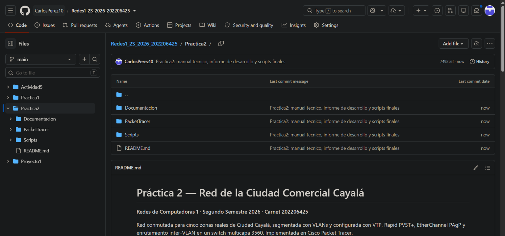

# Informe de Desarrollo
## Práctica 2 — Red de la Ciudad Comercial Cayalá

| Campo | Valor |
|---|---|
| Curso | Redes de Computadoras 1 — Segundo Semestre 2026 |
| Estudiante | Carlos Javier Pérez Pocón |
| Carnet | 202206425 |

---

## 1. Objetivo
Diseñar e implementar en Cisco Packet Tracer una red conmutada para cinco zonas reales de Ciudad Cayalá. La red se segmenta con una VLAN por zona y se configura con VTP, Rapid PVST+ y EtherChannel PAgP. Se verificó la conectividad dentro de cada zona y entre zonas, el aislamiento de los dominios de broadcast y la tolerancia a fallas de las zonas críticas.

## 2. Desarrollo de la práctica
El trabajo se organizó en fases. Cada fase terminó con su verificación y su commit en el repositorio.

| Fase | Actividad | Resultado |
|---|---|---|
| 1 | Investigación de Cayalá, selección de zonas y diseño en draw.io | Topología híbrida con estrella extendida, malla parcial, anillo y bus |
| 2 | Montaje en Packet Tracer | 9 switches, 14 PCs y 25 enlaces según TIA/EIA-568B, con zonas identificadas por color |
| 3 | Configuración base, VTP, VLANs, troncales y EtherChannel | Dominio VTP 202206425 sincronizado y Po1 en estado SU |
| 4 | Rapid PVST+, puertos de acceso, Blackhole y SVIs | Root bridges definidos por zona y enrutamiento inter-VLAN activo |
| 5 | Direccionamiento de hosts y pruebas de conectividad | 13 pruebas exitosas y análisis de ARP e ICMP |
| 6 | Pruebas de alta disponibilidad | Servicio mantenido ante la caída de enlaces |

### 2.1 Diseño
Primero se analizó el rol de cada zona dentro del complejo. Con base en ese análisis se decidió cuánta redundancia necesitaba cada una:
- **Administración, Comercial y Seguridad** son críticas y tienen más de un camino hacia la red.
- **Residencial y Gastronomía** usan un solo enlace.

El direccionamiento se calculó con VLSM sobre 192.168.5.0/24, asignando las subredes de mayor a menor tamaño.

### 2.2 Montaje
Se usó un switch multicapa 3560-24PS como núcleo y ocho switches 2960-24TT. Los enlaces entre switches se hicieron con cable cross-over y los de hosts con straight-through. El EtherChannel se armó con los dos puertos Gigabit de cada extremo.

### 2.3 Configuración en dos fases
La **Fase 1** se aplicó en todos los switches: configuración base, VTP, troncales y EtherChannel. Las VLANs se crearon solo en SW-Z1-CORE. Al confirmar con `show vlan brief` que todos tenían las VLANs 15, 25, 35, 45, 55, 99 y 999, se aplicó la **Fase 2**: STP, puertos de acceso, Blackhole y SVIs.

### 2.4 Enrutamiento entre zonas
El 3560 tiene `ip routing` y una SVI por VLAN que funciona como gateway de cada zona. Cada zona conserva su propio dominio de broadcast y la comunicación entre zonas pasa siempre por el núcleo.

## 3. Problemas encontrados y soluciones

| # | Problema | Causa | Solución |
|---|---|---|---|
| 1 | SW-Z4-MAIN seguía mostrando el prompt `Switch#` después de pegar su configuración | Parte del bloque se perdió al pegarlo en la CLI, incluido el `hostname` | Se volvió a aplicar la configuración completa del switch y se revisó que el prompt mostrara el nombre correcto en los 9 equipos |
| 2 | El EtherChannel quedó en `Po1(SD)` con los puertos en `(I)` (stand-alone) | Los puertos no recibían negociación PAgP del otro extremo; SW-Z4-MAIN tenía una configuración incompleta | Se eliminó el canal en ambos switches (`no channel-group`, `no interface port-channel 1`) y se recreó con parámetros idénticos, sin `switchport nonegotiate` en los miembros |
| 3 | Aun con la configuración correcta, el canal seguía en `(SD)` | Comportamiento del simulador: la negociación quedó detenida | Se guardó la configuración con `write memory` y se reiniciaron SW-Z4-MAIN y SW-Z1-CORE. Tras el reinicio el canal subió como `Po1(SU)` con `Gig0/1(P) Gig0/2(P)` |
| 4 | En `show interfaces trunk` de SW-Z4-MAIN, Fa0/2 solo tenía la VLAN 45 en forwarding | El troncal no estaba completo mientras el switch tenía la configuración a medias | Se resolvió al reaplicar la configuración de SW-Z4-MAIN |
| 5 | Aparecían mensajes `%CDP-4-NATIVE_VLAN_MISMATCH` durante la configuración | Un extremo del troncal ya tenía la VLAN nativa 99 y el otro todavía la VLAN 1 | Desaparecieron al configurar ambos extremos |
| 6 | Riesgo de conflicto de revisión VTP entre los 5 servidores | En modo server, asignar un puerto a una VLAN inexistente la crea y aumenta la revisión | Las VLANs se crearon solo en el núcleo y la configuración se dividió en dos fases |
| 7 | El primer ping entre zonas perdía un paquete | Resolución ARP inicial del host hacia el gateway y del gateway hacia el destino | Es el comportamiento esperado; los pings siguientes respondieron al 100 % |

## 4. Resultados

### 4.1 VTP

### 4.2 Troncales y EtherChannel

### 4.3 Rapid PVST+

### 4.4 Conectividad

### 4.5 Análisis de ARP e ICMP
En modo simulación, la solicitud ARP de PC-Z1-01 hacia su gateway se difundió solo por los puertos de la VLAN 15; ningún host de otra zona la recibió. Luego el ICMP Echo Request llegó a la SVI 192.168.5.1 del núcleo, se enrutó hacia la VLAN 55 y se entregó a PC-Z5-01. El Echo Reply regresó por el mismo camino.

### 4.6 Alta disponibilidad
- Al apagar un cable del EtherChannel, el Port-channel siguió activo con el otro y el ping continuo no se cortó.
- Al apagar el enlace Núcleo–Zona 5, Rapid PVST+ desvió el tráfico de la VLAN 55 por el EtherChannel y el enlace Z4–Z5.

## 5. Conclusiones
1. Asignar una VLAN por zona separó los dominios de broadcast del complejo. El tráfico de cada zona queda contenido y solo se comunica con otras a través del núcleo.
2. La topología híbrida permitió invertir en redundancia únicamente donde la criticidad lo justifica. Las zonas Comercial y de Seguridad soportaron la caída de un enlace sin perder servicio.
3. Fijar la prioridad STP en el switch principal de cada zona hizo predecible el árbol de expansión. Además, al tener roots distintos por VLAN, la carga se reparte entre los enlaces redundantes.
4. El EtherChannel PAgP duplicó la capacidad hacia la zona comercial sin que STP bloqueara ninguno de sus cables.
5. En un dominio VTP con varios servidores, crear las VLANs en un único switch y configurar por fases evitó inconsistencias en la base de datos de VLANs.
6. Verificar cada fase antes de continuar permitió detectar a tiempo la configuración incompleta de SW-Z4-MAIN y el problema del EtherChannel.

## 6. Repositorio

