# Manual Técnico
## Práctica 2 — Red de la Ciudad Comercial Cayalá

Universidad de San Carlos de Guatemala 
Facultad de Ingeniería · Escuela de Ciencias y Sistemas 
Redes de Computadoras 1 · Segundo Semestre 2026

| Campo | Valor |
|---|---|
| Estudiante | Carlos Javier Pérez Pocón |
| Carnet | **202206425** |
| Último dígito del carnet (X) | **5** (impar) |
| Dominio VTP | `202206425` |
| Protocolo EtherChannel | **PAgP** |
| Simulador | Cisco Packet Tracer |
| Archivo de simulación | `PacketTracer/Practica2_202206425.pkt` |

---

## Índice
1. [Descripción general](#1-descripción-general)
2. [Parámetros derivados del carnet](#2-parámetros-derivados-del-carnet)
3. [Análisis de las zonas de Cayalá](#3-análisis-de-las-zonas-de-cayalá)
4. [Topología de red](#4-topología-de-red)
5. [Inventario de dispositivos](#5-inventario-de-dispositivos)
6. [Cableado y justificación de cada enlace físico](#6-cableado-y-justificación-de-cada-enlace-físico)
7. [Direccionamiento IP (VLSM)](#7-direccionamiento-ip-vlsm)
8. [Tabla de VLANs](#8-tabla-de-vlans)
9. [VTP](#9-vtp)
10. [Rapid PVST+](#10-rapid-pvst)
11. [EtherChannel](#11-etherchannel)
12. [Enrutamiento inter-VLAN](#12-enrutamiento-inter-vlan)
13. [Dominios de colisión y de broadcast](#13-dominios-de-colisión-y-de-broadcast)
14. [Asignación de puertos por switch](#14-asignación-de-puertos-por-switch)
15. [Seguridad aplicada](#15-seguridad-aplicada)
16. [Procedimiento de implementación](#16-procedimiento-de-implementación)
17. [Verificación de la configuración](#17-verificación-de-la-configuración)
18. [Pruebas de conectividad](#18-pruebas-de-conectividad)
19. [Pruebas de alta disponibilidad](#19-pruebas-de-alta-disponibilidad)
20. [Escalabilidad](#20-escalabilidad)
21. [Guía rápida de resolución de problemas](#21-guía-rápida-de-resolución-de-problemas)
22. [Referencias](#22-referencias)

---

## 1. Descripción general

La empresa administradora de Ciudad Cayalá, en la zona 16 de la Ciudad de Guatemala, necesita interconectar sus zonas comerciales, residenciales, corporativas y de servicios. La solución es una red conmutada de capa 2 con **una VLAN por zona**. Las zonas se unen mediante troncales 802.1Q hacia un **switch multicapa Cisco 3560**, que funciona como núcleo de la red y como puerta de enlace de todas las VLANs por medio de SVIs.

El diseño no aplica el mismo esquema a todas las zonas. Cada una recibe un tipo de conexión según su función, su criticidad y su volumen de tráfico. En total se combinan cuatro esquemas de topología: **estrella extendida, malla parcial, anillo y bus**.

Protocolos y tecnologías utilizados:

| Tecnología | Uso en la red |
|---|---|
| VLAN 802.1Q | Segmentación por zona, VLAN nativa 99 y VLAN Blackhole 999 |
| VTP v2 | Distribución de la base de datos de VLANs en el dominio `202206425` |
| Rapid PVST+ | Prevención de bucles y convergencia rápida ante fallas |
| EtherChannel PAgP | Agregación de 2 enlaces Gigabit hacia la zona comercial |
| Enrutamiento inter-VLAN (SVI) | Comunicación controlada entre zonas desde el 3560 |

---

## 2. Parámetros derivados del carnet

| Parámetro | Regla del enunciado | Valor aplicado |
|---|---|---|
| X | Último dígito de 20220642**5** | 5 |
| VLAN Zona 1 | 1X | **15** |
| VLAN Zona 2 | 2X | **25** |
| VLAN Zona 3 | 3X | **35** |
| VLAN Zona 4 | 4X | **45** |
| VLAN Zona 5 | 5X | **55** |
| VLAN nativa | Fija | **99** |
| VLAN Blackhole | Fija | **999** |
| Dominio VTP | Número de carnet | **202206425** |
| Contraseña VTP | Libre elección | `Cayala2026` |
| EtherChannel | Par → LACP · Impar → PAgP | **PAgP**, modo `desirable` |
| Red base | Libre elección | **192.168.5.0/24** (el 5 corresponde a X) |

---

## 3. Análisis de las zonas de Cayalá

Ciudad Cayalá es un desarrollo urbano de uso mixto inaugurado en 2011. Reúne barrios residenciales, un paseo comercial con tiendas, restaurantes y cafés, un distrito de oficinas, hoteles y áreas abiertas al público. Recibe visitantes todos los días, además de los residentes y de las personas que trabajan en sus comercios y oficinas. A partir de esa información se eligieron cinco zonas reales del complejo.

| Zona | Nombre | VLAN | Hosts | Actividad | Tráfico | Criticidad |
|---|---|---|---|---|---|---|
| 1 | Distrito Empresarial – Administración Central | 15 | 60 | Administrativa | Alto | **ALTA** |
| 2 | Residencial – Lirios de Cayalá | 25 | 28 | Residencial | Medio | MEDIA |
| 3 | Gastronomía y Entretenimiento | 35 | 12 | Servicios | Bajo | BAJA |
| 4 | Paseo Cayalá – Comercial | 45 | 50 | Comercial | Alto (picos) | **ALTA** |
| 5 | Centro de Monitoreo y Seguridad | 55 | 7 | Seguridad | Bajo pero constante | **ALTA** |

### 3.1 Zona 1 — Distrito Empresarial / Administración Central (VLAN 15)
- **Función:** oficinas de la empresa administradora del complejo: arrendamientos, facturación, mantenimiento y soporte de TI. Se ubica en el Distrito Empresarial, la etapa de edificios de oficinas de Cayalá.
- **Usuarios:** personal administrativo, gerencia y técnicos.
- **Tráfico:** es la zona con más hosts (60). Además, por aquí pasa el tráfico entre todas las zonas, porque en ella está el núcleo que enruta las VLANs.
- **Impacto de una caída:** si esta zona pierde conectividad, se detiene la administración del complejo y ninguna zona puede comunicarse con otra.
- **Decisión:** aloja el switch multicapa (núcleo). Sus dos switches de acceso forman un **anillo** con el núcleo, así cada grupo de hosts tiene dos caminos.

### 3.2 Zona 2 — Residencial Lirios de Cayalá (VLAN 25)
- **Función:** servicios de red para el desarrollo residencial Lirios de Cayalá: garitas, áreas comunes y oficina de administración del condominio.
- **Usuarios:** residentes y administración del condominio.
- **Tráfico:** medio (28 hosts), principalmente navegación y servicios, sin los picos de la zona comercial.
- **Impacto de una caída:** afecta la comodidad de los residentes, pero no la operación comercial ni la seguridad del complejo.
- **Decisión:** esquema **bus o lineal** (SW-Z2-MAIN → SW-Z2-ACC1) con un solo enlace al núcleo. Sigue el cableado natural por bloques de un área residencial y es la opción más económica para una zona no crítica.

### 3.3 Zona 3 — Gastronomía y Entretenimiento (VLAN 35)
- **Función:** red de los restaurantes y cafés del paseo: puntos de venta, menús digitales y equipos de atención.
- **Usuarios:** personal de los locales.
- **Tráfico:** bajo (12 hosts).
- **Impacto de una caída:** es un servicio secundario; los locales pueden operar temporalmente sin la red del complejo.
- **Decisión:** **estrella** simple, un único switch conectado al núcleo con un solo enlace. La redundancia no se justifica por costo y beneficio.

### 3.4 Zona 4 — Paseo Cayalá, zona comercial (VLAN 45)
- **Función:** corazón comercial del complejo, con tiendas, kioscos de información, puntos de venta y señalización digital.
- **Usuarios:** empleados de tiendas y personal de atención al visitante.
- **Tráfico:** alto (50 hosts), con picos los fines de semana y en temporadas.
- **Impacto de una caída:** se detienen los cobros y las ventas en la zona de mayor afluencia.
- **Decisión:** se conecta al núcleo con un **EtherChannel de 2 × 1 Gbps** y además con un enlace de respaldo hacia la Zona 5 (**malla parcial**). En total tiene 3 enlaces físicos hacia la red.

### 3.5 Zona 5 — Centro de Monitoreo y Seguridad (VLAN 55)
- **Función:** videovigilancia, control de accesos y coordinación de la seguridad del complejo.
- **Usuarios:** operadores de monitoreo y jefatura de seguridad.
- **Tráfico:** pocos hosts (7), pero con flujo constante de video y alarmas.
- **Impacto de una caída:** el complejo queda sin supervisión de seguridad.
- **Decisión:** es una red pequeña, pero tiene **2 enlaces físicos**: uno al núcleo y otro a la Zona 4. Así se forma el triángulo Núcleo – Z4 – Z5 y un fallo en cualquiera de los dos enlaces no la deja aislada.

---

## 4. Topología de red

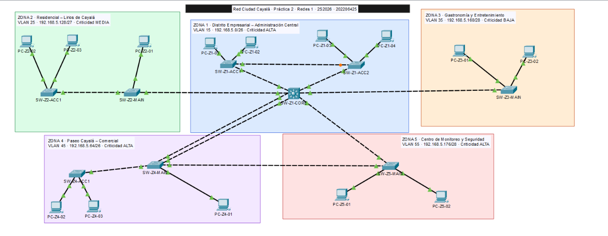

El diseño previo se elaboró en draw.io y se encuentra en [`../Topologia/Topologia_Cayala_202206425.drawio`](../Topologia/Topologia_Cayala_202206425.drawio).

### 4.1 Esquemas combinados (topología híbrida)

| Esquema | Dónde se aplica | Motivo |
|---|---|---|
| **Estrella extendida** | Todas las zonas llegan a SW-Z1-CORE | Punto central de enrutamiento y administración |
| **Malla parcial** | SW-Z1-CORE ↔ SW-Z4-MAIN ↔ SW-Z5-MAIN ↔ SW-Z1-CORE | Zonas críticas con al menos 2 enlaces físicos |
| **Anillo** | SW-Z1-CORE ↔ SW-Z1-ACC1 ↔ SW-Z1-ACC2 ↔ SW-Z1-CORE | Dos caminos para cada switch de acceso de administración |
| **Bus / lineal** | SW-Z1-CORE → SW-Z2-MAIN → SW-Z2-ACC1 | Zona residencial de criticidad media |

Se combinan **4 esquemas**; el mínimo requerido es 2.

### 4.2 Cumplimiento de las condiciones operativas

| Condición | Cómo se cumple |
|---|---|
| Análisis por zona | Cada zona tiene un esquema y un número de enlaces distinto, según las secciones 3 y 6 |
| Alta disponibilidad | Z1: anillo. Z4: 3 enlaces (Po1 de 2 cables + 1 a Z5). Z5: 2 enlaces (núcleo y Z4) |
| Carga de tráfico | Z4 usa un EtherChannel de 2 Gbps. Las zonas pequeñas usan un solo enlace Fast Ethernet |
| Dominios de colisión | Identificados y justificados en la sección 13 |

---

## 5. Inventario de dispositivos

| Dispositivo | Modelo | Zona | Función | VTP | IP de administración |
|---|---|---|---|---|---|
| SW-Z1-CORE | Cisco 3560-24PS | 1 | Núcleo, enrutamiento inter-VLAN | Server | 192.168.5.193 |
| SW-Z1-ACC1 | Cisco 2960-24TT | 1 | Acceso | Client | 192.168.5.194 |
| SW-Z1-ACC2 | Cisco 2960-24TT | 1 | Acceso | Client | 192.168.5.195 |
| SW-Z2-MAIN | Cisco 2960-24TT | 2 | Principal de zona | Server | 192.168.5.196 |
| SW-Z2-ACC1 | Cisco 2960-24TT | 2 | Acceso | Client | 192.168.5.197 |
| SW-Z3-MAIN | Cisco 2960-24TT | 3 | Principal de zona | Server | 192.168.5.198 |
| SW-Z4-MAIN | Cisco 2960-24TT | 4 | Principal de zona | Server | 192.168.5.199 |
| SW-Z4-ACC1 | Cisco 2960-24TT | 4 | Acceso | Client | 192.168.5.200 |
| SW-Z5-MAIN | Cisco 2960-24TT | 5 | Principal de zona | Server | 192.168.5.201 |
| PC-Z1-01 … PC-Z5-02 | PC-PT | 1–5 | Hosts representativos (14) | — | Ver sección 7.2 |

Todos los switches se configuraron únicamente mediante CLI. En la simulación se colocaron hosts representativos por zona. El direccionamiento sí está dimensionado para la cantidad de hosts requerida en cada zona: 60, 28, 12, 50 y 7.

---

## 6. Cableado y justificación de cada enlace físico

| # | Origen | Destino | Cable | Velocidad | Modo | VLANs permitidas | Justificación |
|---|---|---|---|---|---|---|---|
| 1 | SW-Z1-CORE Gi0/1 | SW-Z4-MAIN Gi0/1 | Copper Cross-Over | 1 Gbps | Trunk (Po1) | 45,55,99 | Primer miembro del EtherChannel hacia la zona de mayor tráfico comercial |
| 2 | SW-Z1-CORE Gi0/2 | SW-Z4-MAIN Gi0/2 | Copper Cross-Over | 1 Gbps | Trunk (Po1) | 45,55,99 | Segundo miembro: duplica el ancho de banda y tolera la caída de un cable |
| 3 | SW-Z1-CORE Fa0/3 | SW-Z5-MAIN Fa0/1 | Copper Cross-Over | 100 Mbps | Trunk | 45,55,99 | Enlace principal de Seguridad; transporta VLAN 45 como respaldo de Z4 |
| 4 | SW-Z4-MAIN Fa0/1 | SW-Z5-MAIN Fa0/2 | Copper Cross-Over | 100 Mbps | Trunk | 45,55,99 | Cierra la malla parcial: segundo camino para Z4 y Z5 |
| 5 | SW-Z1-CORE Fa0/4 | SW-Z2-MAIN Fa0/1 | Copper Cross-Over | 100 Mbps | Trunk | 25,99 | Único enlace de la zona residencial |
| 6 | SW-Z2-MAIN Fa0/2 | SW-Z2-ACC1 Fa0/1 | Copper Cross-Over | 100 Mbps | Trunk | 25,99 | Extensión lineal hacia otro bloque residencial |
| 7 | SW-Z1-CORE Fa0/5 | SW-Z3-MAIN Fa0/1 | Copper Cross-Over | 100 Mbps | Trunk | 35,99 | Único enlace de la zona gastronómica, de bajo tráfico |
| 8 | SW-Z1-CORE Fa0/1 | SW-Z1-ACC1 Fa0/1 | Copper Cross-Over | 100 Mbps | Trunk | 15,99 | Lado A del anillo de administración |
| 9 | SW-Z1-CORE Fa0/2 | SW-Z1-ACC2 Fa0/1 | Copper Cross-Over | 100 Mbps | Trunk | 15,99 | Lado B del anillo de administración |
| 10 | SW-Z1-ACC1 Fa0/2 | SW-Z1-ACC2 Fa0/2 | Copper Cross-Over | 100 Mbps | Trunk | 15,99 | Cierra el anillo: respaldo si falla un enlace al núcleo |
| 11 | SW-Z4-MAIN Fa0/2 | SW-Z4-ACC1 Fa0/1 | Copper Cross-Over | 100 Mbps | Trunk | 45,99 | Amplía los puertos de acceso del área comercial |
| 12–25 | Switch Fa0/10–Fa0/11 | PC FastEthernet0 | Copper Straight-Through | 100 Mbps | Access | VLAN de la zona | Conexión de hosts finales |

**Estándar de cableado TIA/EIA-568B:**
- **Cross-over** entre dispositivos del mismo tipo (switch con switch).
- **Straight-through** entre dispositivos distintos (switch con PC).

Se combinan medios de **1 Gbps** en el EtherChannel y de **100 Mbps** en Fast Ethernet.

**VLANs permitidas en troncales:** ningún troncal usa `allowed vlan all`. Cada uno transporta solo las VLANs de las zonas que dependen de ese camino, más la VLAN nativa 99. Esto evita que broadcasts de una zona viajen por enlaces donde no se necesitan. La malla parcial transporta las VLANs 45 y 55 para que ambas zonas tengan un camino alterno.

---

## 7. Direccionamiento IP (VLSM)

La red base es **192.168.5.0/24**. Las subredes se asignaron de mayor a menor tamaño para no desperdiciar direcciones.

| VLAN | Zona | Hosts requeridos | Prefijo | Red | Máscara | Rango utilizable | Broadcast | Gateway |
|---|---|---|---|---|---|---|---|---|
| 15 | Z1 Administración | 60 | /26 | 192.168.5.0 | 255.255.255.192 | .1 – .62 | .63 | 192.168.5.1 |
| 45 | Z4 Comercial | 50 | /26 | 192.168.5.64 | 255.255.255.192 | .65 – .126 | .127 | 192.168.5.65 |
| 25 | Z2 Residencial | 28 | /27 | 192.168.5.128 | 255.255.255.224 | .129 – .158 | .159 | 192.168.5.129 |
| 35 | Z3 Gastronomía | 12 | /28 | 192.168.5.160 | 255.255.255.240 | .161 – .174 | .175 | 192.168.5.161 |
| 55 | Z5 Seguridad | 7 | /28 | 192.168.5.176 | 255.255.255.240 | .177 – .190 | .191 | 192.168.5.177 |
| 99 | Administración de switches | 9 | /27 | 192.168.5.192 | 255.255.255.224 | .193 – .222 | .223 | 192.168.5.193 |
| — | Reserva | — | /27 | 192.168.5.224 | 255.255.255.224 | .225 – .254 | .255 | — |

Cálculo por zona (hosts + gateway ≤ 2ⁿ − 2):
- Zona 1: 61 direcciones → /26 (62 utilizables).
- Zona 4: 51 → /26 (62).
- Zona 2: 29 → /27 (30).
- Zona 3: 13 → /28 (14).
- Zona 5: 8 → /28 (14). Un /29 solo tiene 6 utilizables.

### 7.1 Gateways (SVIs de SW-Z1-CORE)

| Interfaz | IP | Máscara |
|---|---|---|
| Vlan15 | 192.168.5.1 | 255.255.255.192 |
| Vlan25 | 192.168.5.129 | 255.255.255.224 |
| Vlan35 | 192.168.5.161 | 255.255.255.240 |
| Vlan45 | 192.168.5.65 | 255.255.255.192 |
| Vlan55 | 192.168.5.177 | 255.255.255.240 |
| Vlan99 | 192.168.5.193 | 255.255.255.224 |

### 7.2 Hosts

| Host | Switch / Puerto | VLAN | IP | Máscara | Gateway |
|---|---|---|---|---|---|
| PC-Z1-01 | SW-Z1-ACC1 Fa0/10 | 15 | 192.168.5.2 | 255.255.255.192 | 192.168.5.1 |
| PC-Z1-02 | SW-Z1-ACC1 Fa0/11 | 15 | 192.168.5.3 | 255.255.255.192 | 192.168.5.1 |
| PC-Z1-03 | SW-Z1-ACC2 Fa0/10 | 15 | 192.168.5.4 | 255.255.255.192 | 192.168.5.1 |
| PC-Z1-04 | SW-Z1-ACC2 Fa0/11 | 15 | 192.168.5.5 | 255.255.255.192 | 192.168.5.1 |
| PC-Z2-01 | SW-Z2-MAIN Fa0/10 | 25 | 192.168.5.130 | 255.255.255.224 | 192.168.5.129 |
| PC-Z2-02 | SW-Z2-ACC1 Fa0/10 | 25 | 192.168.5.131 | 255.255.255.224 | 192.168.5.129 |
| PC-Z2-03 | SW-Z2-ACC1 Fa0/11 | 25 | 192.168.5.132 | 255.255.255.224 | 192.168.5.129 |
| PC-Z3-01 | SW-Z3-MAIN Fa0/10 | 35 | 192.168.5.162 | 255.255.255.240 | 192.168.5.161 |
| PC-Z3-02 | SW-Z3-MAIN Fa0/11 | 35 | 192.168.5.163 | 255.255.255.240 | 192.168.5.161 |
| PC-Z4-01 | SW-Z4-MAIN Fa0/10 | 45 | 192.168.5.66 | 255.255.255.192 | 192.168.5.65 |
| PC-Z4-02 | SW-Z4-ACC1 Fa0/10 | 45 | 192.168.5.67 | 255.255.255.192 | 192.168.5.65 |
| PC-Z4-03 | SW-Z4-ACC1 Fa0/11 | 45 | 192.168.5.68 | 255.255.255.192 | 192.168.5.65 |
| PC-Z5-01 | SW-Z5-MAIN Fa0/10 | 55 | 192.168.5.178 | 255.255.255.240 | 192.168.5.177 |
| PC-Z5-02 | SW-Z5-MAIN Fa0/11 | 55 | 192.168.5.179 | 255.255.255.240 | 192.168.5.177 |

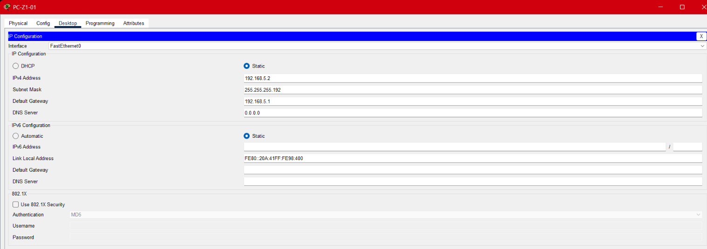

---

## 8. Tabla de VLANs

| VLAN ID | Nombre | Zona | Red | Uso | Puertos de acceso |
|---|---|---|---|---|---|
| 15 | Z1_ADMINISTRACION | 1 | 192.168.5.0/26 | Administración central | SW-Z1-ACC1 y SW-Z1-ACC2 Fa0/10-11 |
| 25 | Z2_RESIDENCIAL | 2 | 192.168.5.128/27 | Residencial | SW-Z2-MAIN Fa0/10, SW-Z2-ACC1 Fa0/10-11 |
| 35 | Z3_GASTRONOMIA | 3 | 192.168.5.160/28 | Restaurantes | SW-Z3-MAIN Fa0/10-11 |
| 45 | Z4_COMERCIAL | 4 | 192.168.5.64/26 | Paseo comercial | SW-Z4-MAIN Fa0/10, SW-Z4-ACC1 Fa0/10-11 |
| 55 | Z5_SEGURIDAD | 5 | 192.168.5.176/28 | Monitoreo | SW-Z5-MAIN Fa0/10-11 |
| 99 | NATIVA_ADMIN | — | 192.168.5.192/27 | VLAN nativa de troncales y administración | SVI en cada switch |
| 999 | BLACKHOLE | — | — | Puertos no utilizados, apagados | Todos los puertos libres |

La VLAN nativa se cambió de 1 a 99 en todos los troncales. Así el tráfico sin etiquetar no queda en la VLAN por defecto y se reduce el riesgo de ataques de *VLAN hopping*.

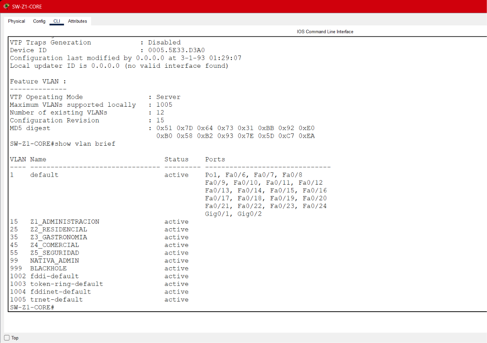

---

## 9. VTP

| Switch | Modo | Dominio | Versión | Contraseña |
|---|---|---|---|---|
| SW-Z1-CORE | **Server** | 202206425 | 2 | Cayala2026 |
| SW-Z2-MAIN | **Server** | 202206425 | 2 | Cayala2026 |
| SW-Z3-MAIN | **Server** | 202206425 | 2 | Cayala2026 |
| SW-Z4-MAIN | **Server** | 202206425 | 2 | Cayala2026 |
| SW-Z5-MAIN | **Server** | 202206425 | 2 | Cayala2026 |
| SW-Z1-ACC1 | Client | 202206425 | 2 | Cayala2026 |
| SW-Z1-ACC2 | Client | 202206425 | 2 | Cayala2026 |
| SW-Z2-ACC1 | Client | 202206425 | 2 | Cayala2026 |
| SW-Z4-ACC1 | Client | 202206425 | 2 | Cayala2026 |

- El switch principal de cada zona es servidor VTP y el resto son clientes, como pide el enunciado.
- En un dominio con varios servidores, el que tenga el número de revisión más alto impone su base de datos a los demás. Para evitar conflictos, **las VLANs se crearon solo en SW-Z1-CORE**. Los demás servidores y clientes las aprendieron por VTP.
- La contraseña evita que un switch ajeno con el mismo dominio modifique la base de datos de VLANs.

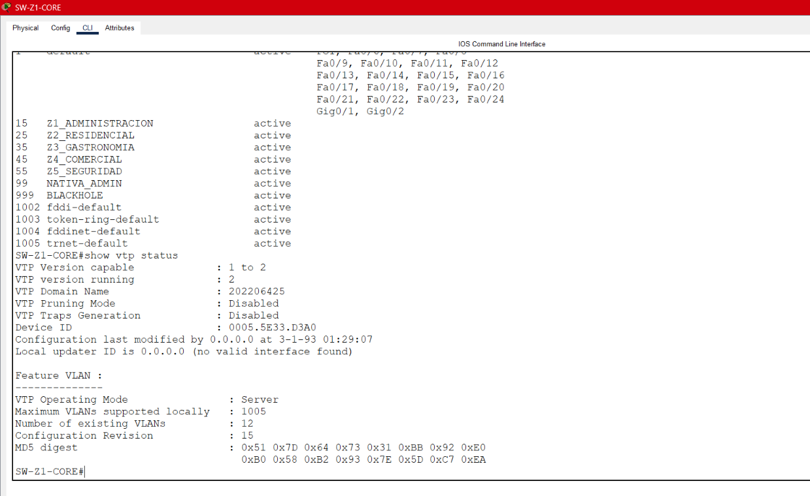
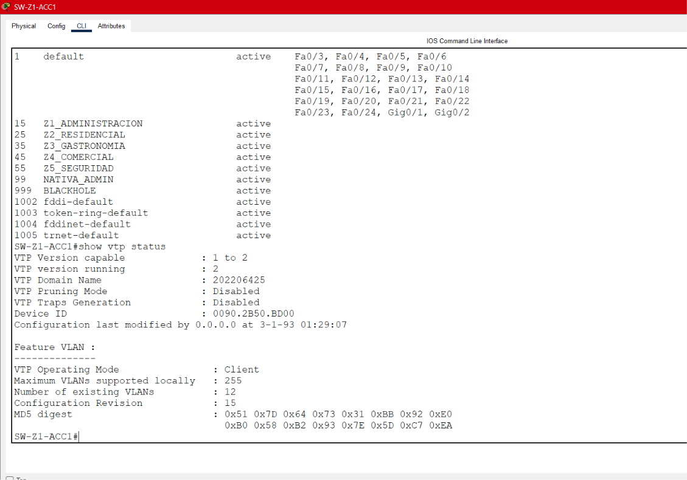
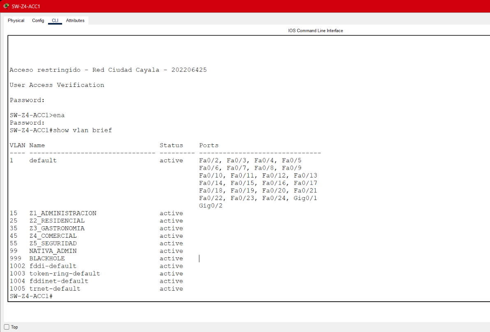

---

## 10. Rapid PVST+

Todos los switches ejecutan `spanning-tree mode rapid-pvst`. Este modo mantiene una instancia de árbol por VLAN y converge en segundos, a diferencia del STP clásico, que tarda 30 a 50 segundos. Los puertos de hosts usan **PortFast** y **BPDU Guard**.

### 10.1 Root bridge por VLAN

| VLAN | Root bridge | Prioridad configurada | Bridge ID mostrado | Root secundario | Prioridad |
|---|---|---|---|---|---|
| 15 | **SW-Z1-CORE** | 4096 | 4111 | — | 32768 |
| 25 | **SW-Z2-MAIN** | 4096 | 4121 | SW-Z1-CORE | 8192 |
| 35 | **SW-Z3-MAIN** | 4096 | 4131 | SW-Z1-CORE | 8192 |
| 45 | **SW-Z4-MAIN** | 4096 | 4141 | SW-Z1-CORE | 8192 |
| 55 | **SW-Z5-MAIN** | 4096 | 4151 | SW-Z1-CORE | 8192 |
| 99 | **SW-Z1-CORE** | 4096 | 4195 | — | 32768 |

En PVST+ el switch anuncia su prioridad sumada al ID de la VLAN (*extended system ID*). Por ejemplo, 4096 + 45 = 4141.

### 10.2 Justificación
1. El enunciado exige que el switch principal de cada zona sea el root de su VLAN. Se configuró la prioridad **4096** de forma explícita para no depender de la dirección MAC.
2. El núcleo tiene prioridad **8192** en las VLANs de las demás zonas. Si el switch principal de una zona falla, el núcleo asume el rol de root y el árbol queda centrado en el punto de enrutamiento.
3. La VLAN 99 viaja por todos los troncales, por eso su root es el núcleo.
4. Con roots distintos por VLAN, los puertos bloqueados quedan en enlaces diferentes según la VLAN y la carga se reparte: la VLAN 45 sube por el EtherChannel y la VLAN 55 por el enlace directo Z5–Núcleo.

### 10.3 Costos de ruta y puertos bloqueados

| Enlace | Costo STP |
|---|---|
| Fast Ethernet (100 Mbps) | 19 |
| Gigabit Ethernet (1 Gbps) | 4 |
| Port-channel 2 × 1 Gbps | 3 |

| VLAN | Enlace redundante | Puerto en estado Alternate (BLK) | Razón |
|---|---|---|---|
| 15 | SW-Z1-ACC1 ↔ SW-Z1-ACC2 | Fa0/2 del switch de acceso con mayor Bridge ID | Ambos tienen costo 19 al root; decide el Bridge ID |
| 45 | SW-Z1-CORE ↔ SW-Z5-MAIN | SW-Z5-MAIN Fa0/1 | El núcleo llega al root por Po1 (costo 3), menor que Z5 (19) |
| 55 | Po1 SW-Z1-CORE ↔ SW-Z4-MAIN | SW-Z4-MAIN Po1 | Empate en costo; gana el núcleo por prioridad 8192 |
| 99 | SW-Z4-MAIN ↔ SW-Z5-MAIN y anillo de Z1 | SW-Z5-MAIN Fa0/2 y un Fa0/2 del anillo | Root en el núcleo |

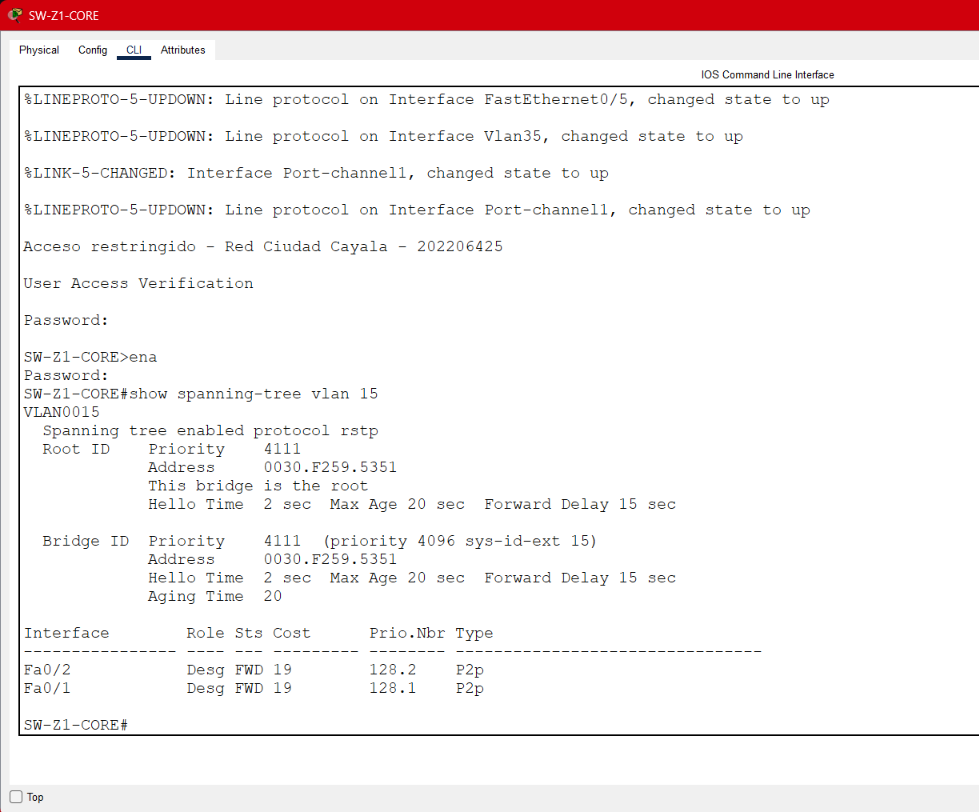
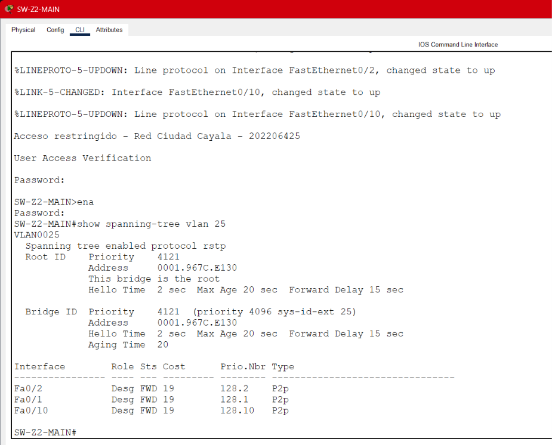
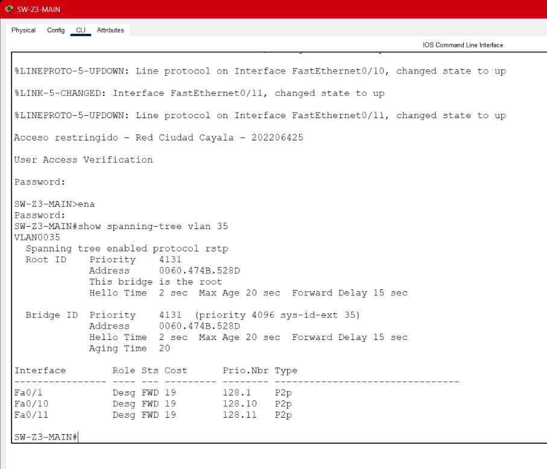
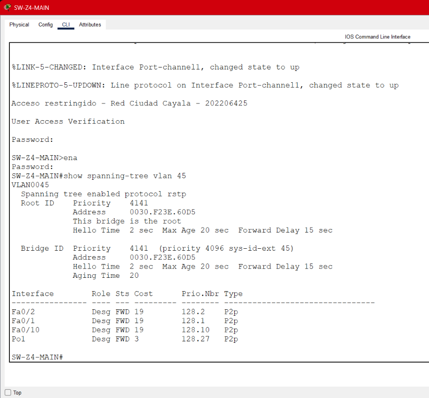
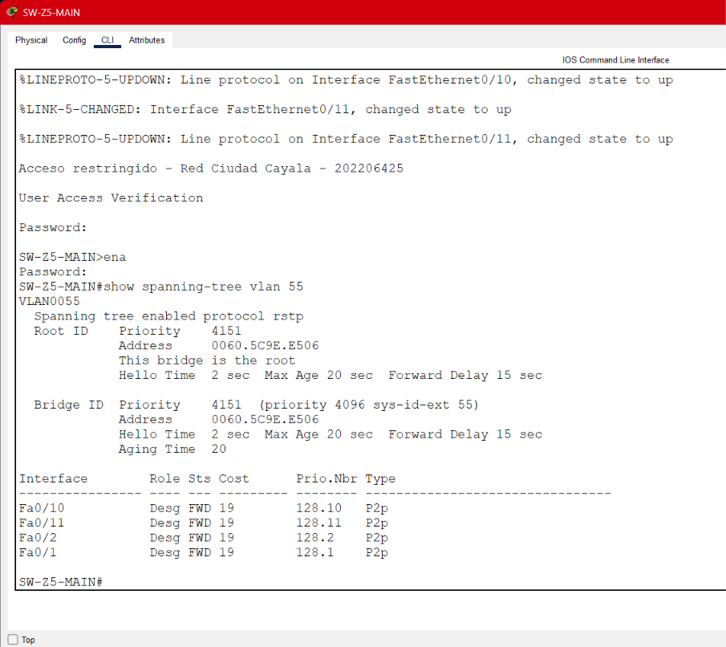
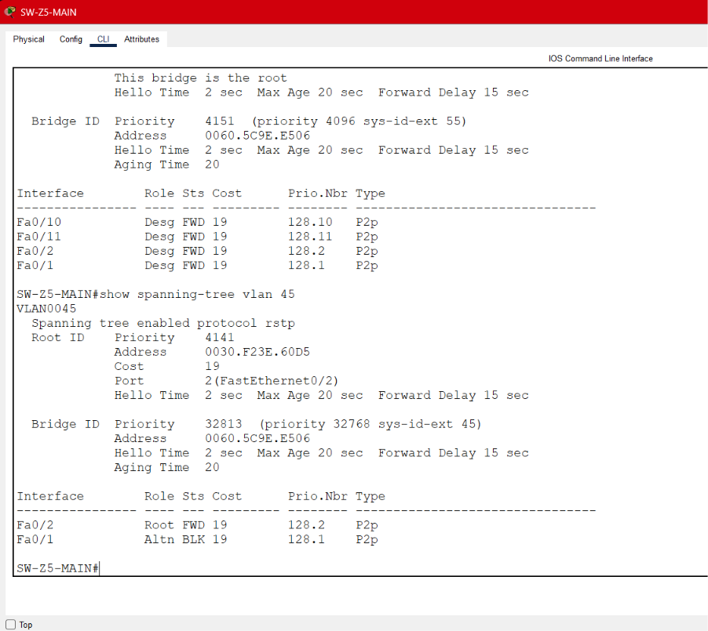
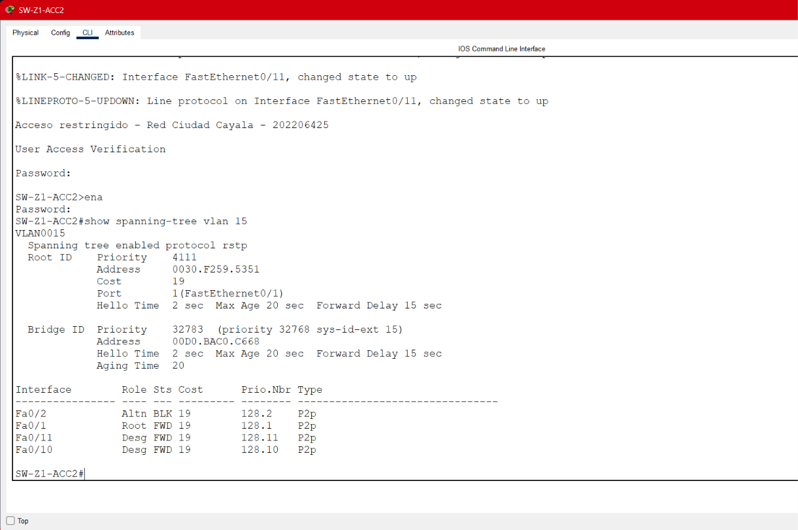

---

## 11. EtherChannel

| Parámetro | Valor |
|---|---|
| Interfaz lógica | Port-channel 1 |
| Extremos | SW-Z1-CORE ↔ SW-Z4-MAIN |
| Puertos miembro | Gi0/1 y Gi0/2 en ambos switches |
| Protocolo | **PAgP** (carnet impar) |
| Modo | `desirable` en ambos extremos |
| Capacidad | 2 × 1 Gbps = 2 Gbps |
| Configuración | Trunk 802.1Q, nativa 99, VLANs permitidas 45,55,99 |

**Justificación:** la Zona 4 es la zona comercial de mayor afluencia del complejo y la segunda con más hosts (50). Todo su tráfico hacia otras zonas pasa por el núcleo, así que necesita más capacidad que un enlace simple. El EtherChannel suma el ancho de banda de ambos cables y reparte la carga entre ellos. Para STP es un solo enlace lógico, por lo que ninguno de los dos cables queda bloqueado. Si uno falla, el canal sigue activo con el otro.

**Modo `desirable`:** el puerto inicia activamente la negociación PAgP. Con `desirable` en ambos lados el canal se forma aunque uno de los dos extremos se reinicie.

**Consideraciones de configuración:**
- Los puertos miembro y la interfaz Port-channel deben tener exactamente los mismos parámetros de troncal: nativa, VLANs permitidas y encapsulación. Si no, los puertos quedan suspendidos.
- En los miembros del canal no se aplicó `switchport nonegotiate`, para no interferir con la negociación en el simulador.
- En el 3560 se define `switchport trunk encapsulation dot1q` antes de `switchport mode trunk`.

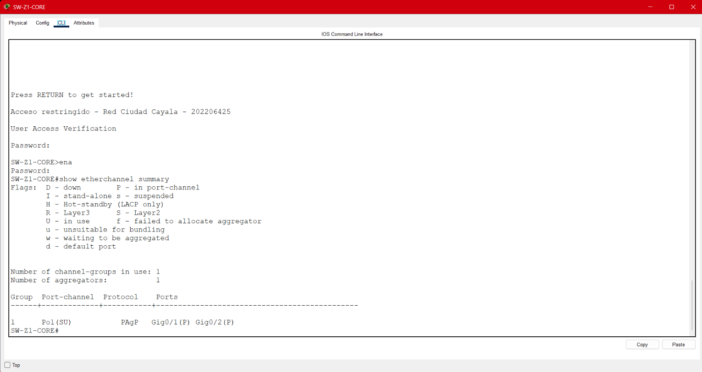
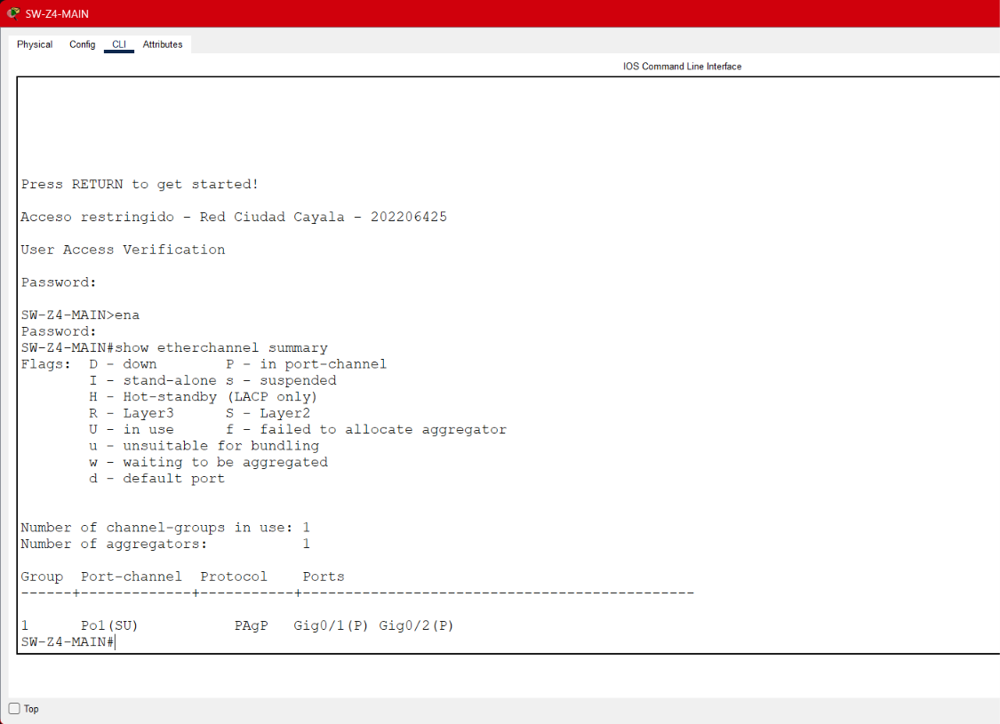

---

## 12. Enrutamiento inter-VLAN

Cada zona es un dominio de broadcast aislado. La comunicación entre zonas se hace en capa 3 dentro de SW-Z1-CORE:
- `ip routing` habilita el enrutamiento en el 3560.
- Cada VLAN tiene una **SVI** (`interface vlan X`) con la primera dirección utilizable de su subred, y esa SVI es el default gateway de los hosts de la zona.
- Las redes aparecen en la tabla de enrutamiento como directamente conectadas (**C**) y locales (**L**). No se necesitan rutas estáticas ni protocolos dinámicos, porque todas las subredes terminan en el mismo equipo.

Una SVI solo pasa a *up/up* si su VLAN existe y tiene al menos un puerto activo en estado forwarding. Por eso cada VLAN de zona está permitida en al menos un troncal del núcleo.

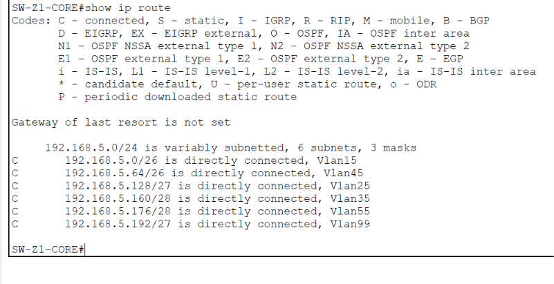
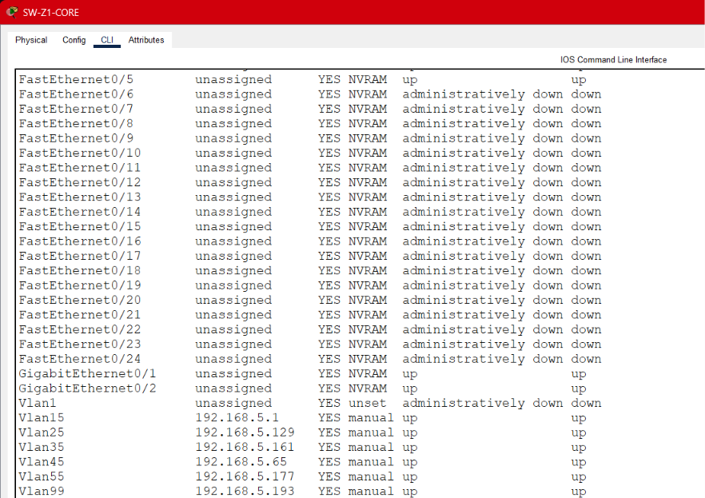

---

## 13. Dominios de colisión y de broadcast

### 13.1 Dominios de colisión
Cada puerto de un switch es un dominio de colisión independiente. Todos los enlaces trabajan en full-duplex, así que en la práctica no se producen colisiones. En la topología no hay hubs.

| Tipo de enlace | Enlaces | Dominios de colisión |
|---|---|---|
| Switch ↔ Switch (incluye los 2 miembros de Po1) | 11 | 11 |
| Switch ↔ PC | 14 | 14 |
| **Total** | **25** | **25** |

- **Qué los delimita:** los puertos de los switches Cisco 2960 y 3560.
- **Por qué es adecuado:** ningún equipo compite por el medio con otro, de modo que la actividad de una tienda o restaurante no afecta el rendimiento de los demás. Esto es importante en zonas de alto tráfico como el Paseo comercial. Si se usaran hubs, todos los hosts de una zona compartirían un solo dominio de colisión.
- Los dos cables del EtherChannel cuentan como dos dominios aunque formen un único enlace lógico.

### 13.2 Dominios de broadcast

| Dominio | VLAN | Dispositivos que abarca |
|---|---|---|
| 1 | 15 | SW-Z1-CORE, SW-Z1-ACC1, SW-Z1-ACC2 y PCs de Z1 |
| 2 | 25 | SW-Z1-CORE, SW-Z2-MAIN, SW-Z2-ACC1 y PCs de Z2 |
| 3 | 35 | SW-Z1-CORE, SW-Z3-MAIN y PCs de Z3 |
| 4 | 45 | SW-Z1-CORE, SW-Z4-MAIN, SW-Z4-ACC1, SW-Z5-MAIN (respaldo) y PCs de Z4 |
| 5 | 55 | SW-Z1-CORE, SW-Z4-MAIN (respaldo), SW-Z5-MAIN y PCs de Z5 |
| 6 | 99 | Todos los switches (administración) |

Hay **6 dominios de broadcast activos**. La VLAN 999 no tiene puertos activos. El único equipo que comunica dominios distintos es el switch multicapa. Un broadcast ARP generado en la VLAN 15 nunca llega a la VLAN 45; así se logra el aislamiento de capa 2 entre zonas.

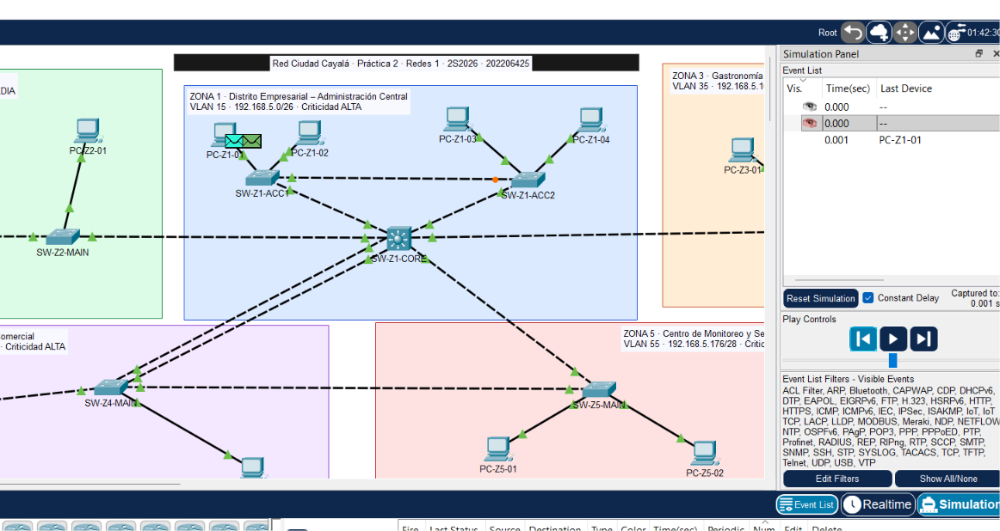

---

## 14. Asignación de puertos por switch

| Switch | Troncales / Port-channel | Acceso (VLAN) | Blackhole 999 (apagados) |
|---|---|---|---|
| SW-Z1-CORE | Gi0/1-2 (Po1), Fa0/1-5 | — | Fa0/6-24 |
| SW-Z1-ACC1 | Fa0/1, Fa0/2 | Fa0/10-11 (15) | Fa0/3-9, Fa0/12-24, Gi0/1-2 |
| SW-Z1-ACC2 | Fa0/1, Fa0/2 | Fa0/10-11 (15) | Fa0/3-9, Fa0/12-24, Gi0/1-2 |
| SW-Z2-MAIN | Fa0/1, Fa0/2 | Fa0/10 (25) | Fa0/3-9, Fa0/11-24, Gi0/1-2 |
| SW-Z2-ACC1 | Fa0/1 | Fa0/10-11 (25) | Fa0/2-9, Fa0/12-24, Gi0/1-2 |
| SW-Z3-MAIN | Fa0/1 | Fa0/10-11 (35) | Fa0/2-9, Fa0/12-24, Gi0/1-2 |
| SW-Z4-MAIN | Gi0/1-2 (Po1), Fa0/1, Fa0/2 | Fa0/10 (45) | Fa0/3-9, Fa0/11-24 |
| SW-Z4-ACC1 | Fa0/1 | Fa0/10-11 (45) | Fa0/2-9, Fa0/12-24, Gi0/1-2 |
| SW-Z5-MAIN | Fa0/1, Fa0/2 | Fa0/10-11 (55) | Fa0/3-9, Fa0/12-24, Gi0/1-2 |

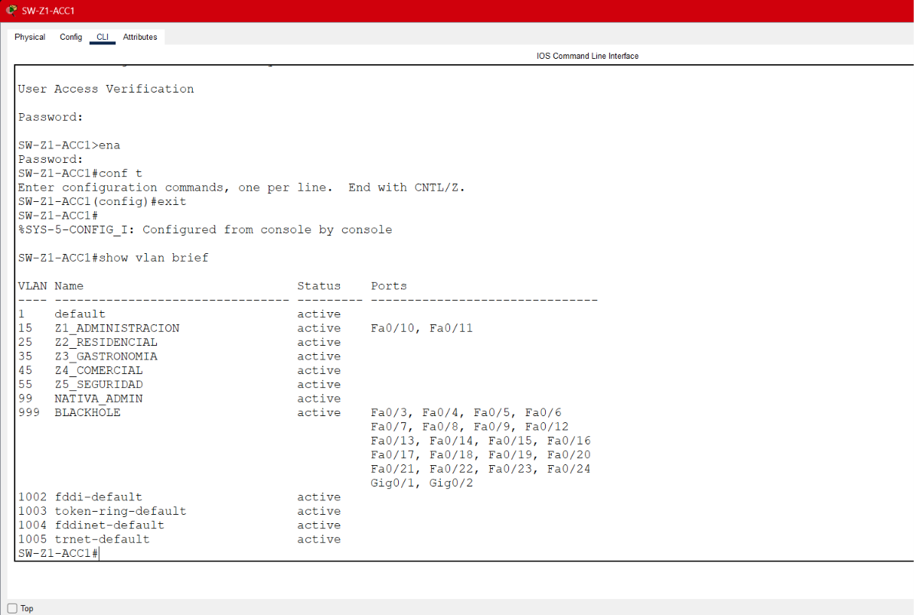

Los scripts completos de cada switch están en [`../Scripts`](../Scripts).

---

## 15. Seguridad aplicada

| Medida | Configuración | Propósito |
|---|---|---|
| VLAN Blackhole | Puertos libres en VLAN 999 y `shutdown` | Nadie puede conectarse a un puerto libre y quedar en una VLAN válida |
| VLAN nativa distinta de 1 | `switchport trunk native vlan 99` | Mitiga el *VLAN hopping* por doble etiquetado |
| VLANs restringidas en troncales | `switchport trunk allowed vlan ...` | Cada enlace transporta solo lo necesario |
| DTP deshabilitado | `switchport nonegotiate` en troncales Fast Ethernet | Evita que un equipo externo negocie un troncal |
| BPDU Guard | En puertos de hosts | Apaga el puerto si se conecta un switch no autorizado |
| Contraseña VTP | `vtp password Cayala2026` | Impide cambios en la base de VLANs desde switches ajenos |
| Contraseñas de acceso | `enable secret`, consola y VTY | Protege la administración de los equipos |
| Cifrado de contraseñas | `service password-encryption` | Las contraseñas no se muestran en texto plano |
| Banner | `banner motd` | Aviso de acceso restringido |

**Credenciales de la práctica**

| Acceso | Contraseña |
|---|---|
| Consola / VTY | `redes1` |
| Enable secret | `redes1` |
| VTP | `Cayala2026` |

---

## 16. Procedimiento de implementación

1. **Montaje físico:** colocar los 9 switches y las 14 PCs y cablear según la sección 6, eligiendo cada puerto manualmente.
2. **Fase 1 de configuración** (todos los switches, empezando por SW-Z1-CORE): configuración base, VTP, VLANs (solo en el núcleo), troncales y EtherChannel.
3. **Verificación intermedia:** `show vlan brief` en cada switch hasta ver las VLANs 15, 25, 35, 45, 55, 99 y 999.
4. **Fase 2 de configuración:** Rapid PVST+, puertos de acceso, Blackhole, SVIs de administración y enrutamiento en el núcleo.
5. **Hosts:** IP, máscara y gateway estáticos según la sección 7.2.
6. **Pruebas:** conectividad intra-VLAN, entre zonas, simulación ARP/ICMP y alta disponibilidad.

Dividir la configuración en dos fases evita que un servidor VTP cree VLANs por su cuenta al asignar un puerto de acceso a una VLAN que todavía no conoce.

---

## 17. Verificación de la configuración

| Comando | Qué valida |
|---|---|
| `show vtp status` | Dominio, modo, versión y número de revisión |
| `show vlan brief` | VLANs existentes y puertos de acceso asignados |
| `show interfaces trunk` | Troncales activos, VLAN nativa y VLANs permitidas |
| `show etherchannel summary` | Estado del Port-channel y de sus miembros |
| `show spanning-tree vlan X` | Root bridge, prioridad y rol de cada puerto |
| `show ip route` | Redes conectadas en el núcleo |
| `show ip interface brief` | Estado de las SVIs |

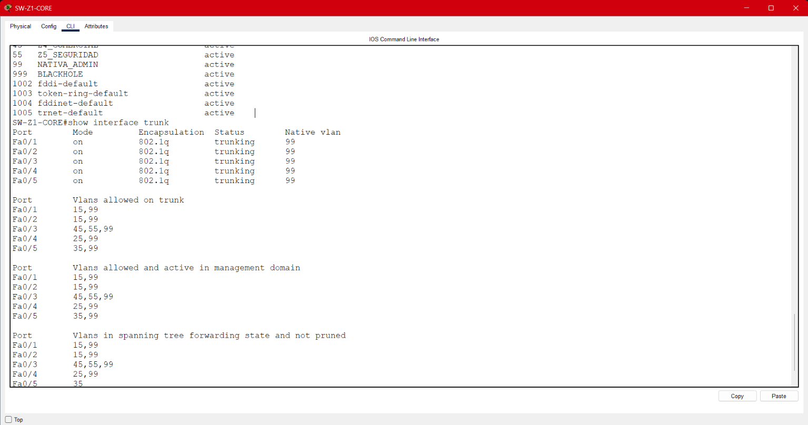
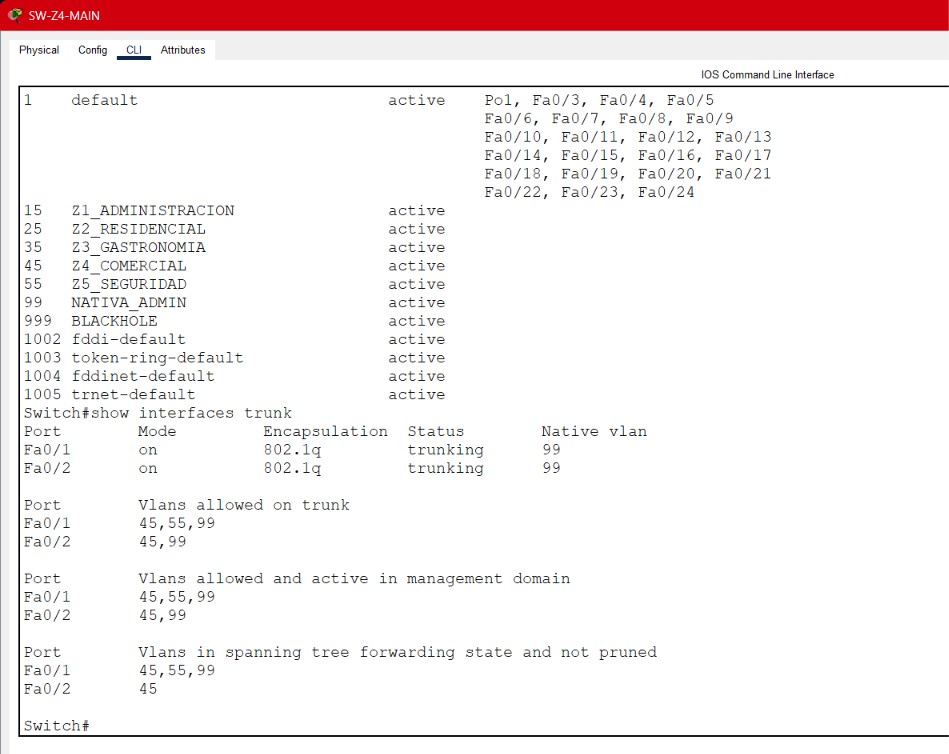

---

## 18. Pruebas de conectividad

### 18.1 Intra-VLAN
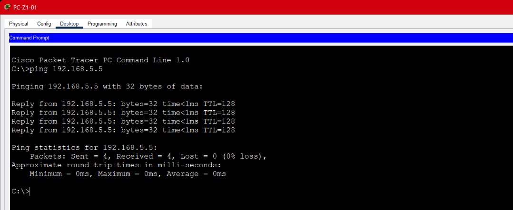
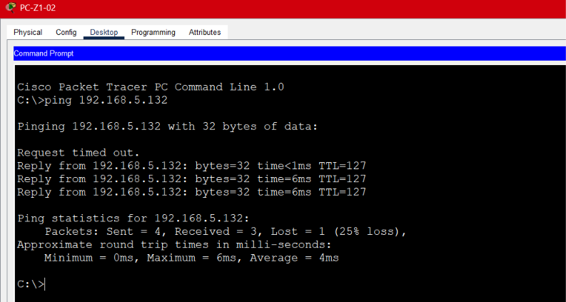
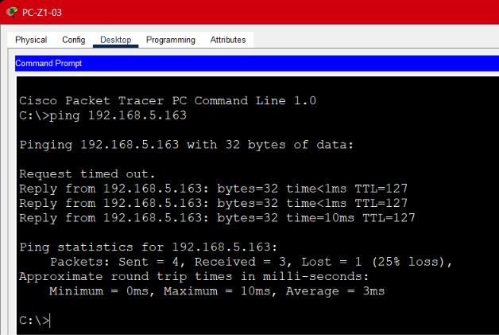
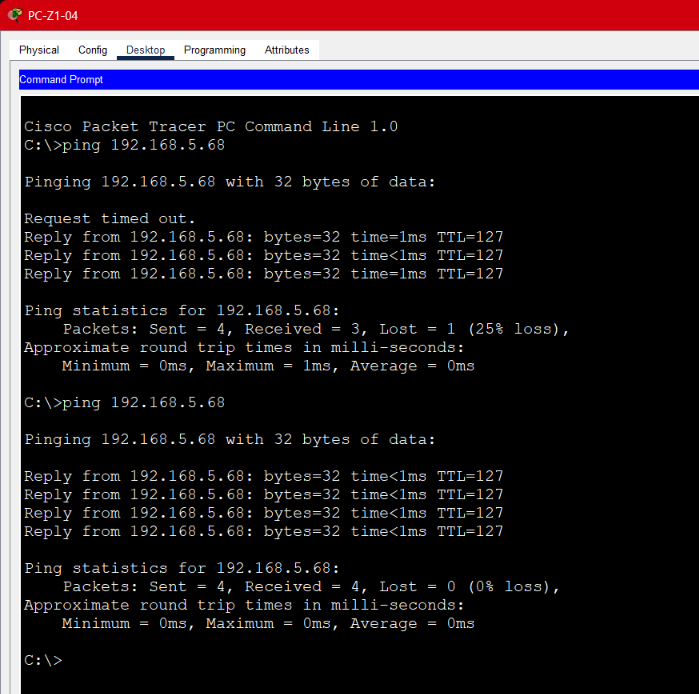
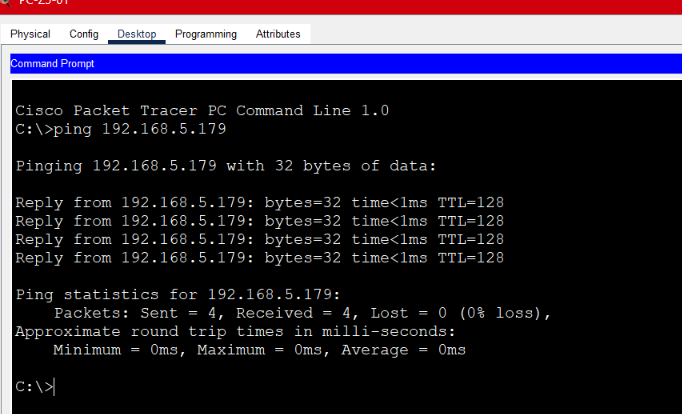

### 18.2 Entre zonas
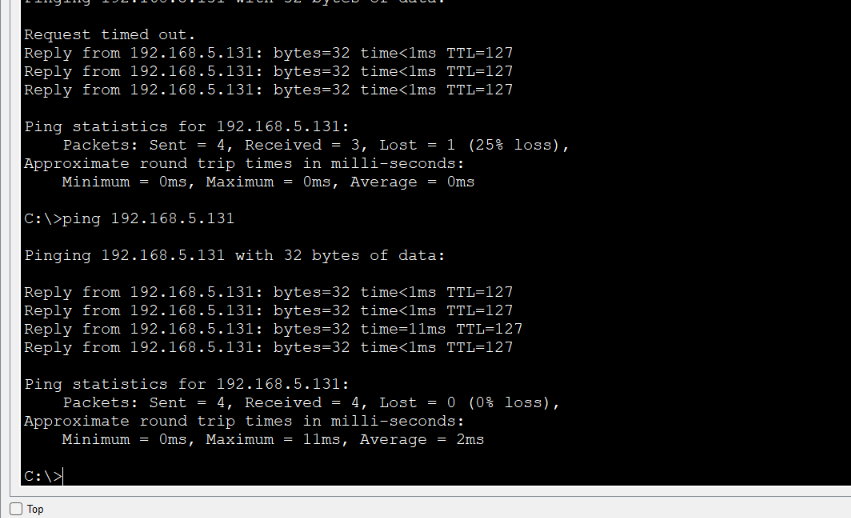
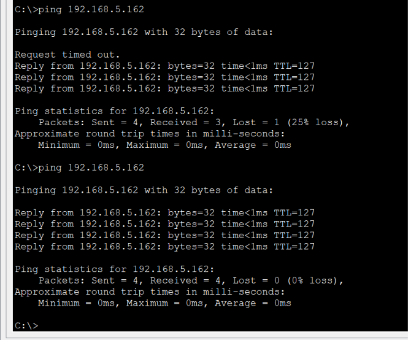
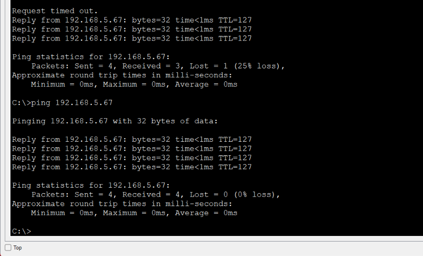
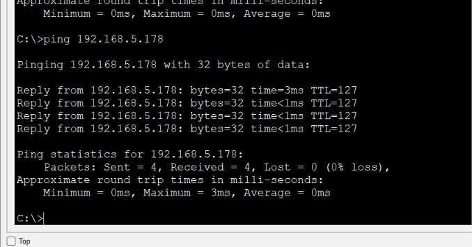
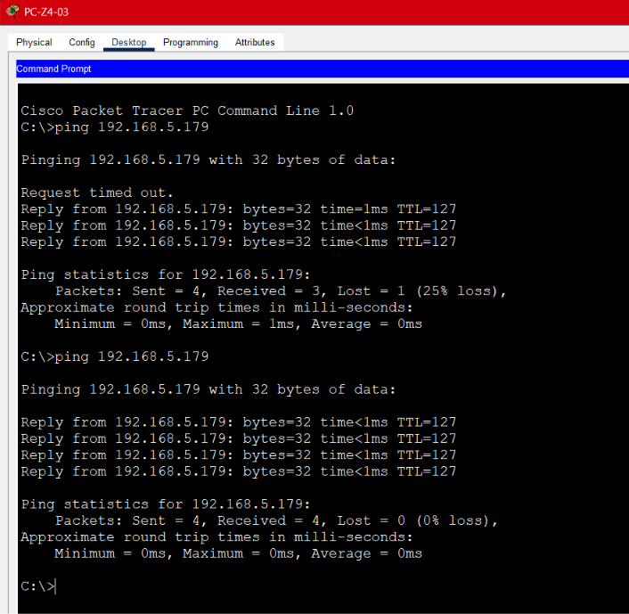

### 18.3 Resumen de pruebas

| # | Origen | Destino | Tipo | Resultado |
|---|---|---|---|---|
| 1 | PC-Z1-01 | PC-Z1-04 | Intra-VLAN 15 | Exitoso |
| 2 | PC-Z1-02 | PC-Z1-03 | Intra-VLAN 15 | Exitoso |
| 3 | PC-Z2-01 | PC-Z2-03 | Intra-VLAN 25 | Exitoso |
| 4 | PC-Z3-01 | PC-Z3-02 | Intra-VLAN 35 | Exitoso |
| 5 | PC-Z4-01 | PC-Z4-03 | Intra-VLAN 45 | Exitoso |
| 6 | PC-Z4-02 | PC-Z4-03 | Intra-VLAN 45 | Exitoso |
| 7 | PC-Z5-01 | PC-Z5-02 | Intra-VLAN 55 | Exitoso |
| 8 | PC-Z1-01 | PC-Z2-02 | Entre zonas | Exitoso |
| 9 | PC-Z1-01 | PC-Z3-01 | Entre zonas | Exitoso |
| 10 | PC-Z1-01 | PC-Z4-02 | Entre zonas | Exitoso |
| 11 | PC-Z1-01 | PC-Z5-01 | Entre zonas | Exitoso |
| 12 | PC-Z4-03 | PC-Z5-02 | Entre zonas | Exitoso |
| 13 | PC-Z2-03 | PC-Z3-02 | Entre zonas | Exitoso |

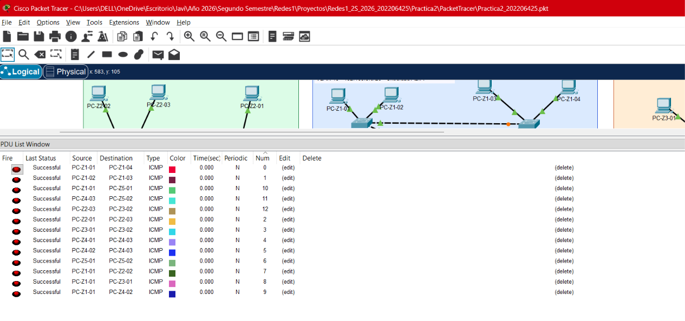

### 18.4 Flujo ARP e ICMP
1. PC-Z1-01 necesita llegar a PC-Z5-01, que está en otra red, así que envía el paquete a su gateway 192.168.5.1.
2. Como no conoce la MAC del gateway, envía un **ARP Request** de broadcast. Este broadcast solo recorre los puertos de la VLAN 15 y los troncales que la permiten.
3. La SVI Vlan15 del núcleo responde con un **ARP Reply**.
4. El **ICMP Echo Request** llega al núcleo, que lo enruta hacia la SVI Vlan55. Si hace falta, el núcleo hace un nuevo ARP dentro de la VLAN 55 y entrega el paquete a PC-Z5-01.
5. El **Echo Reply** regresa por el mismo camino en sentido inverso.

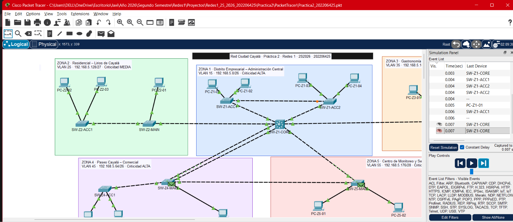

### 18.5 Administración de switches
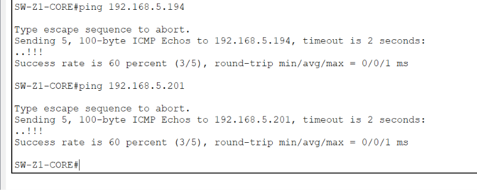

---

## 19. Pruebas de alta disponibilidad

### 19.1 Falla de un miembro del EtherChannel
Se apagó `Gi0/1` en SW-Z1-CORE mientras corría un ping continuo de PC-Z1-01 a PC-Z4-02. El Port-channel siguió en estado `SU` con Gi0/2 y el ping no se interrumpió.

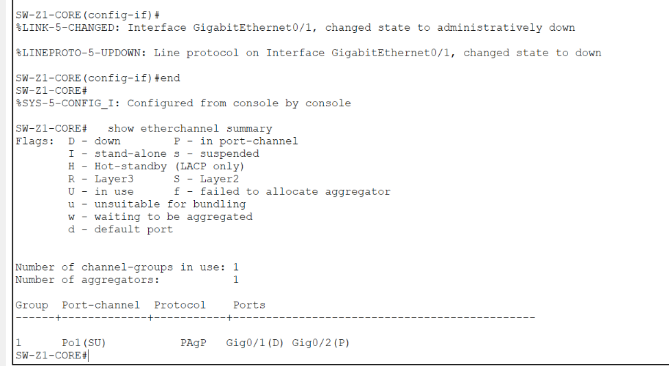

### 19.2 Falla del enlace Núcleo ↔ Zona 5
Se apagó `Fa0/3` en SW-Z1-CORE mientras corría un ping continuo de PC-Z1-01 a PC-Z5-01. Rapid PVST+ reconvergió y el puerto raíz de la VLAN 55 en el núcleo pasó a ser **Po1**. El tráfico siguió el camino Núcleo → Po1 → SW-Z4-MAIN → SW-Z5-MAIN, y el ping se recuperó tras la reconvergencia.

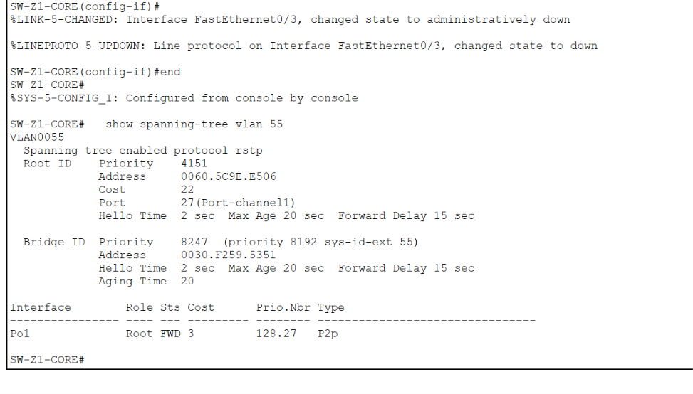

Al finalizar ambas pruebas se restauraron las interfaces con `no shutdown`.

| Prueba | Enlace afectado | Camino alterno | Resultado |
|---|---|---|---|
| 1 | Gi0/1 (miembro de Po1) | Gi0/2 del mismo Po1 | Sin pérdida de servicio |
| 2 | Núcleo Fa0/3 ↔ Z5 Fa0/1 | Po1 → SW-Z4-MAIN → SW-Z5-MAIN | Servicio recuperado tras la reconvergencia |

---

## 20. Escalabilidad

- El bloque **192.168.5.224/27** queda libre para una sexta zona o para ampliar otra.
- Cada switch 2960 tiene 24 puertos Fast Ethernet. Los puertos libres ya están en la VLAN 999, así que para habilitar un host basta asignar el puerto a la VLAN de su zona y activarlo con `no shutdown`.
- Una nueva VLAN se crea una sola vez en SW-Z1-CORE y VTP la propaga a todo el dominio. Después se agrega a la lista `allowed vlan` de los troncales que la necesiten.
- Si la Zona 5 aumenta su tráfico de video, el enlace directo al núcleo puede convertirse en un segundo EtherChannel.

---

## 21. Guía rápida de resolución de problemas

| Síntoma | Causa probable | Solución |
|---|---|---|
| Un switch no tiene las VLANs | Dominio o contraseña VTP diferente | `show vtp status` / `show vtp password` y corregir |
| `%CDP-4-NATIVE_VLAN_MISMATCH` | VLAN nativa distinta en los extremos | `switchport trunk native vlan 99` en ambos lados |
| `Po1(SD)` y puertos `(I)` | PAgP no negoció con el otro extremo | Igualar la configuración de miembros, recrear el canal y reiniciar ambos switches |
| Puertos del canal en `(s)` | Configuración distinta entre miembros | Configurarlos con `interface range` |
| SVI en `down` | VLAN sin puertos activos en el núcleo | Revisar VLANs permitidas en los troncales |
| Primer ping con un *timeout* | Resolución ARP inicial | Comportamiento normal; repetir el ping |
| Puerto de host apagado (err-disabled) | BPDU Guard detectó un switch | Retirar el equipo y hacer `shutdown` / `no shutdown` |

---

## 22. Referencias
- Odom, W. (2019). *CCNA 200-301 Official Cert Guide, Volume 1*. Cisco Press.
- Cisco Networking Academy. https://www.netacad.com/
- Ciudad Cayalá, sitio oficial. https://cayala.com/
- Ciudad Cayalá (Guatemala), Wikipedia. https://es.wikipedia.org/wiki/Ciudad_Cayal%C3%A1_%28Guatemala%29
- ICSC. *La otra mitad de Ciudad de Guatemala*. https://www.icsc.com/news-and-views/sct-iberoamerica/la-otra-mitad-de-ciudad-de-guatemala
