# Proyecto 1 — SmartCity Tech Park

**Redes de Computadoras 1 · Segundo Semestre 2026**
Universidad de San Carlos de Guatemala · Facultad de Ingeniería · Ingeniería en Ciencias y Sistemas

| Campo | Valor |
|---|---|
| Estudiante | Carlos Javier Pérez Pocón |
| Carné | 202206425 |
| Archivo de simulación | `Proyecto1_202206425.pkt` |
| Simulador | Cisco Packet Tracer 8.x |
| Fecha de entrega | 17/09/2026 |

---

## 1. Planteamiento

### 1.1 El problema

El campus de SmartCity Tech Park opera hoy como una **red plana de Capa 2**. Esto produce tres fallas estructurales, cada una con una consecuencia medible:

| Falla observada | Consecuencia técnica |
|---|---|
| Un único dominio de broadcast para todo el campus | Cada trama de broadcast (ARP, DHCP Discover) generada por un visitante llega a los servidores críticos y a la maquinaria industrial. Se consume ancho de banda útil y el tráfico administrativo queda expuesto a usuarios no confiables. |
| Dominio de colisión compartido en la Planta de Producción | La maquinaria legacy comparte medio. Cada colisión dispara el algoritmo de backoff de CSMA/CD; el throughput efectivo cae de forma no lineal conforme se agregan equipos. |
| Dependencia de enlaces físicos únicos | La caída de un solo cable o switch aísla un área completa. No existe tolerancia a fallos ni capacidad agregada en los enlaces de mayor demanda. |

### 1.2 La solución propuesta

Reestructuración completa de Capa 1 y Capa 2 sobre un modelo jerárquico de tres niveles (núcleo, distribución y acceso), aplicando:

| Tecnología | Problema que ataca |
|---|---|
| Segmentación con VLANs | Fragmenta el dominio de broadcast único en seis dominios independientes. |
| VTP | Centraliza la administración de VLANs en un único punto y evita divergencia de bases de datos entre switches. |
| EtherChannel (PAgP) | Agrega ancho de banda y elimina el punto único de falla en los enlaces de mayor demanda. |
| Rapid-PVST | Administra los bucles introducidos deliberadamente por la redundancia, sin tormentas de broadcast y con convergencia rápida. |
| Aislamiento de segmento legacy | Contiene el dominio de colisión heredado en un solo puerto de acceso, sin obligar a migrar la maquinaria. |

### 1.3 Resultado medible

| Métrica | Antes | Después |
|---|---|---|
| Dominios de broadcast | 1 | 6 |
| Dominios de colisión | 1 (medio compartido) | 62 |
| Áreas con tolerancia a fallo de switch | 0 | 2 (I+D y Centro de Datos) |
| Áreas con ruta alterna | 0 | 3 |

---

## 2. Parámetros derivados del carné

Todos los identificadores del proyecto se derivan del carné **202206425**.

| Parámetro | Regla del enunciado | Valor aplicado |
|---|---|---|
| Último dígito (X) | — | **5** |
| Penúltimo dígito (#) | — | **2** |
| Dominio VTP | `Smart_#` | `Smart_2` |
| Contraseña VTP | fija | `proyecto12S2026` |
| Paridad del carné | — | **Impar** |
| Protocolo de agregación | LACP si par, PAgP si impar | **PAgP** |
| Protocolo de Spanning Tree | PVST si par, Rapid-PVST si impar | **Rapid-PVST** |
| VLAN nativa de troncales | `9X` | **95** |
| Banner MOTD | `Acceso Restringido - TechPark_[Carné]` | `Acceso Restringido - TechPark_202206425` |

---

## 3. Topología general

La red se estructura en un modelo jerárquico de tres niveles. El **núcleo** reside en el Centro de Datos y concentra la administración VTP y la raíz del árbol de expansión. Tres **switches de distribución** (uno por edificio) se conectan al núcleo mediante enlaces troncales 802.1Q. Bajo cada distribución cuelgan los **switches de acceso** que dan servicio a los dispositivos finales.

El lienzo está delimitado por color: morado para el núcleo, verde y azul para las áreas confiables de usuarios, ámbar para el segmento no confiable de visitantes y rojo para el segmento legacy. La elección de color refleja el nivel de confianza de cada zona, no solo su ubicación física.

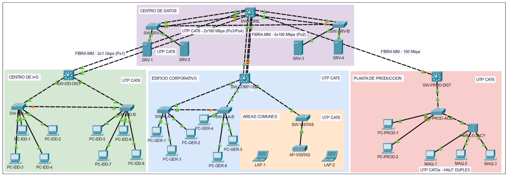

*Figura 1. Topología completa del campus, con las cuatro áreas delimitadas por color y el etiquetado de medios de transmisión por segmento.*

### 3.1 Inventario de dispositivos

| Nombre | Modelo | Rol jerárquico | Área | Modo VTP |
|---|---|---|---|---|
| `SW-CORE` | 3560-24PS | Núcleo | Centro de Datos | Server |
| `SW-SRV-A` | 2960-24TT | Acceso | Centro de Datos | Client |
| `SW-SRV-B` | 2960-24TT | Acceso | Centro de Datos | Client |
| `SW-IDD-DIST` | 3560-24PS | Distribución | Centro de I+D | Client |
| `SW-IDD-A` | 2960-24TT | Acceso | Centro de I+D | Client |
| `SW-IDD-B` | 2960-24TT | Acceso | Centro de I+D | Client |
| `SW-CORP-DIST` | 3560-24PS | Distribución | Edificio Corporativo | Client |
| `SW-ALA-A` | 2960-24TT | Acceso | Edificio Corporativo | Client |
| `SW-ALA-B` | 2960-24TT | Acceso | Edificio Corporativo | Client |
| `SW-VISITAS` | 2960-24TT | Acceso | Áreas Comunes | **Transparent** |
| `SW-PROD-DIST` | 3560-24PS | Distribución | Planta de Producción | Client |
| `SW-PROD-ACC` | 2960-24TT | Acceso | Planta de Producción | Client |
| `HUB-LEGACY` | Hub-PT | Capa 1 | Planta de Producción | N/A |
| `AP-VISITAS` | AccessPoint-PT | Acceso inalámbrico | Áreas Comunes | N/A |

Dispositivos finales: 4 servidores, 19 estaciones de trabajo y 2 laptops inalámbricas.

---

## 4. Diseño por área

### 4.1 Centro de Datos (núcleo)

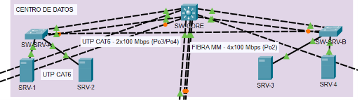

*Figura 2. Centro de Datos: núcleo, doble switch de acceso y granja de cuatro servidores.*

**Requisito:** administración VTP centralizada, troncales hacia los 3 edificios, granja de al menos 4 servidores sin depender de una única conexión física.

**Solución implementada.** `SW-CORE` es un 3560-24PS elegido por dos razones: dispone de dos puertos Gigabit necesarios para el enlace de mayor capacidad del campus, y soporta la concentración de cuatro EtherChannel simultáneos. Es el único switch en modo VTP Server y la raíz del árbol de expansión para todas las VLANs.

La granja de servidores **no se conectó a un solo switch de acceso**. El enunciado exige que los servidores no dependan de una única conexión física, requisito que un EtherChannel hacia un switch único ya satisface en su letra. Sin embargo, esa solución deja al propio switch como punto único de falla: su caída desconectaría los cuatro servidores críticos. Resultaría incoherente proteger el Centro de I+D contra la caída de un switch y dejar la granja de servidores sin esa misma protección.

Por ello se implementaron **dos switches de acceso** con los servidores repartidos (SRV-1 y SRV-2 en `SW-SRV-A`, SRV-3 y SRV-4 en `SW-SRV-B`), cada uno con su propio EtherChannel hacia el núcleo (`Po3` y `Po4`), más un **enlace lateral directo entre ambos**. Ese enlace forma un triángulo con el núcleo: si el uplink de un switch falla, alcanza el núcleo atravesando su par. El enunciado deja explícitamente la cantidad de switches intermedios a criterio del estudiante, lo que habilita esta decisión.

**Limitación reconocida.** Los servidores de Packet Tracer disponen de una sola interfaz de red, por lo que no es posible conectar cada servidor simultáneamente a ambos switches. La redundancia a nivel de servidor individual requeriría NIC teaming, funcionalidad que el simulador no implementa. El diseño reduce el radio de impacto de una falla de switch de cuatro servidores a dos, y garantiza redundancia completa de rutas; en un entorno productivo se complementaría con doble NIC por servidor.

### 4.2 Centro de I+D

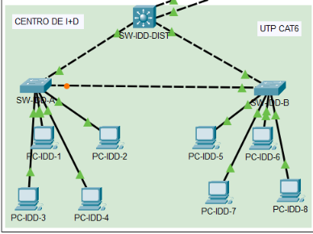

*Figura 3. Centro de I+D: tres switches en anillo y ocho estaciones de trabajo distribuidas.*

**Requisito:** al menos 3 switches interconectados de forma que la caída de uno no aísle a los demás; troncal hacia el núcleo con mayor ancho de banda que el resto del campus; mínimo 8 estaciones de trabajo.

**Solución implementada.** Tres switches en configuración de anillo: `SW-IDD-DIST` conecta con `SW-IDD-A` y con `SW-IDD-B`, y adicionalmente `SW-IDD-A` y `SW-IDD-B` se enlazan directamente entre sí. Esta topología garantiza que ante la caída de cualquiera de los tres, los dos restantes conservan conectividad mutua.

El enlace redundante entre `SW-IDD-A` y `SW-IDD-B` constituye un bucle de Capa 2 introducido de forma deliberada. Rapid-PVST lo mantiene en estado de bloqueo durante la operación normal y lo habilita automáticamente cuando la ruta principal deja de estar disponible.

El troncal hacia el núcleo utiliza los **dos puertos Gigabit** de ambos switches agregados en `Po1`, alcanzando 2 Gbps. Es el enlace de mayor capacidad del campus, justificado por la naturaleza del área: I+D genera volúmenes elevados de transferencia hacia los servidores del Centro de Datos.

Las 8 estaciones se distribuyen 4 en `SW-IDD-A` y 4 en `SW-IDD-B`, de modo que la caída de un switch de acceso afecta a la mitad de los usuarios y no a la totalidad.

**Prueba de alta disponibilidad.** Con un ping continuo entre `PC-IDD-1` y `PC-IDD-8` se apagó `SW-IDD-DIST`. Tras un breve período de reconvergencia, el tráfico se restableció a través del enlace directo entre los switches de acceso.

### 4.3 Edificio Corporativo

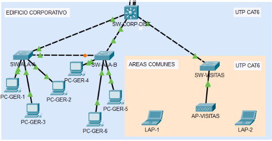

*Figura 4. Edificio Corporativo: dos alas con ruta alterna entre ellas, y el segmento aislado de Áreas Comunes con su Access Point.*

**Requisito:** dos alas con switch de acceso propio, conectividad entre alas activa aun si falla la ruta hacia la distribución; segmento de Áreas Comunes con aislamiento total de tráfico y de administración de VLANs, con servicio inalámbrico por Access Point.

**Solución implementada.** `SW-CORP-DIST` distribuye hacia `SW-ALA-A` y `SW-ALA-B`, y ambas alas se conectan además de forma directa entre sí. Esa ruta alterna es el segundo bucle deliberado del diseño: si el enlace de un ala hacia la distribución queda inhabilitado, el tráfico se reencamina por el ala contigua.

El segmento de Áreas Comunes cuelga de `SW-VISITAS`, configurado en **modo VTP Transparent**. Esta es la decisión que satisface el requisito de aislar "la administración de VLANs del resto del campus": un switch transparente no aplica los anuncios VTP del dominio, mantiene su propia base de datos local y no puede ser modificado desde el núcleo. Sus VLANs (55 y 95) se crearon manualmente. La evidencia es directa: `show vlan brief` en `SW-VISITAS` muestra únicamente las VLANs locales, sin GERENCIA, INVESTIGACION, PRODUCCION ni SERVIDORES.

El aislamiento de tráfico se logra por la segmentación en VLAN 55, sin enrutamiento entre VLANs. Las laptops de invitados se asocian a `AP-VISITAS` por radio, previa sustitución de su módulo Ethernet por el adaptador inalámbrico WPC300N.

**Prueba de redundancia entre alas.** Con ping continuo entre `PC-GER-1` y `PC-GER-4` se deshabilitó la interfaz Fa0/5 de `SW-CORP-DIST`. El tráfico se reencaminó por el enlace directo entre alas.

### 4.4 Planta de Producción

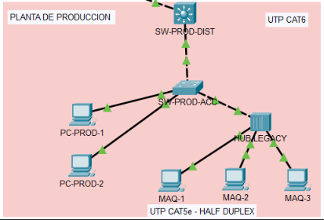

*Figura 5. Planta de Producción: el hub agrupa las tres máquinas industriales en un único dominio de colisión compartido, conectado a la red por un solo puerto de acceso.*

**Requisito:** segmento legacy con dominio de colisión compartido en Capa 1, integrado mediante un switch de acceso; documentar el impacto y las medidas de contención.

**Solución implementada.** Tres máquinas industriales (`MAQ-1` a `MAQ-3`) se conectan a `HUB-LEGACY`, y este a su vez a un único puerto de acceso (Fa0/2) de `SW-PROD-ACC`, asignado a la VLAN 35.

**Impacto del dominio de colisión compartido.** Un hub es un repetidor de Capa 1: regenera la señal eléctrica recibida y la retransmite por todos sus puertos restantes, sin examinar direcciones MAC. En consecuencia:

- Los tres equipos y el puerto del switch comparten **un único dominio de colisión**. Solo un dispositivo puede transmitir a la vez.
- El medio opera obligatoriamente en **half-duplex**, lo que reduce a la mitad la capacidad efectiva respecto a un enlace conmutado equivalente.
- Cuando dos equipos transmiten simultáneamente se produce una colisión. CSMA/CD detecta el evento, ambos emisores abortan y aplican el algoritmo de backoff exponencial antes de reintentar. El throughput efectivo cae de forma no lineal conforme aumenta el número de equipos y el volumen de tráfico.
- Todo el tráfico del segmento es visible para todos sus integrantes, lo que constituye además una exposición de seguridad.

**Medidas de contención aplicadas.** El segmento no puede eliminarse porque la maquinaria heredada no admite migración inmediata. Las medidas aplicadas mitigan el impacto sobre el resto de la red sin retirar el hub:

| Medida | Implementación | Qué mitiga |
|---|---|---|
| Confinamiento a un solo puerto | Decisión de diseño | El switch segmenta colisiones, por lo que el dominio compartido no se extiende más allá de Fa0/2. El resto del campus permanece inmune. |
| Segmentación en VLAN 35 | `switchport access vlan 35` | El broadcast generado por el segmento legacy no alcanza a servidores, gerencia ni visitantes. |
| Control de tormentas | `storm-control broadcast level 20` en Fa0/2 | Si el broadcast supera el 20% del ancho de banda del puerto, el switch limita el tráfico e impide que una tormenta originada en el segmento legacy se propague al campus. |

Estas medidas **mitigan parcialmente** el impacto. No lo eliminan: el medio compartido y sus colisiones siguen existiendo dentro del hub. La solución definitiva requiere sustituir el hub por un switch, lo que implica migrar la maquinaria industrial.

---

## 5. Medios de transmisión

| Enlace | Medio seleccionado | Distancia estimada | Justificación |
|---|---|---|---|
| `SW-CORE` ↔ `SW-IDD-DIST` | Fibra óptica multimodo | > 100 m | Enlace entre edificios que excede el límite de 100 m del cobre. Requiere además la mayor capacidad del campus (2 Gbps agregados). |
| `SW-CORE` ↔ `SW-CORP-DIST` | Fibra óptica multimodo | > 100 m | Enlace entre edificios. Concentra el tráfico del área con mayor número de usuarios. |
| `SW-CORE` ↔ `SW-PROD-DIST` | Fibra óptica multimodo | > 100 m | Enlace entre edificios. La fibra es inmune a la interferencia electromagnética generada por la maquinaria industrial, factor determinante en esta ruta. |
| `SW-CORE` ↔ `SW-SRV-A` / `SW-SRV-B` | UTP Cat 6 | < 10 m | Enlaces dentro del mismo cuarto de equipos. El cobre es suficiente y considerablemente más económico por puerto. |
| Enlaces intra-edificio (distribución ↔ acceso) | UTP Cat 6 | < 90 m | Distancias dentro del rango del estándar. No justifican el sobrecosto de fibra ni sus módulos. |
| Enlaces a dispositivos finales | UTP Cat 6 | < 90 m | Estándar de cableado horizontal. |
| `HUB-LEGACY` ↔ máquinas industriales | UTP Cat 5e | < 50 m | Cableado heredado preexistente. El segmento opera en half-duplex a 10/100 Mbps, por lo que Cat 6 no aportaría beneficio. |

**Criterio general aplicado.** La selección obedece a tres factores en orden de prioridad: distancia máxima soportada por el estándar, ancho de banda requerido por el segmento, e inmunidad electromagnética donde el entorno lo exige. El costo actúa como criterio de desempate: se emplea fibra únicamente donde alguno de los tres factores anteriores la hace necesaria.

El etiquetado de cada segmento es visible en la Figura 1, donde cada tramo del backbone indica el medio empleado y su capacidad.

**Nota sobre la implementación en el simulador.** Los switches 2960 y 3560 de Packet Tracer no admiten módulos de fibra óptica. Para conservar la funcionalidad de EtherChannel, VTP y Rapid-PVST, los enlaces se implementaron con cobre en la simulación y el medio real de cada segmento se documenta mediante etiquetas en el lienzo. La justificación técnica corresponde al diseño, no a la limitación de la herramienta.

---

## 6. Dominios de colisión

Cada puerto activo de un switch constituye un dominio de colisión independiente, porque el switch conmuta por dirección MAC y opera en full-duplex. Un hub, en cambio, repite la señal por todos sus puertos: todos sus equipos y el puerto de switch al que se conecta comparten un único dominio.

| Dispositivo | Puertos activos | Dominios que genera | Observación |
|---|---|---|---|
| `SW-CORE` | 11 | 11 | Fa0/1–0/8, Fa0/10, Gi0/1–0/2 |
| `SW-SRV-A` | 5 | 5 | Fa0/1–0/3, Fa0/11–0/12 |
| `SW-SRV-B` | 5 | 5 | Fa0/1–0/3, Fa0/11–0/12 |
| `SW-IDD-DIST` | 4 | 4 | Fa0/1–0/2, Gi0/1–0/2 |
| `SW-IDD-A` | 6 | 6 | Fa0/1–0/2, Fa0/11–0/14 |
| `SW-IDD-B` | 6 | 6 | Fa0/1–0/2, Fa0/11–0/14 |
| `SW-CORP-DIST` | 7 | 7 | Fa0/1–0/7 |
| `SW-ALA-A` | 5 | 5 | Fa0/1–0/2, Fa0/11–0/13 |
| `SW-ALA-B` | 5 | 5 | Fa0/1–0/2, Fa0/11–0/13 |
| `SW-VISITAS` | 2 | 2 | Fa0/1, Fa0/11 |
| `SW-PROD-DIST` | 2 | 2 | Fa0/1–0/2 |
| `SW-PROD-ACC` | 4 | 3 + 1 compartido | Fa0/1, Fa0/11–0/12 independientes. **Fa0/2 integra el dominio compartido del segmento Legacy.** |
| `HUB-LEGACY` | 4 | — | No genera dominios propios: sus 4 puertos pertenecen al mismo dominio compartido que Fa0/2 de `SW-PROD-ACC`. |
| **Total** | **62** | **62** | 61 independientes + 1 compartido |

**Dominio de colisión compartido del segmento Legacy:** integrado por `SW-PROD-ACC` Fa0/2, los cuatro puertos de `HUB-LEGACY` y las tres máquinas industriales `MAQ-1`, `MAQ-2` y `MAQ-3`.

**Nota sobre EtherChannel.** Los puertos agrupados en un `Port-channel` continúan siendo enlaces físicos independientes en Capa 1. Cada uno conserva su propio dominio de colisión; la agregación es una abstracción lógica de Capa 2.

**Nota sobre el medio inalámbrico.** La celda de `AP-VISITAS` constituye un medio compartido adicional entre `LAP-1` y `LAP-2`, gobernado por CSMA/CA en lugar de CSMA/CD. No se contabiliza en la tabla por tratarse de un dominio de contención inalámbrico y no de un dominio de colisión Ethernet.

---

## 7. Dominios de broadcast

Cada VLAN activa constituye un dominio de broadcast independiente. Antes de la reestructuración, el campus operaba con **un solo dominio de broadcast**.

| VLAN ID | Nombre | Área donde está presente | Dispositivos finales | Red IP |
|---|---|---|---|---|
| 15 | GERENCIA | Edificio Corporativo (ambas alas) | 6 PC | 192.168.15.0/24 |
| 25 | INVESTIGACION | Centro de I+D | 8 PC | 192.168.25.0/24 |
| 35 | PRODUCCION | Planta de Producción | 2 PC + 3 máquinas legacy | 192.168.35.0/24 |
| 45 | SERVIDORES | Centro de Datos | 4 servidores | 192.168.45.0/24 |
| 55 | VISITANTES | Áreas Comunes | 2 laptops inalámbricas | 192.168.55.0/24 |
| 95 | NATIVA | Todos los troncales del campus | Sin hosts asignados | — |
| **Total** | **6 dominios de broadcast** | | **25 dispositivos** | |

La VLAN 95 no transporta tráfico de usuarios. Existe exclusivamente como VLAN nativa de los enlaces troncales, según se detalla en la sección 10.4.

---

## 8. Tabla de VLANs

| VLAN ID | Nombre configurado | Propósito | Origen |
|---|---|---|---|
| 15 | `GERENCIA` | Personal administrativo | Creada en `SW-CORE`, propagada por VTP |
| 25 | `INVESTIGACION` | Estaciones de I+D | Creada en `SW-CORE`, propagada por VTP |
| 35 | `PRODUCCION` | Equipos de planta y maquinaria legacy | Creada en `SW-CORE`, propagada por VTP |
| 45 | `SERVIDORES` | Granja de servidores críticos | Creada en `SW-CORE`, propagada por VTP |
| 55 | `VISITANTES` | Invitados externos vía Access Point | Creada en `SW-CORE` **y localmente en `SW-VISITAS`** |
| 95 | `NATIVA` | VLAN nativa de todos los troncales | Creada en `SW-CORE`, propagada por VTP |

Los identificadores se derivan del último dígito del carné (5) según la tabla oficial del enunciado. La VLAN 95 no forma parte de la tabla oficial pero es indispensable para cumplir el requisito de sustituir la VLAN nativa por defecto.

---

## 9. Asignación de puertos por switch

### 9.1 `SW-CORE` (3560-24PS)

| Interfaz | Modo | Asignación | Conecta con |
|---|---|---|---|
| Fa0/1 – Fa0/4 | Trunk | `Po2` | `SW-CORP-DIST` Fa0/1–0/4 |
| Fa0/5 – Fa0/6 | Trunk | `Po3` | `SW-SRV-A` Fa0/1–0/2 |
| Fa0/7 – Fa0/8 | Trunk | `Po4` | `SW-SRV-B` Fa0/1–0/2 |
| Fa0/10 | Trunk | Nativa 95 | `SW-PROD-DIST` Fa0/1 |
| Gi0/1 – Gi0/2 | Trunk | `Po1` | `SW-IDD-DIST` Gi0/1–0/2 |

### 9.2 `SW-SRV-A` (2960-24TT)

| Interfaz | Modo | Asignación | Conecta con |
|---|---|---|---|
| Fa0/1 – Fa0/2 | Trunk | `Po3` | `SW-CORE` Fa0/5–0/6 |
| Fa0/3 | Trunk | Nativa 95 | `SW-SRV-B` Fa0/3 (enlace lateral) |
| Fa0/11 | Access | VLAN 45 + port-security | `SRV-1` |
| Fa0/12 | Access | VLAN 45 + port-security | `SRV-2` |

### 9.3 `SW-SRV-B` (2960-24TT)

| Interfaz | Modo | Asignación | Conecta con |
|---|---|---|---|
| Fa0/1 – Fa0/2 | Trunk | `Po4` | `SW-CORE` Fa0/7–0/8 |
| Fa0/3 | Trunk | Nativa 95 | `SW-SRV-A` Fa0/3 (enlace lateral) |
| Fa0/11 | Access | VLAN 45 + port-security | `SRV-3` |
| Fa0/12 | Access | VLAN 45 + port-security | `SRV-4` |

### 9.4 `SW-IDD-DIST` (3560-24PS)

| Interfaz | Modo | Asignación | Conecta con |
|---|---|---|---|
| Fa0/1 | Trunk | Nativa 95 | `SW-IDD-A` Fa0/1 |
| Fa0/2 | Trunk | Nativa 95 | `SW-IDD-B` Fa0/1 |
| Gi0/1 – Gi0/2 | Trunk | `Po1` | `SW-CORE` Gi0/1–0/2 |

### 9.5 `SW-IDD-A` (2960-24TT)

| Interfaz | Modo | Asignación | Conecta con |
|---|---|---|---|
| Fa0/1 | Trunk | Nativa 95 | `SW-IDD-DIST` Fa0/1 |
| Fa0/2 | Trunk | Nativa 95 | `SW-IDD-B` Fa0/2 (cierre de anillo) |
| Fa0/11 – Fa0/14 | Access | VLAN 25 | `PC-IDD-1` a `PC-IDD-4` |

### 9.6 `SW-IDD-B` (2960-24TT)

| Interfaz | Modo | Asignación | Conecta con |
|---|---|---|---|
| Fa0/1 | Trunk | Nativa 95 | `SW-IDD-DIST` Fa0/2 |
| Fa0/2 | Trunk | Nativa 95 | `SW-IDD-A` Fa0/2 (cierre de anillo) |
| Fa0/11 – Fa0/14 | Access | VLAN 25 | `PC-IDD-5` a `PC-IDD-8` |

### 9.7 `SW-CORP-DIST` (3560-24PS)

| Interfaz | Modo | Asignación | Conecta con |
|---|---|---|---|
| Fa0/1 – Fa0/4 | Trunk | `Po2` | `SW-CORE` Fa0/1–0/4 |
| Fa0/5 | Trunk | Nativa 95 | `SW-ALA-A` Fa0/1 |
| Fa0/6 | Trunk | Nativa 95 | `SW-ALA-B` Fa0/1 |
| Fa0/7 | Trunk | Nativa 95 | `SW-VISITAS` Fa0/1 |

### 9.8 `SW-ALA-A` (2960-24TT)

| Interfaz | Modo | Asignación | Conecta con |
|---|---|---|---|
| Fa0/1 | Trunk | Nativa 95 | `SW-CORP-DIST` Fa0/5 |
| Fa0/2 | Trunk | Nativa 95 | `SW-ALA-B` Fa0/2 (ruta alterna) |
| Fa0/11 – Fa0/13 | Access | VLAN 15 | `PC-GER-1` a `PC-GER-3` |

### 9.9 `SW-ALA-B` (2960-24TT)

| Interfaz | Modo | Asignación | Conecta con |
|---|---|---|---|
| Fa0/1 | Trunk | Nativa 95 | `SW-CORP-DIST` Fa0/6 |
| Fa0/2 | Trunk | Nativa 95 | `SW-ALA-A` Fa0/2 (ruta alterna) |
| Fa0/11 – Fa0/13 | Access | VLAN 15 | `PC-GER-4` a `PC-GER-6` |

### 9.10 `SW-VISITAS` (2960-24TT, VTP Transparent)

| Interfaz | Modo | Asignación | Conecta con |
|---|---|---|---|
| Fa0/1 | Trunk | Nativa 95 | `SW-CORP-DIST` Fa0/7 |
| Fa0/11 | Access | VLAN 55 | `AP-VISITAS` Port 0 |

### 9.11 `SW-PROD-DIST` (3560-24PS)

| Interfaz | Modo | Asignación | Conecta con |
|---|---|---|---|
| Fa0/1 | Trunk | Nativa 95 | `SW-CORE` Fa0/10 |
| Fa0/2 | Trunk | Nativa 95 | `SW-PROD-ACC` Fa0/1 |

### 9.12 `SW-PROD-ACC` (2960-24TT)

| Interfaz | Modo | Asignación | Conecta con |
|---|---|---|---|
| Fa0/1 | Trunk | Nativa 95 | `SW-PROD-DIST` Fa0/2 |
| Fa0/2 | Access | VLAN 35 + storm-control | `HUB-LEGACY` Port 0 |
| Fa0/11 – Fa0/12 | Access | VLAN 35 | `PC-PROD-1`, `PC-PROD-2` |

---

## 10. Decisiones de diseño y su justificación

### 10.1 Selección del switch servidor de VTP

**Decisión.** `SW-CORE` opera en modo **Server**. `SW-VISITAS` opera en modo **Transparent**. Los diez switches restantes operan en modo **Client**.

**Justificación del servidor.** El núcleo es el único punto de la topología por el que atraviesa el tráfico de las cuatro áreas, lo que lo convierte en el lugar natural para la administración centralizada. Concentrar en él la capacidad de crear, modificar y eliminar VLANs produce tres beneficios concretos: las seis VLANs se definen una sola vez en lugar de doce, se elimina la posibilidad de divergencia entre bases de datos por error humano, y cualquier cambio futuro se propaga automáticamente a todo el dominio.

**Justificación de los clientes.** Mantener los diez switches restantes en modo Client impide que una configuración local accidental modifique la topología de VLANs del campus. Un switch cliente rechaza la creación manual de VLANs, lo que actúa como salvaguarda operativa.

**Justificación del switch transparente.** El enunciado exige que el segmento de Áreas Comunes aísle "la administración de VLANs del resto del campus". El modo Transparent es la única opción de VTP que cumple ese requisito de forma literal: el switch reenvía los anuncios VTP sin aplicarlos, mantiene una base de datos local independiente y no puede ser administrado desde el núcleo. Sus VLANs (55 y 95) se crearon manualmente. La verificación con `show vlan brief` en `SW-VISITAS` muestra únicamente esas dos VLANs más las de sistema, confirmando el aislamiento administrativo.

**Sobre el número de revisión.** El contador `Configuration Revision` del servidor no coincide con la cantidad de VLANs creadas, porque se incrementa con cada modificación de la base de datos y no por cada VLAN. Ese contador es el mecanismo que determina qué switch posee la información más reciente dentro del dominio.

#### Evidencia del switch servidor

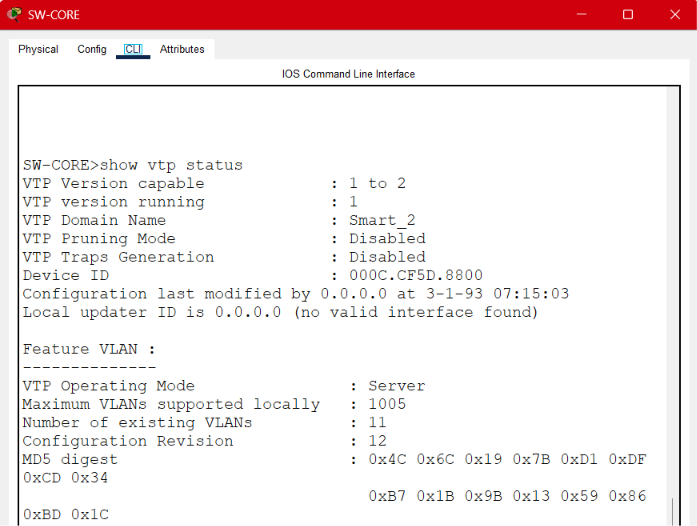

*Figura 6. `show vtp status` en `SW-CORE`: modo Server, dominio `Smart_2` y número de revisión de configuración.*

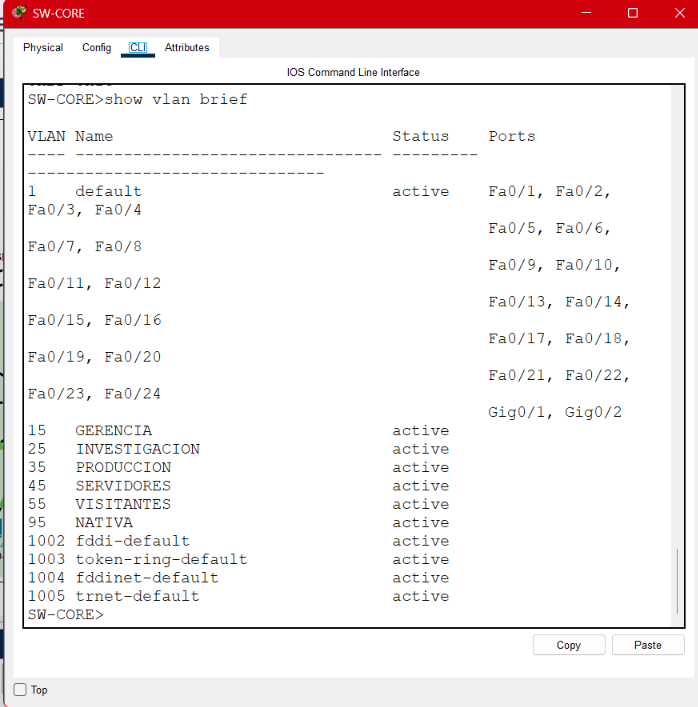

*Figura 7. `show vlan brief` en `SW-CORE`: las seis VLANs creadas con sus nombres exactos.*

#### Evidencia de la propagación hacia los clientes

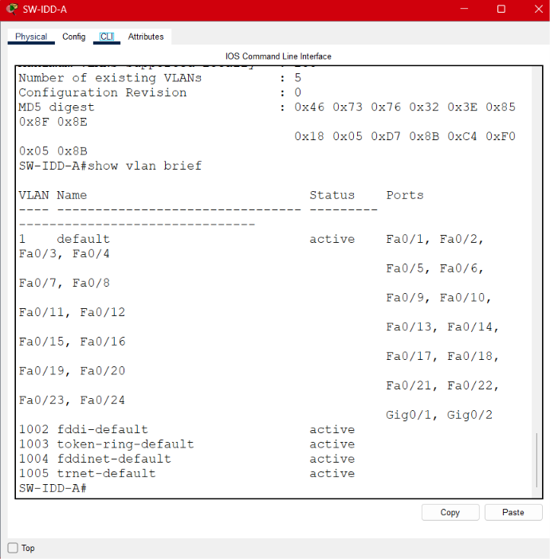

*Figura 8. `show vlan brief` en `SW-IDD-A` antes de configurar los enlaces troncales: la base de datos está vacía. VTP solo se propaga por troncales, por lo que este es el comportamiento esperado en esa etapa.*

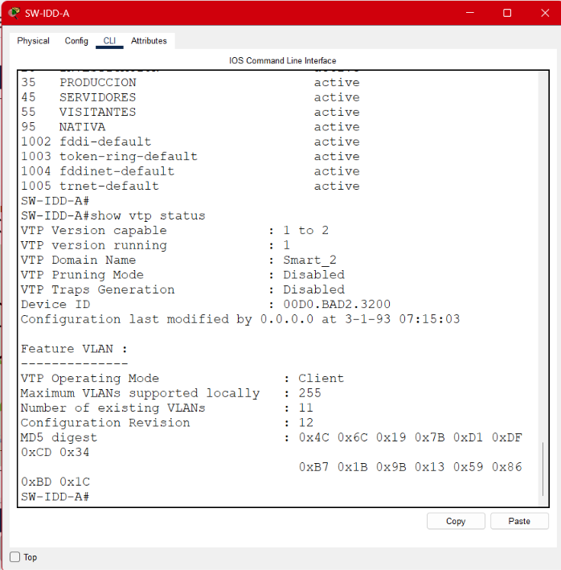

*Figura 9. `show vtp status` en `SW-IDD-A`: modo Client con el número de revisión sincronizado con el del servidor, lo que confirma la propagación efectiva.*

#### Evidencia del aislamiento administrativo

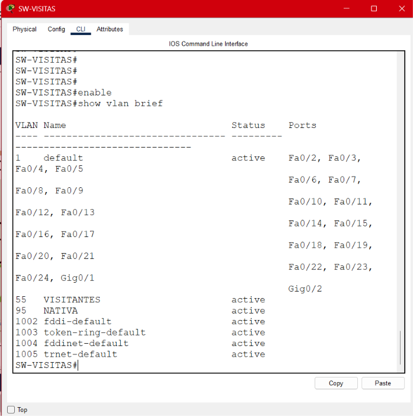

*Figura 10. `show vlan brief` en `SW-VISITAS`: únicamente las VLANs 55 y 95 creadas localmente, más las de sistema. No aparecen GERENCIA, INVESTIGACION, PRODUCCION ni SERVIDORES, lo que demuestra que el modo Transparent aísla la administración de VLANs de este segmento respecto del resto del campus.*

### 10.2 Selección del Root Bridge por VLAN

**Decisión.** `SW-CORE` es raíz primaria para las seis VLANs. `SW-CORP-DIST` es raíz secundaria para las seis VLANs.

| VLAN | Raíz primaria | Raíz secundaria | Prioridad configurada |
|---|---|---|---|
| 15 | `SW-CORE` | `SW-CORP-DIST` | 24576 / 28672 |
| 25 | `SW-CORE` | `SW-CORP-DIST` | 24576 / 28672 |
| 35 | `SW-CORE` | `SW-CORP-DIST` | 24576 / 28672 |
| 45 | `SW-CORE` | `SW-CORP-DIST` | 24576 / 28672 |
| 55 | `SW-CORE` | `SW-CORP-DIST` | 24576 / 28672 |
| 95 | `SW-CORE` | `SW-CORP-DIST` | 24576 / 28672 |

**Justificación.** Sin intervención, STP elige como raíz al switch con menor Bridge ID. Como todos los switches comparten la prioridad por defecto de 32768, el desempate se resuelve por la dirección MAC más baja, criterio completamente arbitrario respecto al diseño. Podría resultar raíz un switch de acceso de la Planta de Producción, lo que obligaría al tráfico del campus a recorrer caminos subóptimos.

En esta topología todo el tráfico converge hacia el núcleo: los servidores residen allí y los tres edificios se conectan a él. Situar la raíz en `SW-CORE` alinea el árbol calculado por STP con los caminos que el tráfico realmente necesita recorrer, minimizando la latencia de las rutas efectivas.

La raíz secundaria en `SW-CORP-DIST` responde a que el Edificio Corporativo concentra el mayor número de usuarios del campus. Ante una falla del núcleo, es el punto más razonable para que la topología se reorganice sin depender del azar de las direcciones MAC.

**Mecanismo.** El comando `root primary` establece la prioridad en 24576 y `root secondary` en 28672, ambos por debajo del valor por defecto. No se trata de una designación directa sino de aritmética de Bridge ID: el switch con menor prioridad gana la elección.

**Extended System ID.** La verificación muestra `Priority 24621 (priority 24576 sys-id-ext 45)` para la VLAN 45. Los 45 adicionales corresponden al identificador de VLAN incorporado al Bridge ID. Este mecanismo es el que permite que cada VLAN mantenga un árbol de expansión independiente, característica que diferencia a PVST/Rapid-PVST de un STP clásico de instancia única.

**Protocolo.** Rapid-PVST, correspondiente a carné impar. La verificación con `show spanning-tree` confirma `enabled protocol rstp`. Frente a PVST clásico, reduce el tiempo de convergencia de aproximadamente 50 segundos a un rango de 1 a 2 segundos, ventaja determinante en las tres rutas redundantes del diseño.

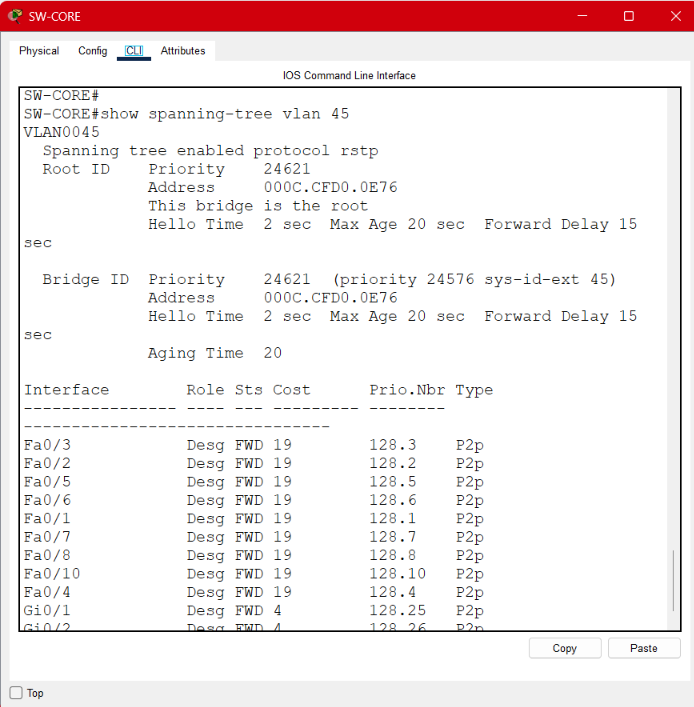

*Figura 11. `show spanning-tree` en `SW-CORE`: protocolo rstp activo, `This bridge is the root`, prioridad 24576 más el extended system ID de la VLAN, y los once puertos en estado designado/forwarding. Se observa además el costo 4 en los puertos Gigabit frente a 19 en los FastEthernet.*

### 10.3 EtherChannel implementados

| Port-channel | Extremos | Enlaces agrupados | Capacidad | Justificación de su ubicación |
|---|---|---|---|---|
| `Po1` | `SW-CORE` ↔ `SW-IDD-DIST` | 2 × Gigabit | 2 Gbps | Enlace de mayor capacidad del campus, exigido por el enunciado para el Centro de I+D. |
| `Po2` | `SW-CORE` ↔ `SW-CORP-DIST` | 4 × FastEthernet | 400 Mbps | El Corporativo concentra gerencia y visitantes, uno de los mayores volúmenes de tráfico del campus. |
| `Po3` | `SW-CORE` ↔ `SW-SRV-A` | 2 × FastEthernet | 200 Mbps | Granja de servidores: alto volumen hacia el núcleo sin dependencia de una conexión física única. |
| `Po4` | `SW-CORE` ↔ `SW-SRV-B` | 2 × FastEthernet | 200 Mbps | Segundo switch de la granja, con su propio canal independiente. |

**Justificación general.** EtherChannel resuelve simultáneamente dos requisitos que de otro modo requerirían soluciones separadas. Primero, agrega el ancho de banda de los enlaces miembros en un único enlace lógico. Segundo, aporta tolerancia a fallos: la caída de un cable individual reduce la capacidad del canal pero no interrumpe el servicio.

El beneficio adicional, y menos evidente, es su interacción con STP. Sin agregación, varios enlaces paralelos entre el mismo par de switches constituyen bucles de Capa 2, y STP bloquearía todos menos uno, desperdiciando el ancho de banda instalado. Al agruparlos, STP percibe un único enlace lógico y mantiene todos los miembros en estado de reenvío.

**Protocolo.** PAgP, correspondiente a carné impar. Se configuró `mode desirable` en ambos extremos de los cuatro canales. Esta elección garantiza la formación del canal sin depender de que un extremo tome la iniciativa de la negociación, a diferencia de la combinación `auto`/`auto`, en la que ningún extremo inicia y el canal nunca se establece.

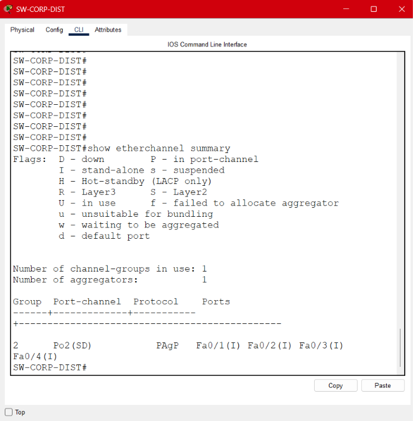

*Figura 12. `show etherchannel summary` en `SW-CORE`: los cuatro canales configurados con protocolo PAgP.*

**Estado de validación.** _[Completar según la respuesta del auxiliar. Si los canales no llegaron a formarse: documentar que la configuración se verificó idéntica en ambos extremos —modo troncal, encapsulación 802.1Q, VLAN nativa 95, número de channel-group y modo PAgP—, que los puertos físicos se confirmaron en estado `connected` mediante `show interfaces status`, y que el canal no alcanzó el estado `SU` en la versión de Packet Tracer utilizada.]_

### 10.4 Seguridad básica

| Medida | Alcance | Configuración |
|---|---|---|
| Banner MOTD | 4 switches de distribución | `Acceso Restringido - TechPark_202206425` |
| VLAN nativa | Todos los troncales del campus | VLAN 95 |
| Port-security | `SW-SRV-A` y `SW-SRV-B`, Fa0/11–0/12 | `maximum 1`, `mac-address sticky`, `violation restrict` |
| Storm-control | `SW-PROD-ACC` Fa0/2 | `broadcast level 20` |

**Por qué se sustituye la VLAN nativa.** El tráfico de la VLAN nativa circula **sin etiqueta 802.1Q** por los enlaces troncales. Cuando la nativa es la VLAN 1 —valor por defecto en todo switch Cisco— la red queda expuesta a ataques de *VLAN hopping* por doble etiquetado: un atacante situado en la VLAN nativa puede inyectar tramas con dos etiquetas, de modo que el primer switch retira la externa y reenvía la trama hacia una VLAN a la que no debería tener acceso. Trasladar la nativa a la VLAN 95, que no transporta tráfico de usuarios ni tiene puertos de acceso asignados, elimina ese vector: ningún host se encuentra en la VLAN nativa.

**Por qué `violation restrict` en los servidores.** Ante una violación de seguridad, `shutdown` deshabilita el puerto por completo, lo que en un servidor crítico convierte un incidente menor en una interrupción de servicio. `restrict` descarta el tráfico no autorizado, genera el registro correspondiente e incrementa el contador de violaciones, pero mantiene el puerto operativo. Es el balance adecuado para equipos cuya disponibilidad es prioritaria.

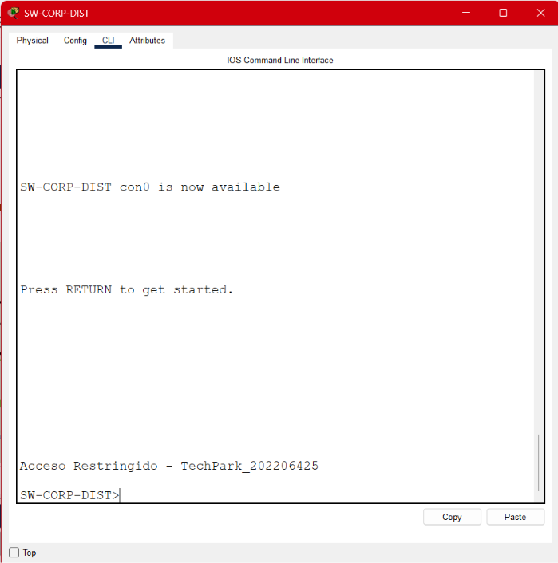

*Figura 13. Banner MOTD mostrado al iniciar sesión en un switch de distribución.*

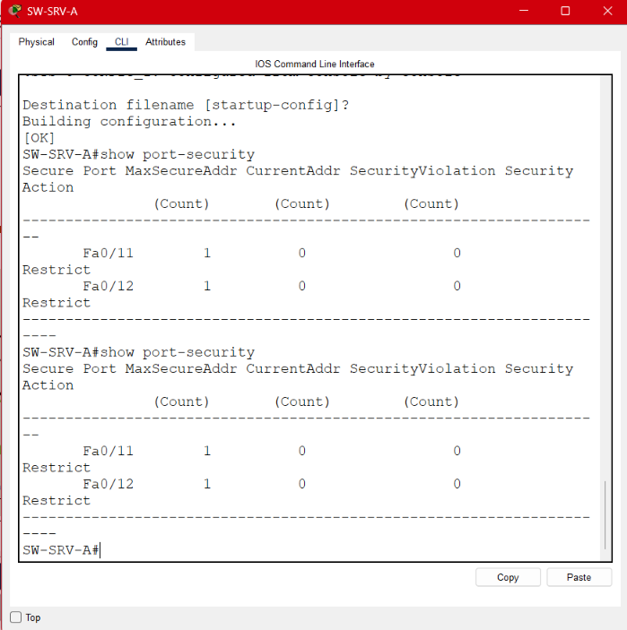

*Figura 14. `show port-security` en `SW-SRV-A`: máximo de una dirección MAC por puerto y acción `Restrict` en los puertos de los servidores.*

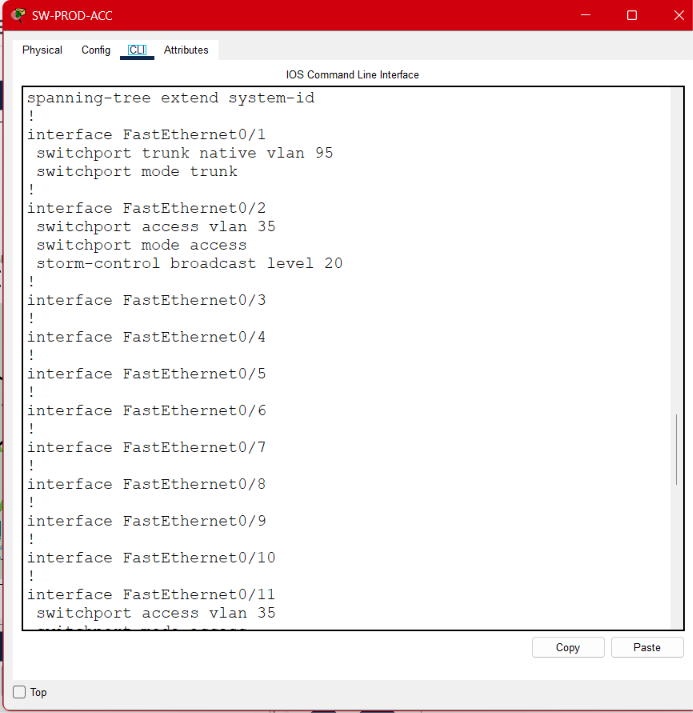

*Figura 15. Configuración de `storm-control broadcast level 20` sobre Fa0/2 de `SW-PROD-ACC`, el puerto que integra el segmento legacy.*

**Por qué `maximum 1` y `sticky`.** Los servidores son equipos fijos que no cambian de puerto. Limitar a una dirección MAC y aprenderla automáticamente impide que un dispositivo no autorizado sustituya al servidor en ese puerto. Esta medida **no se aplicó al puerto del hub**: por ese puerto llegan tres direcciones MAC distintas, y un límite de uno derribaría el segmento legacy completo.

---

## 11. Comandos utilizados por dispositivo

### 11.1 `SW-CORE` (3560-24PS — Núcleo, VTP Server, Root Bridge)

```
enable
configure terminal
hostname SW-CORE
!
! --- Spanning Tree ---
spanning-tree mode rapid-pvst
!
! --- VTP ---
vtp domain Smart_2
vtp password proyecto12S2026
vtp mode server
!
! --- Creación de VLANs ---
vlan 15
 name GERENCIA
vlan 25
 name INVESTIGACION
vlan 35
 name PRODUCCION
vlan 45
 name SERVIDORES
vlan 55
 name VISITANTES
vlan 95
 name NATIVA
exit
!
! --- Root Bridge ---
spanning-tree vlan 15 root primary
spanning-tree vlan 25 root primary
spanning-tree vlan 35 root primary
spanning-tree vlan 45 root primary
spanning-tree vlan 55 root primary
spanning-tree vlan 95 root primary
!
! --- EtherChannel Po1 hacia I+D ---
interface range gigabitEthernet 0/1-2
 no shutdown
 switchport trunk encapsulation dot1q
 switchport mode trunk
 switchport trunk native vlan 95
 channel-group 1 mode desirable
 exit
!
! --- EtherChannel Po2 hacia Corporativo ---
interface range fastEthernet 0/1-4
 no shutdown
 switchport trunk encapsulation dot1q
 switchport mode trunk
 switchport trunk native vlan 95
 channel-group 2 mode desirable
 exit
!
! --- EtherChannel Po3 hacia SW-SRV-A ---
interface range fastEthernet 0/5-6
 no shutdown
 switchport trunk encapsulation dot1q
 switchport mode trunk
 switchport trunk native vlan 95
 channel-group 3 mode desirable
 exit
!
! --- EtherChannel Po4 hacia SW-SRV-B ---
interface range fastEthernet 0/7-8
 no shutdown
 switchport trunk encapsulation dot1q
 switchport mode trunk
 switchport trunk native vlan 95
 channel-group 4 mode desirable
 exit
!
! --- Troncal simple hacia Producción ---
interface fastEthernet 0/10
 switchport trunk encapsulation dot1q
 switchport mode trunk
 switchport trunk native vlan 95
 exit
!
! --- Seguridad ---
banner motd #Acceso Restringido - TechPark_202206425#
!
end
copy running-config startup-config
```

### 11.2 `SW-SRV-A` (2960-24TT — Acceso servidores)

```
enable
configure terminal
hostname SW-SRV-A
spanning-tree mode rapid-pvst
!
vtp domain Smart_2
vtp password proyecto12S2026
vtp mode client
!
! --- EtherChannel Po3 hacia el núcleo ---
interface range fastEthernet 0/1-2
 no shutdown
 switchport mode trunk
 switchport trunk native vlan 95
 channel-group 3 mode desirable
 exit
!
! --- Enlace lateral hacia SW-SRV-B ---
interface fastEthernet 0/3
 switchport mode trunk
 switchport trunk native vlan 95
 exit
!
! --- Puertos de acceso a servidores ---
interface range fastEthernet 0/11-12
 switchport mode access
 switchport access vlan 45
 switchport port-security
 switchport port-security maximum 1
 switchport port-security mac-address sticky
 switchport port-security violation restrict
 exit
!
end
copy running-config startup-config
```

### 11.3 `SW-SRV-B` (2960-24TT — Acceso servidores)

```
enable
configure terminal
hostname SW-SRV-B
spanning-tree mode rapid-pvst
!
vtp domain Smart_2
vtp password proyecto12S2026
vtp mode client
!
interface range fastEthernet 0/1-2
 no shutdown
 switchport mode trunk
 switchport trunk native vlan 95
 channel-group 4 mode desirable
 exit
!
interface fastEthernet 0/3
 switchport mode trunk
 switchport trunk native vlan 95
 exit
!
interface range fastEthernet 0/11-12
 switchport mode access
 switchport access vlan 45
 switchport port-security
 switchport port-security maximum 1
 switchport port-security mac-address sticky
 switchport port-security violation restrict
 exit
!
end
copy running-config startup-config
```

### 11.4 `SW-IDD-DIST` (3560-24PS — Distribución I+D)

```
enable
configure terminal
hostname SW-IDD-DIST
spanning-tree mode rapid-pvst
!
vtp domain Smart_2
vtp password proyecto12S2026
vtp mode client
!
! --- EtherChannel Po1 hacia el núcleo ---
interface range gigabitEthernet 0/1-2
 no shutdown
 switchport trunk encapsulation dot1q
 switchport mode trunk
 switchport trunk native vlan 95
 channel-group 1 mode desirable
 exit
!
! --- Troncales hacia switches de acceso ---
interface range fastEthernet 0/1-2
 switchport trunk encapsulation dot1q
 switchport mode trunk
 switchport trunk native vlan 95
 exit
!
banner motd #Acceso Restringido - TechPark_202206425#
!
end
copy running-config startup-config
```

### 11.5 `SW-IDD-A` (2960-24TT — Acceso I+D)

```
enable
configure terminal
hostname SW-IDD-A
spanning-tree mode rapid-pvst
!
vtp domain Smart_2
vtp password proyecto12S2026
vtp mode client
!
! --- Troncal a distribución y cierre de anillo ---
interface range fastEthernet 0/1-2
 switchport mode trunk
 switchport trunk native vlan 95
 exit
!
! --- Puertos de acceso ---
interface range fastEthernet 0/11-14
 switchport mode access
 switchport access vlan 25
 exit
!
end
copy running-config startup-config
```

### 11.6 `SW-IDD-B` (2960-24TT — Acceso I+D)

```
enable
configure terminal
hostname SW-IDD-B
spanning-tree mode rapid-pvst
!
vtp domain Smart_2
vtp password proyecto12S2026
vtp mode client
!
interface range fastEthernet 0/1-2
 switchport mode trunk
 switchport trunk native vlan 95
 exit
!
interface range fastEthernet 0/11-14
 switchport mode access
 switchport access vlan 25
 exit
!
end
copy running-config startup-config
```

### 11.7 `SW-CORP-DIST` (3560-24PS — Distribución Corporativo, Root secundario)

```
enable
configure terminal
hostname SW-CORP-DIST
spanning-tree mode rapid-pvst
!
vtp domain Smart_2
vtp password proyecto12S2026
vtp mode client
!
! --- Root Bridge secundario ---
spanning-tree vlan 15 root secondary
spanning-tree vlan 25 root secondary
spanning-tree vlan 35 root secondary
spanning-tree vlan 45 root secondary
spanning-tree vlan 55 root secondary
spanning-tree vlan 95 root secondary
!
! --- EtherChannel Po2 hacia el núcleo ---
interface range fastEthernet 0/1-4
 no shutdown
 switchport trunk encapsulation dot1q
 switchport mode trunk
 switchport trunk native vlan 95
 channel-group 2 mode desirable
 exit
!
! --- Troncales hacia alas y visitantes ---
interface range fastEthernet 0/5-7
 switchport trunk encapsulation dot1q
 switchport mode trunk
 switchport trunk native vlan 95
 exit
!
banner motd #Acceso Restringido - TechPark_202206425#
!
end
copy running-config startup-config
```

### 11.8 `SW-ALA-A` (2960-24TT — Acceso Corporativo)

```
enable
configure terminal
hostname SW-ALA-A
spanning-tree mode rapid-pvst
!
vtp domain Smart_2
vtp password proyecto12S2026
vtp mode client
!
! --- Troncal a distribución y ruta alterna hacia el ala B ---
interface range fastEthernet 0/1-2
 switchport mode trunk
 switchport trunk native vlan 95
 exit
!
interface range fastEthernet 0/11-13
 switchport mode access
 switchport access vlan 15
 exit
!
end
copy running-config startup-config
```

### 11.9 `SW-ALA-B` (2960-24TT — Acceso Corporativo)

```
enable
configure terminal
hostname SW-ALA-B
spanning-tree mode rapid-pvst
!
vtp domain Smart_2
vtp password proyecto12S2026
vtp mode client
!
interface range fastEthernet 0/1-2
 switchport mode trunk
 switchport trunk native vlan 95
 exit
!
interface range fastEthernet 0/11-13
 switchport mode access
 switchport access vlan 15
 exit
!
end
copy running-config startup-config
```

### 11.10 `SW-VISITAS` (2960-24TT — Acceso Áreas Comunes, VTP Transparent)

```
enable
configure terminal
hostname SW-VISITAS
spanning-tree mode rapid-pvst
!
! --- VTP Transparent: aislamiento administrativo ---
vtp mode transparent
vtp domain Smart_2
vtp password proyecto12S2026
!
! --- VLANs creadas localmente (no llegan por VTP) ---
vlan 55
 name VISITANTES
vlan 95
 name NATIVA
exit
!
interface fastEthernet 0/1
 switchport mode trunk
 switchport trunk native vlan 95
 exit
!
interface fastEthernet 0/11
 switchport mode access
 switchport access vlan 55
 exit
!
end
copy running-config startup-config
```

### 11.11 `SW-PROD-DIST` (3560-24PS — Distribución Producción)

```
enable
configure terminal
hostname SW-PROD-DIST
spanning-tree mode rapid-pvst
!
vtp domain Smart_2
vtp password proyecto12S2026
vtp mode client
!
interface range fastEthernet 0/1-2
 switchport trunk encapsulation dot1q
 switchport mode trunk
 switchport trunk native vlan 95
 exit
!
banner motd #Acceso Restringido - TechPark_202206425#
!
end
copy running-config startup-config
```

### 11.12 `SW-PROD-ACC` (2960-24TT — Acceso Producción, segmento Legacy)

```
enable
configure terminal
hostname SW-PROD-ACC
spanning-tree mode rapid-pvst
!
vtp domain Smart_2
vtp password proyecto12S2026
vtp mode client
!
! --- Troncal hacia distribución ---
interface fastEthernet 0/1
 switchport mode trunk
 switchport trunk native vlan 95
 exit
!
! --- Puerto del segmento Legacy con contención ---
interface fastEthernet 0/2
 switchport mode access
 switchport access vlan 35
 storm-control broadcast level 20
 exit
!
! --- Estaciones modernas de planta ---
interface range fastEthernet 0/11-12
 switchport mode access
 switchport access vlan 35
 exit
!
end
copy running-config startup-config
```

### 11.13 Configuración de dispositivos finales

Direccionamiento estático asignado desde **Desktop → IP Configuration** en cada equipo. No se configura puerta de enlace, dado que el proyecto se limita a Capa 2 y no existe enrutamiento entre VLANs.

| Equipo | Dirección IP | Máscara | VLAN |
|---|---|---|---|
| `SRV-1` a `SRV-4` | 192.168.45.11 – .14 | 255.255.255.0 | 45 |
| `PC-IDD-1` a `PC-IDD-8` | 192.168.25.11 – .18 | 255.255.255.0 | 25 |
| `PC-GER-1` a `PC-GER-6` | 192.168.15.11 – .16 | 255.255.255.0 | 15 |
| `PC-PROD-1`, `PC-PROD-2` | 192.168.35.11, .12 | 255.255.255.0 | 35 |
| `MAQ-1` a `MAQ-3` | 192.168.35.13 – .15 | 255.255.255.0 | 35 |
| `LAP-1`, `LAP-2` | 192.168.55.11, .12 | 255.255.255.0 | 55 |

Las laptops requirieron la sustitución de su módulo Ethernet por el adaptador inalámbrico **WPC300N** desde la pestaña Physical, con el equipo apagado. El Access Point se configuró con SSID `TechPark_Guest`.

---

## 12. Evidencia de pruebas

### 12.1 `show interfaces trunk`

Ejecutado en `SW-CORE`. Confirma los enlaces troncales activos con encapsulación 802.1Q y VLAN nativa 95 en la totalidad de los puertos, y las VLANs permitidas y activas en el dominio de administración.

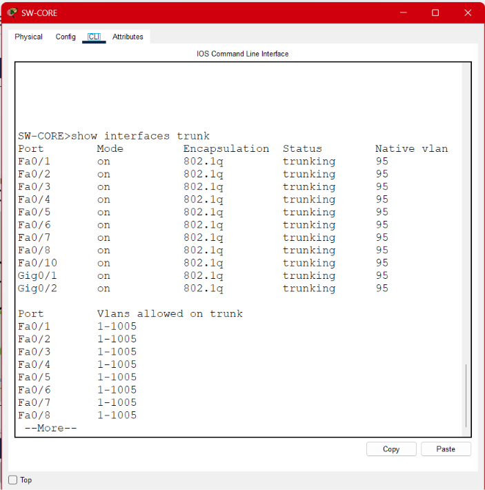

*Figura 16. `show interfaces trunk` en `SW-CORE`.*

### 12.2 `show spanning-tree`

Ejecutado en `SW-CORE` para la VLAN 45. La salida confirma:

- `Spanning tree enabled protocol rstp` — Rapid-PVST activo, correspondiente a carné impar.
- `This bridge is the root` — el núcleo es la raíz, conforme al diseño.
- `Priority 24621 (priority 24576 sys-id-ext 45)` — prioridad configurada mediante `root primary` más el identificador de VLAN.
- Los once puertos en estado `Desg FWD`, comportamiento esperado en el puente raíz.
- Costo 4 en los puertos Gigabit frente a 19 en los FastEthernet, lo que confirma la preferencia del enlace de mayor capacidad.

La captura de la raíz se presenta en la Figura 11 de la sección 10.2.

Ejecutado adicionalmente en `SW-IDD-A` para la VLAN 25, donde se observa el puerto en estado de bloqueo correspondiente al cierre del anillo:

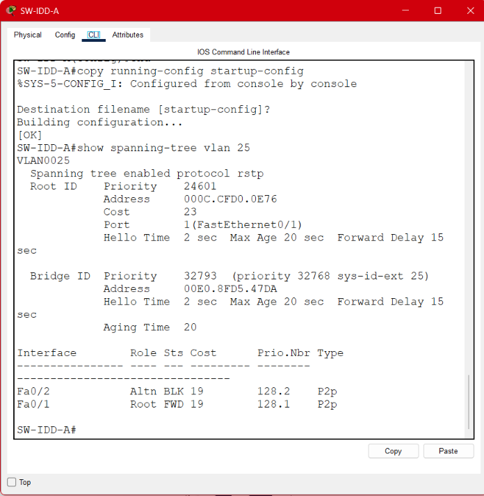

*Figura 17. `show spanning-tree` en un switch de acceso del anillo de I+D. El puerto en estado de bloqueo corresponde al enlace redundante entre `SW-IDD-A` y `SW-IDD-B`, mantenido inactivo por Rapid-PVST para evitar el bucle de Capa 2 y disponible para su activación automática ante una falla.*

### 12.3 `show etherchannel summary`

Ejecutado en `SW-CORE`. La captura correspondiente se presenta en la Figura 12 de la sección 10.3.

_[Documentar el estado obtenido según la resolución del caso.]_

### 12.4 Pruebas de conectividad

Prueba ejecutada desde `PC-IDD-1` (192.168.25.11), equipo conectado a `SW-IDD-A`.

| Origen | Destino | VLAN origen | VLAN destino | Resultado esperado | Resultado obtenido |
|---|---|---|---|---|---|
| `PC-IDD-1` | `PC-IDD-8` (192.168.25.18) | 25 | 25 | Éxito | **4/4 paquetes, 0% pérdida** |
| `PC-IDD-1` | `SRV-1` (192.168.45.11) | 25 | 45 | Fallo por aislamiento | **0/4 paquetes, 100% pérdida** |
| `LAP-1` | `LAP-2` (192.168.55.12) | 55 | 55 | Éxito | _[Completar]_ |

La primera prueba es la más significativa del proyecto: `PC-IDD-1` y `PC-IDD-8` están conectados a **switches distintos**, por lo que el tráfico atraviesa el enlace troncal entre `SW-IDD-A` y `SW-IDD-DIST`. Su éxito demuestra que la VLAN 25 se propagó correctamente y que el etiquetado 802.1Q funciona a través de la topología.

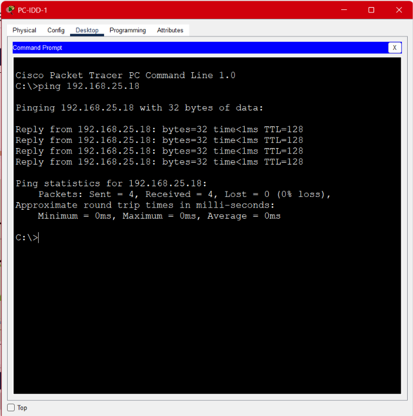

*Figura 18. Ping desde `PC-IDD-1` hacia `PC-IDD-8`, ambos en VLAN 25 pero conectados a switches distintos: 4 de 4 paquetes recibidos, 0% de pérdida.*

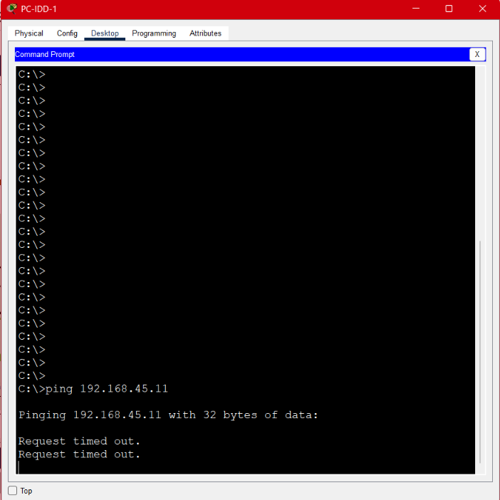

*Figura 19. Ping desde `PC-IDD-1` (VLAN 25) hacia `SRV-1` (VLAN 45): 100% de pérdida. El resultado confirma el aislamiento entre dominios de broadcast.*

La segunda prueba demuestra el aislamiento. La pérdida total no constituye un error sino la confirmación de que la segmentación cumple su propósito: sin un dispositivo de Capa 3, dos VLANs distintas no pueden comunicarse. Es exactamente el comportamiento que resuelve el problema original de mezclar tráfico administrativo con tráfico de invitados.

### 12.5 Pruebas de tolerancia a fallos

| Escenario simulado | Comportamiento esperado | Resultado |
|---|---|---|
| Caída de `SW-IDD-DIST` | `SW-IDD-A` y `SW-IDD-B` conservan conectividad por el enlace directo entre ambos | _[Completar]_ |
| Caída del enlace `SW-CORP-DIST` ↔ `SW-ALA-A` | El tráfico del ala A se reencamina por el enlace hacia el ala B | _[Completar]_ |
| Caída de un enlace físico de un EtherChannel | El canal reduce su capacidad pero mantiene el servicio | _[Completar]_ |

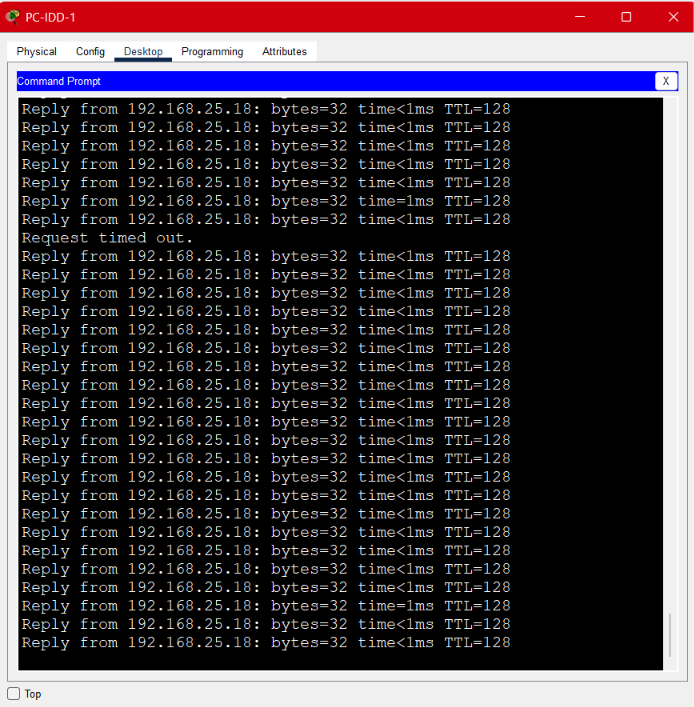

*Figura 20. Prueba de alta disponibilidad en el Centro de I+D: tras la caída de un switch del anillo, los equipos conservan conectividad a través del enlace redundante entre los switches de acceso.*

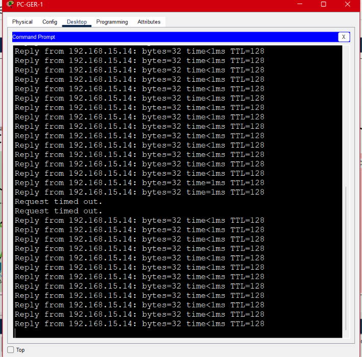

*Figura 21. Prueba de redundancia entre alas: al deshabilitar el enlace de un ala hacia el switch de distribución, el tráfico se reencamina por el enlace directo hacia el ala contigua.*

### 12.6 Verificación de seguridad

`show port-security` en `SW-SRV-A` confirma los puertos Fa0/11 y Fa0/12 con máximo de una dirección MAC y acción `Restrict`.

`show running-config` en `SW-PROD-ACC` confirma el `storm-control broadcast level 20` aplicado sobre Fa0/2, el puerto del segmento legacy.

El banner MOTD se verifica al establecer una nueva sesión de consola en cualquiera de los cuatro switches de distribución.

---

## 13. Presupuesto estimado

| Equipo / Material | Modelo de referencia | Cantidad | Costo unitario (Q) | Subtotal (Q) |
|---|---|---|---|---|
| Switch multicapa (núcleo y distribución) | Cisco Catalyst 3560-24PS | 4 | | |
| Switch de acceso | Cisco Catalyst 2960-24TT | 8 | | |
| Hub (segmento legacy existente) | — | 1 | | |
| Access Point | — | 1 | | |
| Módulos transceptores de fibra (GBIC/SFP) | — | 8 | | |
| Fibra óptica multimodo (m) | OM3 dúplex LC | _[metros]_ | | |
| Cable UTP Cat 6 (m) | — | _[metros]_ | | |
| Conectores RJ-45 | — | _[unidades]_ | | |
| **Total** | | | | |

**Nota metodológica.** Los módulos de fibra se contabilizan de a dos por enlace, uno en cada extremo: cuatro para los dos enlaces de `Po1` hacia I+D y cuatro para los enlaces hacia Corporativo y Producción. El hub se incluye en el inventario por tratarse de equipo preexistente que el proyecto conserva de forma deliberada, sin costo de adquisición.

_[Completar con precios de mercado e indicar la fuente consultada y la fecha.]_

---

## 14. Anexo — Inspección de PDUs (alcance opcional)

### 14.1 BPDU de STP

_[Capturar una BPDU en Modo Simulación filtrando únicamente STP. Identificar en el encabezado: Root ID (identificador del puente raíz), Bridge ID (identificador del puente emisor) y Root Path Cost (costo acumulado hacia la raíz).]_

### 14.2 PDU de VTP

_[Capturar una PDU de VTP. Identificar el VTP Domain Name (`Smart_2`) y el Configuration Revision Number, que determina qué switch posee la base de datos de VLANs más reciente.]_

---

## 15. Matriz de trazabilidad de requisitos

| # | Requisito del enunciado | Sección | Estado |
|---|---|---|---|
| 1 | Topología jerárquica con núcleo y 3 distribuciones | §3, §4 | Cumplido |
| 2 | Justificación del medio de transmisión por enlace | §5 | Cumplido |
| 3 | Granja de ≥4 servidores sin conexión física única | §4.1 | Cumplido y ampliado |
| 4 | I+D con ≥3 switches y tolerancia a caída de uno | §4.2 | Cumplido |
| 5 | I+D con el troncal de mayor ancho de banda | §4.2, §10.3 | Cumplido |
| 6 | I+D con ≥8 estaciones de trabajo | §4.2, §9 | Cumplido |
| 7 | Corporativo con 2 alas y ruta alterna entre ellas | §4.3 | Cumplido |
| 8 | Áreas Comunes aisladas en tráfico y administración | §4.3, §10.1 | Cumplido |
| 9 | Access Point para laptops de invitados | §4.3, §11.13 | Cumplido |
| 10 | Hub legacy con dominio de colisión compartido | §4.4, §6 | Cumplido |
| 11 | Impacto y contención del segmento legacy documentados | §4.4 | Cumplido |
| 12 | Dominio VTP `Smart_2` con contraseña | §10.1, §11 | Cumplido |
| 13 | VLANs 15/25/35/45/55 con nombres exactos | §8 | Cumplido |
| 14 | VLAN nativa 95 en todos los troncales | §10.4 | Cumplido |
| 15 | EtherChannel con PAgP | §10.3 | _[Según validación]_ |
| 16 | Rapid-PVST con root bridge justificado | §10.2 | Cumplido |
| 17 | Banner MOTD en switches de distribución | §10.4 | Cumplido |
| 18 | Tabla de dominios de colisión | §6 | Cumplido |
| 19 | Tabla de dominios de broadcast | §7 | Cumplido |
| 20 | Tabla de asignación de puertos | §9 | Cumplido |
| 21 | Comandos por dispositivo | §11 | Cumplido |
| 22 | Evidencia `show spanning-tree` | §12.2 | Cumplido |
| 23 | Evidencia `show etherchannel summary` | §12.3 | _[Según validación]_ |
| 24 | Evidencia `show interfaces trunk` | §12.1 | Cumplido |
| 25 | Etiquetado de medios en Packet Tracer | §5 | Cumplido |
| 26 | Presupuesto de equipos | §13 | _[Pendiente]_ |
| 27 | Inspección de PDUs (opcional) | §14 | _[Opcional]_ |

---

## 16. Conclusiones

**Sobre el resultado alcanzado.** La red pasó de un único dominio de broadcast a seis dominios independientes, y de un medio compartido a 62 dominios de colisión. La prueba de conectividad lo confirma de forma directa: dos equipos de la misma VLAN situados en switches distintos alcanzan 100% de éxito, mientras que dos equipos de VLANs diferentes registran 100% de pérdida. El tráfico administrativo dejó de ser accesible desde el segmento de invitados sin necesidad de infraestructura adicional.

**Sobre los compromisos de diseño.** El diseño aceptó deliberadamente tres bucles de Capa 2 —el anillo de I+D, la ruta alterna entre alas del Corporativo y el enlace lateral entre los switches de servidores— porque la redundancia física exige aceptar bucles lógicos y confiar su administración a Spanning Tree. La elección de Rapid-PVST reduce la reconvergencia a un rango de uno a dos segundos, lo que hace viable esa decisión en un entorno con servidores críticos.

La granja de servidores se resolvió con dos switches en lugar de uno, superando lo que el enunciado exigía en su letra. La razón es de coherencia: proteger el Centro de I+D contra la caída de un switch y dejar los servidores críticos dependiendo de uno solo habría sido inconsistente.

**Sobre las limitaciones que persisten.** El proyecto se circunscribe a Capa 2, por lo que **no existe comunicación entre VLANs**. En un entorno productivo sería necesario incorporar enrutamiento inter-VLAN mediante router-on-a-stick o interfaces virtuales conmutadas en el switch multicapa, acompañado de listas de control de acceso que permitieran el tráfico legítimo entre gerencia y servidores mientras mantuvieran aislado el segmento de visitantes.

El segmento legacy continúa siendo el punto débil de la infraestructura. Las medidas aplicadas contienen su impacto sobre el resto del campus, pero el dominio de colisión compartido y su operación en half-duplex persisten. Su eliminación requiere sustituir el hub por un switch, decisión que depende de la migración de la maquinaria industrial y excede el alcance de este proyecto.

Finalmente, la redundancia implementada protege contra fallas de switch y de enlace, pero no contra la falla de la interfaz de red de un servidor individual, dado que cada servidor conserva una única conexión. La solución completa requeriría agregación de enlaces a nivel de host.

---

## Estructura del repositorio

```
Proyecto1/
├── README.md
├── Proyecto1_202206425.pkt
├── img/
└── configs/
```